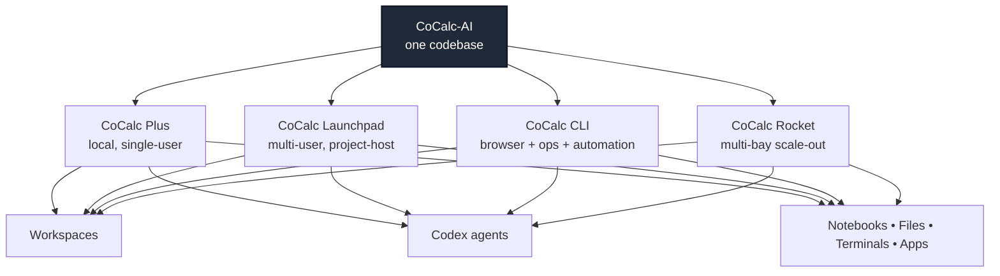

# CoCalc-AI

CoCalc-AI is a complete rewrite of CoCalc.  This repository is the codebase for the next generation of CoCalc products:

- [CoCalc Plus](https://software.cocalc.ai/software/cocalc-plus/index.html): a local, single-user CoCalc runtime
- [CoCalc Launchpad](https://software.cocalc.ai/software/cocalc-launchpad/index.html): a multi-user CoCalc with project hosts
- [CoCalc CLI:](https://software.cocalc.ai/software/cocalc/index.html) the operator and agent CLI used to drive projects, browsers, workspaces, and automation
- `CoCalc Rocket`: the multi-bay scalable architecture built on the same core ideas as Launchpad

The relaunch is AI-native: Codex is integrated as a first-class agent runtime, browser automation is built into the platform, and the same project/workspace concepts are intended to work across local, self-hosted, and large-scale deployments.



## What CoCalc-AI Is

At a product level, CoCalc-AI combines:

- computational documents and notebooks
- files, terminals, app servers, and browser-based IDE workflows
- real-time collaboration
- project-scoped agent workflows
- durable project infrastructure: root filesystems, backups, snapshots, and project and host placement

Compared to the older CoCalc architecture, the important shift is this:

- Plus is the fast local single-user path
- Launchpad is the current multi-user project-host architecture
- Rocket is the scale-out target
- Codex and agent tooling are core part of the platform, not an add-on

## Product Surface

### CoCalc Plus

Single-user, local-first CoCalc. This is the lightweight path for running CoCalc on one machine without the full multi-host control plane.

### CoCalc Launchpad

The current multi-user direction. A hub manages auth, routing, and orchestration while project-hosts run project workloads and own project storage, proxies, backups, and runtime state.

### CoCalc CLI

The CLI is increasingly important. It is not just an admin tool; it also provides browser automation, workspace inspection, notebook execution helpers, and agent-facing control surfaces.

### CoCalc Rocket

Rocket is the scalable form of Launchpad: many bays, many project hosts, and the same basic architecture extended to much larger deployments.

## Current Architecture In One Page

The current architecture centers on:

- a TypeScript-heavy pnpm monorepo under `src/packages`
- Conat for typed RPC and streaming between frontend, hub, hosts, and project services
- project-hosts that combine file server, runtime, proxying, quotas, snapshots, and backups
- local Lite/Plus mode for fast single-user workflows
- Codex app-server integration through ACP-style request/stream transport
- browser automation and workspace-aware tooling as first-class capabilities

Useful architecture docs:

- [docs/overview.md](./docs/overview.md)
- [docs/architecture.md](./docs/architecture.md)
- [docs/agents.md](./docs/agents.md)
- [docs/api.md](./docs/api.md)
- [docs/launchpad.md](./docs/launchpad.md)
- [docs/self-host.md](./docs/self-host.md)

Also note that `src/.agents/` contains many working design docs and implementation plans. Those files are valuable, but some describe target state or active rollout work rather than fully shipped behavior.

## Repository Layout

Top-level:

- [`docs/`](./docs) - architecture notes, operational docs, and implementation references
- [`src/`](./src) - the actual application monorepo
- [`AGENTS.md`](./AGENTS.md) - repo-specific guidance for coding agents and contributors

Inside `src/`:

- `package.json` - the main build, test, Lite, and daemon scripts
- `workspaces.py` - the workspace build/install helper used across packages
- `packages/` - the monorepo packages
- `scripts/dev/` - Lite and hub daemon helpers, smoke scripts, and local dev tooling
- `python/` - the Python API client and related Python build surface

Notable package areas:`src/packages/frontend` - main browser UI

- `src/packages/conat` - RPC, persistence, and routing primitives

- `src/packages/lite` - local single-user runtime

- `src/packages/hub` - hub/control-plane server

- `src/packages/cli` - `cocalc` CLI

- `src/packages/ai` - agent and Codex integration

- `src/packages/file-server` - project storage, quotas, snapshots, and backup plumbing

- `src/packages/cloud` / `src/packages/launchpad` - cloud and Launchpad-specific functionality

## Building From Source

If you are working on the codebase itself, almost everything starts in `src/`.

### Prerequisites

- Node.js `22+`
- a recent `pnpm`
- Python `3`
- `make` for the Python API build

For full Launchpad / project-host work you will also want a Linux environment with the host/runtime tooling used by that stack. For general frontend, Lite, CLI, and many agent workflows, the local Lite path is enough.

### First Build

```bash
git clone https://github.com/sagemathinc/cocalc-ai.git
cd cocalc-ai/src
pnpm build
```

That command installs package dependencies and builds the development bundles across the monorepo.

## Running CoCalc-AI Locally

### Lite / CoCalc Plus Style Development

This is the fastest way to get a local server running.

```bash
cd src
pnpm lite:daemon:init
pnpm lite:daemon:start
pnpm lite:daemon:status
```

To load the matching environment in your current shell:

```bash
cd src
eval "$(pnpm -s dev:env:lite)"
```

That prints and exports the current Lite API URL, browser target, auth context, and helper paths. It is the recommended starting point for browser automation and local bug reproduction.

### Hub / Launchpad Development

For the fuller control-plane path:

```bash
cd src
pnpm hub:daemon:init
pnpm hub:daemon:start
pnpm hub:daemon:status
```

And load the corresponding shell environment:

```bash
cd src
eval "$(pnpm -s dev:env:hub)"
```

That environment matters for CLI commands, browser automation, host operations, and any live Launchpad control-plane testing.

## Useful Development Commands

Run these from `src/` unless stated otherwise.

### Core Build And Validation

```bash
pnpm build:dev   # debug frontend - uses a lot more browser memory but better for some development
pnpm tsc
pnpm lint
pnpm version-check
pnpm test
```

### Package-Scoped Work

```bash
cd src/packages/<package>
pnpm tsc --build
pnpm build
```

### Formatting

```bash
pnpm prettier --write <file>
```

### Lite / Browser Validation

```bash
pnpm lite:daemon:status
pnpm lite:test:e2e
pnpm lite:test:e2e:headed
```

### Smoke / Ops Tooling

```bash
pnpm smoke:self-host
pnpm smoke:cloud-host
pnpm smoke:codex-launchpad
```

## Recommended Docs To Read First

If you are new to this repository, start here:

1. [docs/overview.md](./docs/overview.md)  
   Fast entry point to the newer subsystem docs.
2. [docs/architecture.md](./docs/architecture.md)  
   Current project-host architecture.
3. [docs/agents.md](./docs/agents.md)  
   How Codex/ACP fits into CoCalc today.
4. [docs/api.md](./docs/api.md)  
   Browser automation and agentic browser API.
5. [docs/browser-debugging.md](./docs/browser-debugging.md)  
   How to debug real browser behavior when tests are not enough.
6. [docs/launchpad.md](./docs/launchpad.md) and [docs/self-host.md](./docs/self-host.md)  
   Launchpad and self-hosted deployment direction.

Then browse `src/.agents/` for deeper design notes on the specific subsystem you are touching.

## What Has Changed From Older CoCalc

The old top-level description of CoCalc as a single hosted collaboration app is no longer enough.

This repo now includes:

- local single-user runtime work
- multi-user project-host orchestration
- agent and Codex infrastructure
- browser automation APIs
- workspaces, app servers, and portability tooling
- the early architecture for the Rocket scale-out path

So the right mental model is:

- this is a product-family repository
- `src/` is the real monorepo
- Lite and Launchpad are both first-class
- many docs in `docs/` and `src/.agents/` are newer and more accurate than older public-facing descriptions

## License And Commercial Use

This repository is source-available under the Microsoft Reference Source License. See [LICENSE.md](./LICENSE.md).

Important implication: **this is not an ordinary permissive open source license**. Read the license carefully before building, running, redistributing, or hosting CoCalc outside of an authorized context.

If you need:

- a licensed self-hosted deployment
- commercial support
- permission to evaluate or deploy CoCalc in your organization

contact SageMath, Inc. through the commercial CoCalc channels:

- https://cocalc.com/
- https://cocalc.com/pricing/onprem

## Project Links

- Main CoCalc site: https://cocalc.com/
- User documentation: https://doc.cocalc.com/
- Active repository: https://github.com/sagemathinc/cocalc-ai
- Historical/public CoCalc repository: https://github.com/sagemathinc/cocalc
- This repo's docs index: [docs/README.md](./docs/README.md)
- Contributors: [AUTHORS.md](./AUTHORS.md)

## Acknowledgements

CoCalc has been developed over many years by SageMath, Inc. and a long list of contributors. See [AUTHORS.md](./AUTHORS.md) and the contributor history in GitHub for the broader picture.
