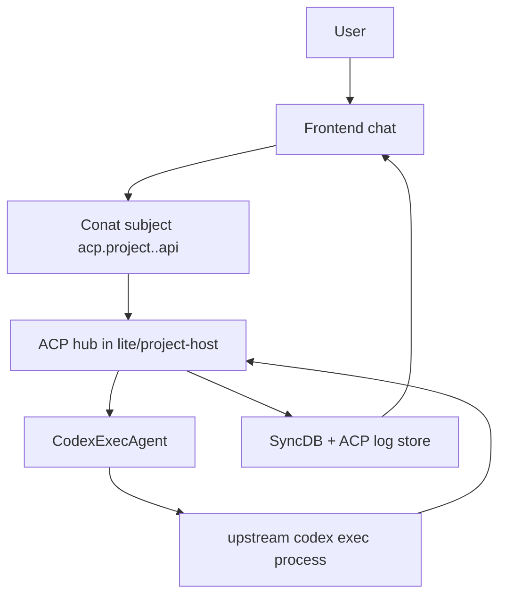

# Agent Architecture in CoCalc

This document explains the current Codex/ACP architecture used by CoCalc.

## Current Model

CoCalc no longer runs a separate `codex-acp` runtime. We run upstream `codex` directly via `codex exec --experimental-json`, and stream events through the ACP chat pipeline.

## High-Level Flow

## Modes

### cocalc-plus (single-user)

- ACP hub runs in-process.
- `CodexExecAgent` can run codex on the local host environment.
- Session persistence and chat logs are written through the same ACP/SyncDB pipeline.

### launchpad / project-host (multi-user)

- ACP hub runs on project-host.
- `CodexExecAgent` uses project-host spawner hooks to run Codex in a podman runtime tied to the target workspace.
- Each Codex runtime is keyed by project and auth context (subscription/project key/account key/site key/shared-home) to isolate collaborator auth state.

## What ACP Handles

ACP here is the request/streaming protocol between frontend and hub:

- evaluate turns
- stream status/output/errors/summary
- interrupt requests
- session fork and replay support

It is not a `codex-acp` tool-call runtime in the current architecture.

## Transport and Persistence

- Request transport: Conat API subjects (`acp.project.<project_id>.api`)
- Streaming: incremental ACP payloads recorded to chat/AKV log stores
- Replay/recovery: queued ACP payload support in lite sqlite

## Security/Isolation Notes

- Users do not get direct shell access to the Codex runtime container.
- Project-host resolves auth per turn and mounts only the selected Codex home/auth context.
- OpenAI keys/subscription files are managed outside normal workspace file access paths.

## Quick References

- ACP hub: [src/packages/lite/hub/acp/index.ts](../src/packages/lite/hub/acp/index.ts)
- Codex exec agent: [src/packages/ai/acp/codex-exec.ts](../src/packages/ai/acp/codex-exec.ts)
- Project-host codex spawner: [src/packages/project-host/codex/codex-project.ts](../src/packages/project-host/codex/codex-project.ts)
- ACP Conat bridge/types: [src/packages/conat/ai/acp](../src/packages/conat/ai/acp)
