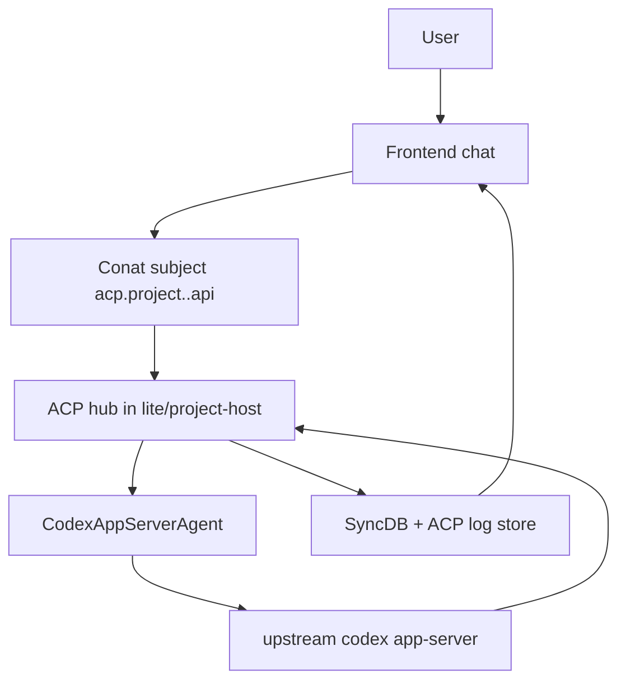

# Agent Architecture in CoCalc

This document explains the current Codex/ACP architecture used by CoCalc.

For the opt-in generic ACP v1 integration, see
[Experimental ACP Harnesses](acp-harnesses.md). The native Codex path described
below remains the default.

## Current Model

CoCalc no longer runs a separate `codex-acp` runtime. We run upstream `codex app-server` directly and stream events through the ACP chat pipeline.

## High-Level Flow

```mermaid
flowchart TB
    U[User] --> F[Frontend chat]
    F --> C[Conat subject acp.project.<project_id>.api]
    C --> H[ACP hub in lite/project-host]
    H --> A[CodexAppServerAgent]
    A --> X[upstream codex app-server]
    X --> H
    H --> S[SyncDB + ACP log store]
    S --> F
```

## Modes

### cocalc-plus (single-user)

- ACP hub runs in-process.
- `CodexAppServerAgent` runs upstream Codex on the local host environment.
- Session persistence and chat logs are written through the same ACP/SyncDB pipeline.

### launchpad / project-host (multi-user)

- ACP hub runs on project-host.
- `CodexAppServerAgent` uses project-host spawner hooks to run Codex in a podman runtime tied to the target workspace.
- Each Codex runtime is keyed by project and auth context (subscription/project key/account key/site key/shared-home) to isolate collaborator auth state.

## What ACP Handles

ACP here is the request/streaming protocol between frontend and hub:

- evaluate turns
- stream status/output/errors/summary
- interrupt requests
- session fork and replay support

It is not a `codex-acp` tool-call runtime in the current architecture.

## Transport and Persistence

- Request transport: Conat API subjects (`acp.project.<project_id>.api`)
- Streaming: incremental ACP payloads recorded to chat/AKV log stores
- Replay/recovery: queued ACP payload support in lite sqlite
- Mid-turn user guidance uses upstream `turn/steer` instead of interrupting and restarting a turn.

## Security/Isolation Notes

### Accepted Agent Network Messages

New sends authenticate the registered sender's live identity run. Once admitted, the
destination project-host stores execution metadata in its trusted ACP queue.
The sender's ordinary shutdown or credential expiry must not invalidate that
already-accepted work.

Queued execution uses a separate internal `checkExecutionNetwork` check. It
routes to the account home for current network/account generations and to the
source project's owner for the recorded run's principal. This historical run
lookup does not authenticate tokens or enable new sends. Current agent status,
collaborator access, account/session revocation, network membership, and the
destination host/conversation are still checked. An unknown or pruned run is
rejected; existing run-history retention bounds how long this provenance is
available.

Only the trusted host-owned queue supplies execution metadata. Chat rows and
message bodies are not admission proofs. External installation authentication
is unchanged. This does not change queue dispatch,
deduplication, or automatically replay failed messages.

This is a hub-side change, with no schema or queue-format migration. For
multi-bay rollout, coordinate updates of participating source-owner, account-home,
and destination-owner hubs: during a mixed-version rollout, an older bay without
the new internal method rejects execution rather than silently relaxing checks.
A rollback restores the original ended-run failure and does
not require reviving credentials or rewriting queued records.

### Runtime Isolation

- Users do not get direct shell access to the Codex runtime container.
- Project-host resolves auth per turn and mounts only the selected Codex home/auth context.
- OpenAI keys/subscription files are managed outside normal workspace file access paths.

## Quick References

- ACP hub: [src/packages/lite/hub/acp/index.ts](../src/packages/lite/hub/acp/index.ts)
- Codex app-server agent: [src/packages/ai/acp/codex-app-server.ts](../src/packages/ai/acp/codex-app-server.ts)
- Project-host codex spawner: [src/packages/project-host/codex/codex-project.ts](../src/packages/project-host/codex/codex-project.ts)
- ACP Conat bridge/types: [src/packages/conat/ai/acp](../src/packages/conat/ai/acp)
