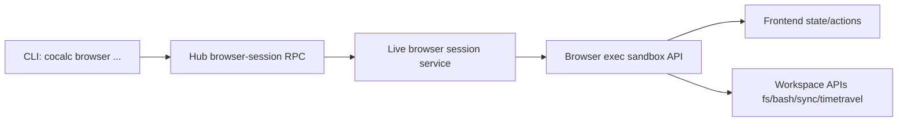
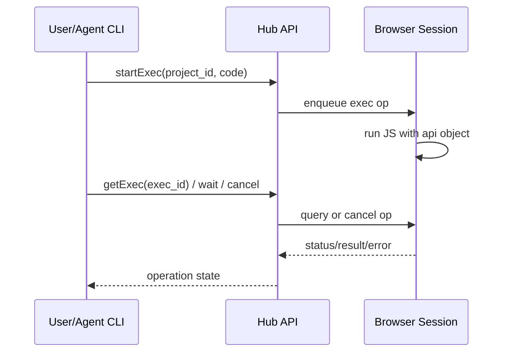
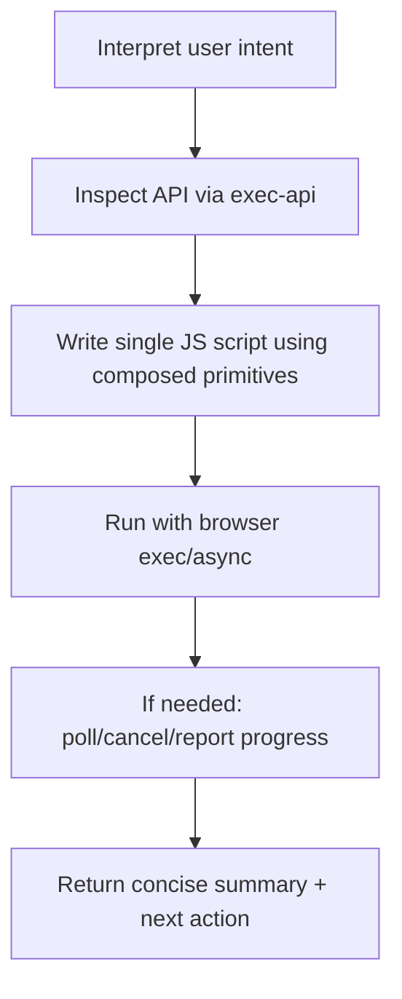

# CoCalc Agentic Browser API

This document captures the current architecture and roadmap for agentic browser automation in CoCalc, aimed at both humans and new Codex sessions continuing development.

## Goals

- Let an agent perform the same practical workflows a user can perform in the browser UI.
- Keep multi-step work composable inside a single `browser exec` script.
- Keep discoverability high via `cocalc browser exec-api` TypeScript declarations.
- Support both product modes:
  - Launchpad (full providers/capabilities)
  - Lite / CoCalc-plus (subset capabilities, same high-level API shape)

## Current Architecture



## Execution Model



## Browser API Status

| Area | Status | Notes |
|---|---|---|
| Session discovery | Implemented | Browser heartbeat + `browser session list/use/clear`. |
| File tab control | Implemented | `listOpenFiles`, `openFiles`, `closeFiles`. |
| Exec API discoverability | Implemented | `browser exec-api` returns TS declaration. |
| Script input modes | Implemented | inline, `--file`, `--stdin`. |
| Async/LRO exec | Implemented | `start/get/wait/cancel` + timeout/polling. |
| Notifications | Implemented | `api.notify.*`. |
| FS API | Implemented | Node-like methods + `find/fd/ripgrep/dust`. |
| Bash API | Implemented | blocking + async job lifecycle. |
| Notebook API | MVP implemented | list/run/set cells. |
| Timetravel providers | Implemented | `patchflow/snapshots/backups/git` list/get primitives. |
| Syncdoc lifecycle | Improved | refcounted direct syncdoc access, no tab dependency. |
| Terminal API | In progress | next major capability set. |

## Capability Shape (Launchpad vs Lite)

| Capability | Launchpad | Lite |
|---|---|---|
| browser sessions | yes | yes |
| exec-api/exec LRO | yes | yes |
| fs + safe search commands | yes | yes |
| bash execution | yes | yes |
| timetravel.patchflow | yes | yes |
| timetravel.snapshots | yes | usually no |
| timetravel.backups | yes | usually no |
| timetravel.git | yes | optional |

Rule: keep one API surface and expose runtime capability checks so scripts can branch cleanly.

## Design Principles

1. Composability over chat round-trips.
2. Absolute paths everywhere.
3. Stable IDs and deterministic output objects.
4. Built-in cancellation/timeout behavior for long workflows.
5. Mode-aware behavior with feature detection, not mode forks.
6. Mutation-friendly with recoverability (snapshots/backups/history).

## Agent Workflow Pattern



## Near-Term Roadmap

### Phase A

- Harden docs and examples (this file + exec-api snippets).
- Add `api.terminal` MVP (list/open split/spawn/write/read/resize/destroy).
- Ensure lite-mode parity for browser subcommands and capability reporting.
- Extend notebook edits (insert/delete/move and kernel/session helpers).

### Phase B

- Add higher-level timetravel helpers: restore/search/summarize.
- Add richer UI interactions (`confirm`, optional modal prompts).
- Add chatroom/course helper APIs.

### Phase C

- Extension/plugin runtime API (register editor/panel/actions).
- Optional exec event streaming for progress and approvals.

## Terminal MVP Target

A practical MVP should enable workflows like:

- Open file + split frame + terminal next to it.
- Spawn/attach to terminal session by stable session path.
- Send commands (`write`) and fetch text (`history`).
- Resize and destroy sessions.
- Enumerate terminal frames currently visible/open in browser editors.

Proposed minimum API shape:

```ts
api.terminal.listOpen(): Promise<TerminalFrameInfo[]>;
api.terminal.openSplit(path, opts?): Promise<TerminalFrameInfo>;
api.terminal.spawn(session_path, opts?): Promise<TerminalSessionInfo>;
api.terminal.write(session_path, data, opts?): Promise<{ ok: true }>;
api.terminal.history(session_path, opts?): Promise<string>;
api.terminal.state(session_path): Promise<"running" | "off">;
api.terminal.resize(session_path, { rows, cols }): Promise<{ ok: true }>;
api.terminal.destroy(session_path): Promise<{ ok: true }>;
```

## Notes for New Codex Sessions

- Start from `browser exec-api` output before coding scripts.
- Prefer one composed `browser exec` script over many CLI round-trips.
- Use feature detection for provider-specific behavior.
- Keep scripts idempotent when possible.
- For expensive history/sync analysis, reuse session-scoped resources and release them in cleanup.

## Key Source Files

- Browser session automation runtime: [src/packages/frontend/conat/browser-session.ts](../src/packages/frontend/conat/browser-session.ts)
- Browser CLI commands: [src/packages/cli/src/bin/commands/browser.ts](../src/packages/cli/src/bin/commands/browser.ts)
- Ongoing implementation plan: [src/.agents/cocalc-cli.md](../src/.agents/cocalc-cli.md)
- Terminal conat client/server: [src/packages/conat/project/terminal/index.ts](../src/packages/conat/project/terminal/index.ts)
- Terminal frontend editor behavior: [src/packages/frontend/frame-editors/terminal-editor](../src/packages/frontend/frame-editors/terminal-editor)
