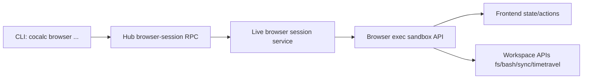
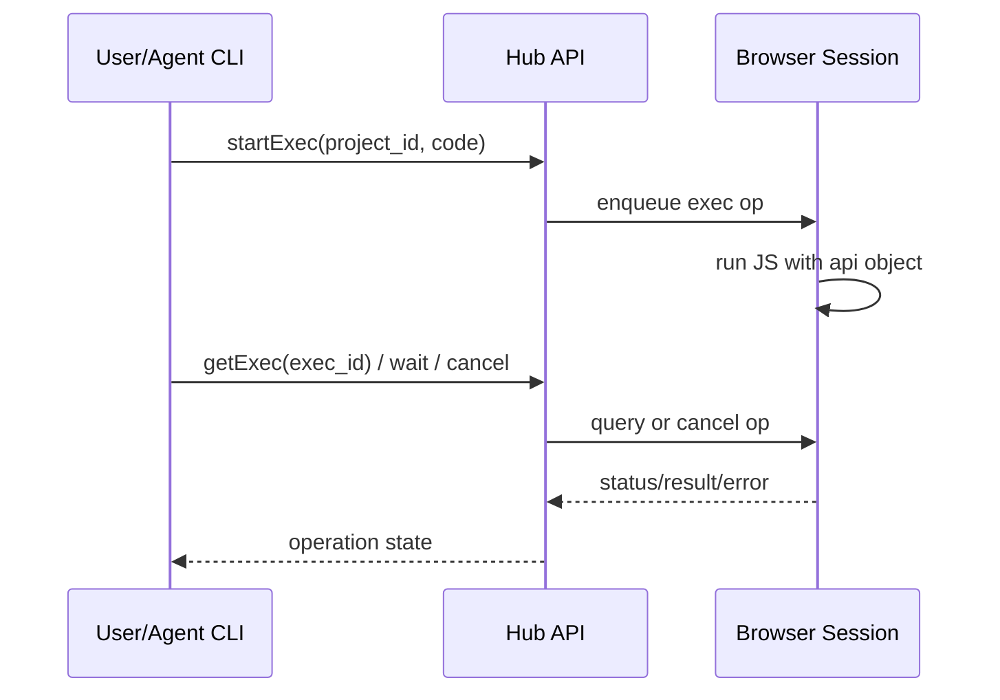
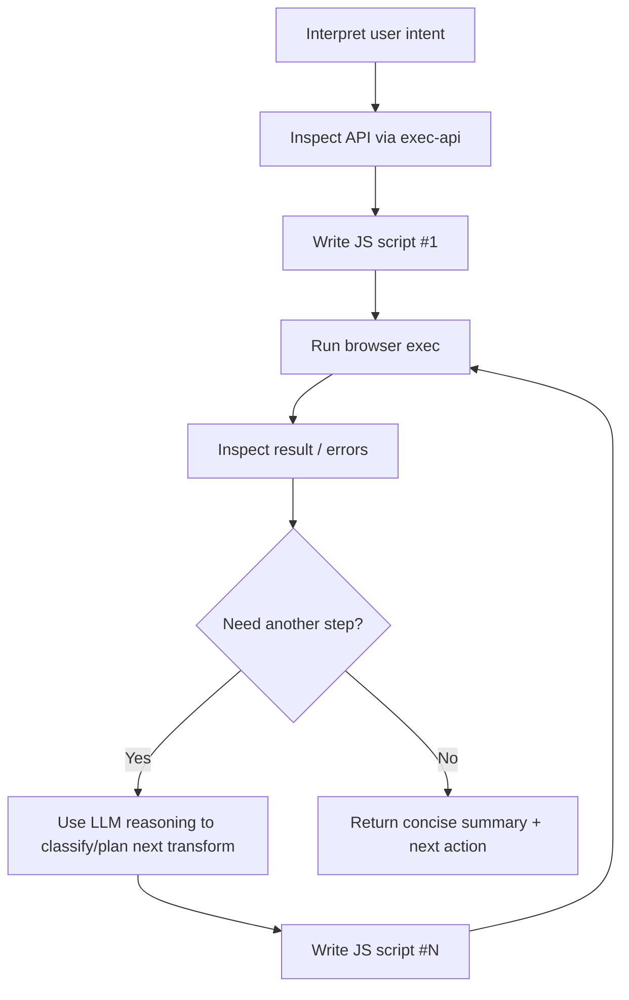

# CoCalc Agentic Browser API

This document describes the agentic browser API architecture and how to discover the capabilities of a running CoCalc instance.

## Goals

- Let an agent perform the same practical workflows a user can perform in the browser UI.
- Keep multi-step work composable inside a single `browser exec` script.
- Keep discoverability high via `cocalc browser exec-api` TypeScript declarations.
- Support both product modes:
  - Launchpad (full providers/capabilities)
  - Lite / CoCalc-plus (subset capabilities, same high-level API shape)

## Current Architecture


```mermaid
flowchart LR
  A[CLI: cocalc browser ...] --> B[Hub browser-session RPC]
  B --> C[Live browser session service]
  C --> D[Browser exec sandbox API]
  D --> E[Frontend state/actions]
  D --> F[Workspace APIs fs/bash/sync/timetravel]
```

## Execution Model


```mermaid
sequenceDiagram
  participant U as User/Agent CLI
  participant H as Hub API
  participant B as Browser Session

  U->>H: startExec(project_id, code)
  H->>B: enqueue exec op
  B->>B: run JS with api object
  U->>H: getExec(exec_id) / wait / cancel
  H->>B: query or cancel op
  B-->>H: status/result/error
  H-->>U: operation state
```

## Browser API Status

The namespace entries below describe the rich execution API; their availability
depends on the policy described in [Discover The Current Surface](#discover-the-current-surface).

| Area                     | Status          | Notes                                                         |
| ------------------------ | --------------- | ------------------------------------------------------------- |
| Session discovery        | Implemented     | Browser heartbeat + `browser session list/use/clear`.         |
| File tab control         | Implemented     | `listOpenFiles`, `openFiles`, `closeFiles`.                   |
| Exec API discoverability | Implemented     | `browser exec-api` returns TS declaration.                    |
| Script input modes       | Implemented     | inline, `--file`, `--stdin`.                                  |
| Async/LRO exec           | Implemented     | `start/get/wait/cancel` + timeout/polling.                    |
| Notifications            | Implemented     | `api.notify.*`.                                               |
| FS API                   | Implemented     | Node-like methods + `find/fd/ripgrep/dust`.                   |
| Bash API                 | Implemented     | blocking + async job lifecycle.                               |
| Notebook API             | MVP implemented | list/run/set cells.                                           |
| Timetravel providers     | Implemented     | `patchflow/snapshots/backups/git` list/get primitives.        |
| Syncdoc lifecycle        | Improved        | refcounted direct syncdoc access, no tab dependency.          |
| Terminal API             | MVP implemented | list/openSplit/spawn/write/history/state/cwd/resize/destroy.  |
| Extensions API           | MVP implemented | session-scoped `api.extensions` with hello-world editor demo. |

## Capability Shape (Launchpad vs Lite)

| Capability                | Launchpad | Lite |
| ------------------------- | --------- | ---- |
| browser sessions          | yes       | yes  |
| exec-api/exec LRO         | yes       | yes  |
| fs + safe search commands | yes       | yes  |
| bash execution            | yes       | yes  |
| timetravel.patchflow      | yes       | yes  |
| timetravel.snapshots      | yes       | yes  |
| timetravel.backups        | yes       | no   |
| timetravel.git            | yes       | yes  |

Provider entries describe advertised support; they do not guarantee that
history exists for a particular file or project. Access to the rich execution
namespaces also depends on browser-session and caller policy, as described below.

Rule: keep one API surface and expose runtime capability checks so scripts can branch cleanly.

## Design Principles

1. Composability over chat round-trips.
2. Absolute paths everywhere.
3. Stable IDs and deterministic output objects.
4. Built-in cancellation/timeout behavior for long workflows.
5. Mode-aware behavior with feature detection, not mode forks.
6. Mutation-friendly with recoverability (snapshots/backups/history).

## Agent Workflow Pattern


```mermaid
flowchart TD
  A[Interpret user intent] --> B[Inspect API via exec-api]
  B --> C[Write JS script #1]
  C --> D[Run browser exec]
  D --> E[Inspect result / errors]
  E --> F{Need another step?}
  F -->|Yes| G[Use LLM reasoning to classify/plan next transform]
  G --> H[Write JS script #N]
  H --> D
  F -->|No| I[Return concise summary + next action]
```

Notes:

- A single user turn can involve multiple `browser exec` calls.
- Common pattern: gather raw data with exec, classify/summarize in the LLM, then run another exec to materialize reports/edits/UI changes.
- Optimize for minimum round-trips, not strictly one round-trip.

## Discover The Current Surface

Read `cocalc browser exec-api` for the selected browser session before writing
a script, and follow its returned declaration for method names and argument
shapes. The rich terminal, extension, notebook, filesystem, Bash and timetravel
namespaces described here require raw execution to be permitted by the session
and caller policy. Otherwise, `browser exec` exposes the constrained QuickJS
action API: calls are synchronous from the script's point of view, and
top-level `await` is unsupported. Receiving a rich declaration does not itself
grant execution permission.

The rich terminal and session-scoped extension APIs are implemented.
`api.extensions` currently exposes `list`, `installHelloWorld`, and `uninstall`.
This is a small session extension surface, not a general package marketplace.

The rich browser notebook surface provides `listCells`, `runCells`, and
`setCells`. For broader live notebook operations, including insertion, movement
and deletion, inspect `cocalc project jupyter -h` and
`cocalc project jupyter exec-api` instead.

Choose the backend document API when the operation does not need a browser.
Use browser exec for visible tabs, splits, selection and other session context.
When the rich API is available, inspect `api.timetravel.providers()` before
choosing a history source, then check whether that provider has history for
the target file or project.

The earlier phased roadmap mixed implemented capabilities with proposals.
Future work must be checked against current source before being described as
available. See [browser debugging](browser-debugging.md) for session targeting
and [the CoCalc skill](../src/packages/cli/skills/cocalc/SKILL.md) for the backend
and browser decision order.

## Terminal API (Rich Execution)

When raw execution is permitted, the rich terminal API supports workflows such as:

- Open file + split frame + terminal next to it.
- Spawn/attach to terminal session by stable session path.
- Send commands (`write`) and fetch text (`history`).
- Resize and destroy sessions.
- Enumerate terminal frames currently visible/open in browser editors.

Rich terminal API shape; check the selected session's returned declaration:

```ts
api.terminal.listOpen(): Promise<TerminalFrameInfo[]>;
api.terminal.openSplit(path, opts?): Promise<TerminalFrameInfo>;
api.terminal.spawn(session_path, opts?): Promise<TerminalSessionInfo>;
api.terminal.write(session_path, data, opts?): Promise<{ ok: true }>;
api.terminal.history(session_path, opts?): Promise<string>;
api.terminal.state(session_path): Promise<"running" | "off">;
api.terminal.resize(session_path, { rows, cols }): Promise<{ ok: true }>;
api.terminal.destroy(session_path): Promise<{ ok: true }>;
```

## Notes for New Codex Sessions

- Start from `browser exec-api` output before coding scripts.
- Prefer as few `browser exec` calls as practical, but use multiple calls in one turn when analysis/iteration improves quality.
- Use feature detection for provider-specific behavior.
- Keep scripts idempotent when possible.
- For expensive history/sync analysis, reuse session-scoped resources and release them in cleanup.

## Key Source Files

- Browser session automation runtime: [src/packages/frontend/conat/browser-session.ts](../src/packages/frontend/conat/browser-session.ts)
- Browser CLI commands: [src/packages/cli/src/bin/commands/browser.ts](../src/packages/cli/src/bin/commands/browser.ts)
- Ongoing implementation plan: [src/.agents/cocalc-cli.md](../src/.agents/cocalc-cli.md)
- Terminal conat client/server: [src/packages/conat/project/terminal/index.ts](../src/packages/conat/project/terminal/index.ts)
- Terminal frontend editor behavior: [src/packages/frontend/frame-editors/terminal-editor](../src/packages/frontend/frame-editors/terminal-editor)
