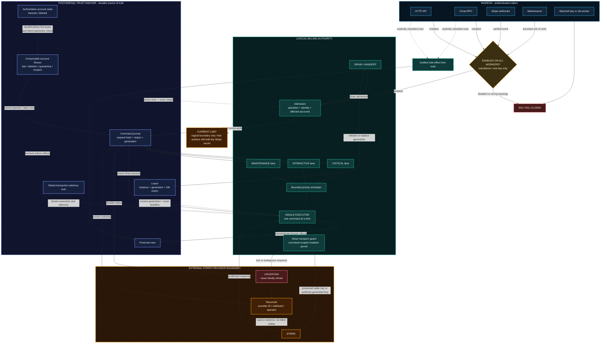
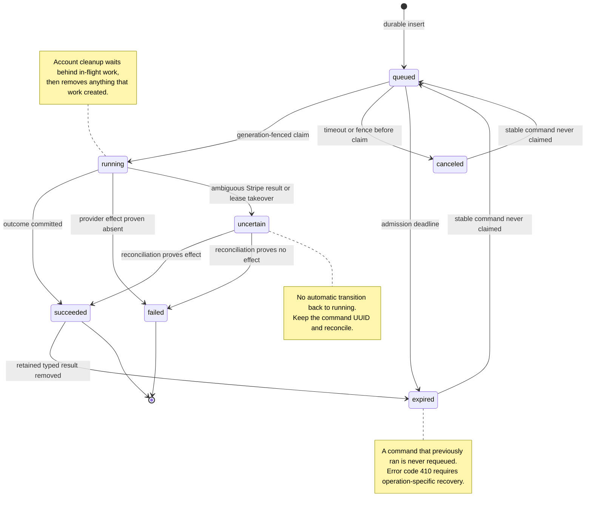

# Billing Authority

CoCalc routes low-volume financial control operations through one logical
billing authority. The authority is deliberately simpler than a distributed
financial system: one PostgreSQL database owns a durable command journal and
exactly one Hub worker executes commands at a time.

The initial deployment supports a standalone installation or the seed bay of
a one-bay hosted deployment. Attached bays fail closed until CoCalc has a
dedicated, narrowly authenticated authority transport. A generic inter-bay Hub
RPC is intentionally not used because the current shared Hub identity is too
broad for a financial mutation boundary.

The authority is default-off. It is activated only when every relevant worker
starts with `COCALC_BILLING_AUTHORITY_ENABLED=1`; deploying the code or schema
alone does not alter billing execution.

## Architecture Review Map

The diagram below separates authenticated ingress, the logical authority,
durable PostgreSQL state, and the external Stripe provider. Solid arrows are
mutation or state-transition paths. Dotted arrows are checks or explicitly
audited read-only paths.

The external Stripe call and the PostgreSQL transaction are intentionally not
presented as atomic. A response that does not prove whether Stripe accepted a
write ends in `uncertain`; reconciliation observes provider state rather than
automatically issuing another write.

### Suggested Review Order

| Invariant                                                                  | Primary implementation                                                                                                                                                       |
| -------------------------------------------------------------------------- | ---------------------------------------------------------------------------------------------------------------------------------------------------------------------------- |
| Activation is explicit and unsupported topologies fail closed              | [`config.ts`](../src/packages/server/purchases/billing-authority/config.ts), [`client.ts`](../src/packages/server/purchases/billing-authority/client.ts)                     |
| Command identity, lifecycle, lanes, and bounded result protocol are stable | [`protocol.ts`](../src/packages/server/purchases/billing-authority/protocol.ts), [`classification.ts`](../src/packages/server/purchases/billing-authority/classification.ts) |
| A command is durable before execution and terminal transitions are fenced  | [`store.ts`](../src/packages/server/purchases/billing-authority/store.ts)                                                                                                    |
| Exactly one current lease generation can execute or complete a command     | [`service.ts`](../src/packages/server/purchases/billing-authority/service.ts), [`store.ts`](../src/packages/server/purchases/billing-authority/store.ts)                     |
| Every operation reaches the centralized dispatcher                         | [`dispatch.ts`](../src/packages/server/purchases/billing-authority/dispatch.ts)                                                                                              |
| Stripe writes require authority context and deterministic idempotency      | [`context.ts`](../src/packages/server/purchases/billing-authority/context.ts), [`connection.ts`](../src/packages/server/stripe/connection.ts)                                |
| Actor and target freezes compose without one cause clearing another        | [`store.ts`](../src/packages/server/purchases/billing-authority/store.ts), [`billing-authority.ts`](../src/packages/util/db-schema/billing-authority.ts)                     |
| Drain and handoff close admission before lease replacement                 | [`service.ts`](../src/packages/server/purchases/billing-authority/service.ts)                                                                                                |

The most important remaining boundary limitation is explicit in the diagram:
this PR creates one logical authority inside the trusted Hub deployment, but it
does not yet isolate the Stripe secret or financial write role in a separate
process identity.

## Scope

Commands include:

- Stripe customer, payment-method, setup, invoice, payment, refund, checkout,
  and subscription mutations;
- purchase, credit, membership subscription, package, team-license, site
  license, and commercial-order control operations;
- verified Stripe webhook processing and provider reconciliation;
- automatic payment, auto-balance, statement, subscription, payment-intent,
  and team-license maintenance;
- legacy-migration credit and membership-renewal changes; and
- account deletion and abuse-quarantine cleanup in Stripe.

High-volume project usage metering remains an append-oriented data-plane path.
It does not possess Stripe credentials or perform external collection.

Explicitly reviewed side-effect-free local billing reads execute directly and
do not enter the journal. Stripe-facing HTTP operations remain serialized
because customer lookup can recover a missing PostgreSQL mapping. Unknown Hub
methods are rejected before authority admission; known operations default to
commands unless explicitly reviewed as reads. `getBalance` uses
`noSave: true`, so a concurrent read cannot overwrite the authoritative cached
balance. A read that unexpectedly attempts a Stripe mutation is rejected by
the Stripe transport guard.

## Durable Command Journal

`billing_authority_commands` records every command before execution. A command
has a UUID, canonical request hash, operation, scheduling lane, affected and
actor account identities, expiry, lifecycle state, execution generation,
bounded result or error, and timestamps. Sensitive command and result payloads
are removed after 48 hours; operation, request hash, account identities, status,
generation, error, and timestamps are retained for 400 days. A succeeded
command whose typed result expires becomes an explicit `expired` outcome with a
`410 billing_authority_result_expired` error. It is never returned as a
fabricated successful `null` result and is never re-executed. Successful Stripe
webhook receipts retain their minimal result so provider retries remain valid.

The lifecycle is:

1. `queued`
2. `running`
3. one of `succeeded`, `failed`, `canceled`, `expired`, or `uncertain`

Every transition into a terminal state atomically records `finished_at` and a
bounded error when the command did not succeed. This keeps health accounting,
payload redaction, and eventual audit-row retention on the same lifecycle
invariant.

Submitting the same UUID and command is an idempotent status lookup. Reusing a
UUID with different input is rejected. Provider events and commands carrying
an explicit idempotency key derive stable UUIDs namespaced by protocol version,
operation, affected accounts, and actor. Unkeyed commands receive random UUIDs:
equal financial operations are not duplicates merely because their payloads
match. Semantic coalescing is explicit, opt-in, and can reuse only currently
queued or running work. A canceled or expired stable command that was never
claimed can be requeued from the newly validated request; anything that started
is never replayed automatically.
Every uncertain-outcome error exposes the authoritative command UUID through
HTTP and Conat so an operator or caller can inspect that exact command rather
than blindly retry it.

Queued commands have bounded admission by lane: critical, interactive, and
maintenance. Critical work is claimed first, then interactive work, then
maintenance. A caller timeout atomically cancels work that is still queued. If
execution already started, the client reports an explicit uncertain outcome
and command UUID; it never pretends cancellation succeeded and never silently
submits a replacement.

Only one command executes at a time. Fleet maintenance commands process at
most one customer, statement, renewal, notification, license, payment intent,
commercial event, commercial invoice, or commercial quote per journal entry.
Commercial work durably rotates among event, invoice, and quote units every ten
seconds, so one busy class cannot starve another. Its scheduler lease is
renewed while an authority command is queued or running. This prevents an
unbounded maintenance scan from holding the authority while payments wait
without allowing overlapping schedulers during a queue delay. Health and
command-status reads query PostgreSQL directly and therefore cannot be blocked
by command admission or consume command slots.

## Lease And Fencing

`billing_authority_lease` is a singleton database-clock lease. It contains a
random process instance UUID, monotonically increasing generation, expiry,
enabled state, and drain state.

The elected worker renews a 12-second PostgreSQL lease every two seconds over a
dedicated UTC PostgreSQL session and also maintains an earlier monotonic local
deadline. If renewal becomes ambiguous or the local deadline expires, the
worker fail-stops and destroys that session. Timed-out election queries are
also canceled by destroying their dedicated connection, so they cannot acquire
a ghost lease later. Stored health reports readiness only after the elected
process marks its locally active lease as serving.

Every command opens a dedicated database transaction, validates its generation,
and holds a global transaction-scoped advisory lock until its journal outcome
is committed. Lease takeover requires the same lock. Thus a replacement cannot
become authority while an old financial command can still commit database work.
Each Stripe mutation also performs a fresh lease assertion before network I/O.
A stale worker therefore cannot overlap a successor even if it retained
asynchronous execution context.

The purchase and credit ledger primitives additionally require the account to
have been checked at claim time or dynamically registered by the active
command. Direct financial-ledger execution also fails once the authority gate
is enabled; high-volume dedicated-host metering is the explicit exception.
This assertion uses the authority's dedicated lease session rather than
another application-pool connection, so it fails closed without creating a
transaction/pool lock inversion.

Command completion is also generation-fenced. On takeover, any `running`
command from another instance or generation becomes `uncertain`; it is never
automatically replayed. Detached asynchronous work loses its mutation permit
as soon as the parent command returns.

This does not make Stripe and PostgreSQL one atomic transaction. At the HTTP
transport boundary, an existing nonempty Stripe idempotency key is preserved
verbatim so operations remain continuous across authority activation. A write
without a key receives a deterministic authority-command-scoped key. Lost
responses and failures after a successful provider mutation are recorded as
`uncertain`, not ordinary retryable failures. Durable provider identifiers,
webhook handling, and domain-specific reconciliation remain necessary for
failures between the two systems.

## Account Fences

`billing_authority_account_fences` provides a monotonic per-account freeze with
independent keyed causes for bans, deletion, quarantine, incident response, and
operator action. Removing one cause cannot clear another. Commands durably
index both actors and affected accounts; provider-resolved accounts are added
and checked before mutation. Deletion, abuse quarantine, and equivalent
containment freeze billing before cleanup is queued. Freezing cancels all
queued ordinary commands involving that actor or target and rejects new ones.
Cleanup commands are the narrow exception for their target, never for a frozen
actor.

Before acquiring the first lease, candidates cooperatively backfill fences from
the authoritative `accounts.banned` and `accounts.deleted` state in bounded,
committed batches. A durable migration cursor survives worker restart. A final
locked verification records completion only after no restricted account is
missing its corresponding cause; later lease acquisition checks only that
indexed completion marker. New admission, dynamic account registration, and
command claim also check the authoritative account row directly. Provider
objects and stored commercial orders register any account discovered during
execution before provider or financial-database mutation. Thus an account
restricted before feature activation cannot slip through an empty new fence
table, and a missed event is defense in depth rather than the sole security
control.

An already-running command completes before the serialized cleanup command can
run. This ordering lets cleanup remove resources created by that in-flight
command. Fleet maintenance rechecks frozen, banned, and deleted accounts when
it selects each bounded unit of work. Ordinary commands cannot be inserted
between freeze and cleanup. Unfreezing is an explicit lifecycle operation.

## Readiness And Lifecycle

The admin system API exposes authority status from PostgreSQL:

- lease instance, generation, and expiry;
- ready, enabled, and draining state;
- active command UUID;
- queue depth by lane; and
- 24-hour success and failure counts.

Global lifecycle mutations require administrator authorization, fresh
authentication, and a second factor when enabled:

- `drainBillingAuthority` disables admission, prevents new claims, waits for
  the active command, and releases the lease;
- `resumeBillingAuthority` re-enables election and waits for readiness; and
- `handoffBillingAuthority` drains, excludes the departing holder, resumes, and
  verifies a newer generation owned by a different process.

If a holder dies after drain starts, the drain path atomically clears the
expired holder and records its running command as `uncertain`. Drain therefore
cannot wait forever on a dead process. These APIs provide an enforceable
cutover and rollback gate rather than relying on timing or log inspection.

## Initial Rollout

Old workers can still execute financial code directly, so the first authority
activation is a coordinated cutover, not a rolling deployment.

1. Deploy the containment and authority code with
   `COCALC_BILLING_AUTHORITY_ENABLED` unset. Confirm legacy billing remains
   healthy and the new schema converged everywhere.
2. Confirm the deployment is standalone/one-bay and that no attached bay or old
   binary can write the financial database. Do not activate on multibay.
3. Disable externally initiated billing and automatic billing maintenance.
4. Stop every old Hub and HTTP worker.
5. Set `COCALC_BILLING_AUTHORITY_ENABLED=1` for every replacement worker and
   start only the authority-enabled release on the authoritative bay.
6. Confirm status is `ready`, exactly one serving lease exists, and queue depth
   is bounded before reopening billing.
7. Smoke-test read-only billing, setup-intent creation, a test-mode payment,
   webhook fulfillment, cancellation, refund authorization, and commercial
   diagnostics.
8. Re-enable automatic maintenance and user billing.

Rollback uses the same gate: disable new billing, drain the authority, stop all
authority-enabled workers, unset the flag, start the prior release, then
deliberately restore billing. Never run old and authority-enabled workers
concurrently.

There is no financial-data migration for the current one-bay production
deployment. It continues using the existing authoritative PostgreSQL database
and Stripe account.

Commercial maintenance submits one bounded financial work item per authority
command and rotates durably among Stripe events, invoices, and quotes. The
fleet-wide diagnostics scan runs afterward under the scheduler lease, outside
the serialized authority queue. This keeps observability from consuming the
financial fail-stop watchdog or blocking payment and webhook commands.

## Self-Hosted Deployments

A standalone installation can opt into the same durable authority by setting
the activation flag for every Hub/HTTP worker. It requires PostgreSQL but no
cloud-specific queue, lock service, or extra daemon. If PostgreSQL or the
authority is unavailable after activation, billing fails closed while unrelated
product functionality can continue.

Operators must configure Stripe webhooks and alerting. Reconciliation is
defense in depth, not a substitute for delivery. Scripts that mutate Stripe
directly are intentionally blocked once enforcement starts; they must use a
reviewed authority command instead of disabling the guard.

## Multibay And Physical Isolation

Public billing entry points and known inter-bay financial writers enter this
authority boundary, but attached bays currently receive `503` for all billing
calls, including reads.
Do not enable multibay billing until all of the following exist:

- one designated global financial database and authority;
- a dedicated authenticated transport whose credential cannot invoke general
  Hub operations;
- account and project ownership attestations appropriate to each command; and
- tests proving no attached-bay legacy writer bypasses the authority.

This version is a logical authority inside the trusted Hub deployment. Hub
workers can still read the Stripe secret, although normal Stripe mutation paths
are guarded. The next trust-boundary improvement is to run the executor as a
separately supervised service, give only it the Stripe secret and financial
database write role, authenticate callers with a narrow workload identity, and
export the retained journal and provider events to immutable external storage.
