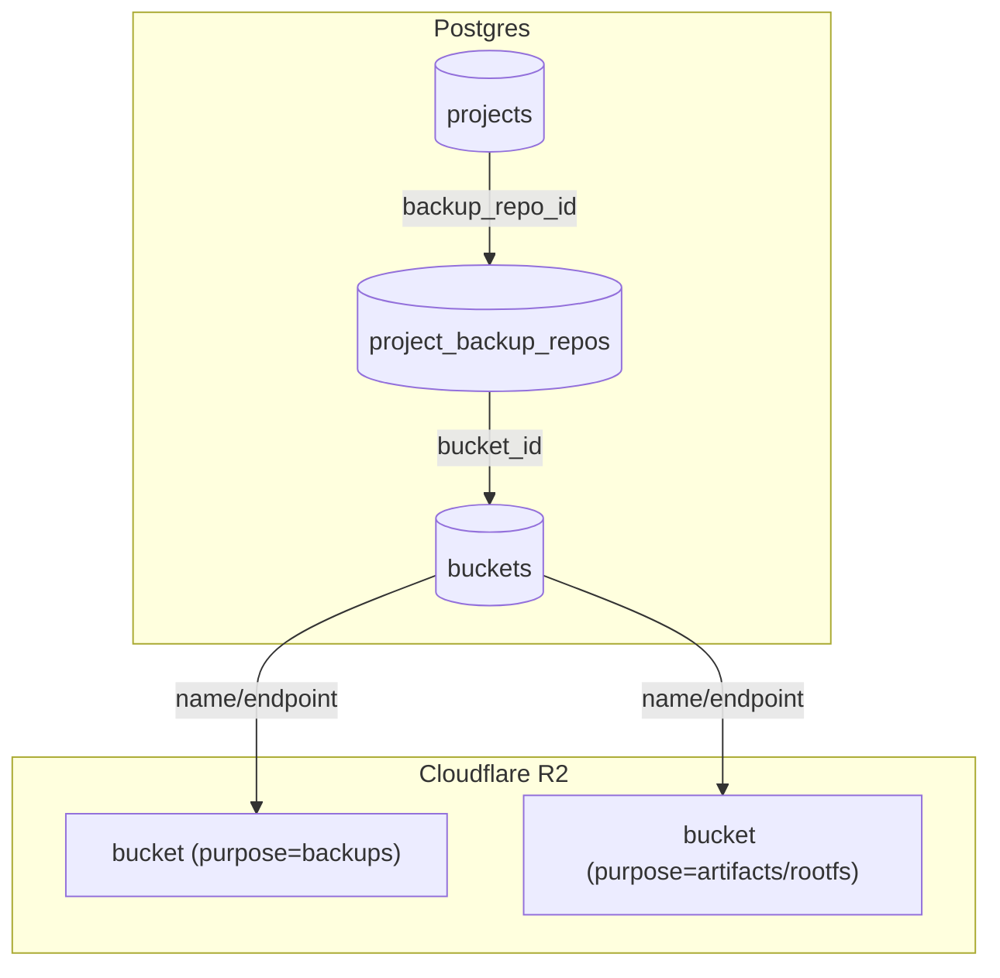

# Buckets Architecture

This document defines how CoCalc uses object storage buckets (Cloudflare R2) for
backups and artifacts. It is designed to be safe, auditable, and flexible for
future providers.

## Goals

- Backups are **region-aware** and can move from one shared repo per region to multiple shards later without changing lookup semantics.
- Bucket placement is **region\-aware** but **stable** once assigned.
- Bucket and repo selection are **explicit** and recorded in the database.
- Artifacts \(software, rootfs\) are **separate** from backups.
- Future migrations are possible but **never implicit**.

## Key Principles

- **DB-assigned repo membership**: each project is assigned to a repo row in Postgres, not by a hash function.
- **Bucket registry**: buckets are tracked in a `buckets` table with a purpose field.
- **First\-use creation**: buckets and the initial shared repo row are created automatically only when a region is used.
- **No silent switches**: once a project is bound to a bucket, it stays unless
  a deliberate migration is performed.

## Architecture Diagram

## Data Model

`buckets` table (generic registry):

- `id` (primary key)
- `purpose` (`backups`, `artifacts`, `rootfs`, `logs`, ...)
- `provider` (`r2`, later others)
- `account_id` (provider account)
- `region` (wnam/enam/weur/eeur/apac/oc)
- `location` (reported by provider, if available)
- `name`, `endpoint`
- `status` (active, mismatch, unknown, disabled)
- timestamps

`project_backup_repos`:

- `id`
- `region`
- `bucket_id`
- `root`
- `secret`
- `status`
- timestamps

`projects.backup_repo_id`:

- Set for projects using the shared-repo model.
- Points at the repo row that owns future backups for that project.

## Backup Flow (shared repo)

1. On first backup, select a bucket for the project:
   - Prefer region-matched bucket.
   - Create bucket if missing (using location hint).
   - Verify actual location and record in `buckets`.
2. Create or select an active `project_backup_repos` row for that region.
3. Assign:
   - `projects.backup_repo_id`
4. Rustic uses:
   - `bucket` = bucket name
   - `root` = repo row root, e.g. `rustic/shared-wnam-0001`
   - `password` = repo row secret

Current operational policy:

- Each region auto-creates one active shared repo on first use.
- If we later add more active repo rows, the hub assigns new projects to the least-loaded active repo.
- Existing assigned projects stay on their current repo unless explicitly migrated.

## Artifact Flow (software, rootfs)

- Artifacts use **separate buckets** with `purpose=artifacts` or `rootfs`.
- These are shared and cacheable; no per-project secrets.
- Region selection is independent of backups.

## Location & Stickiness

Cloudflare R2 location hints are **best-effort** and **sticky by bucket name**.
If a bucket name is reused, the original location will be reused. For that
reason:

- Use new bucket names if the first placement is wrong.
- Record actual location in `buckets.location`.
- Do not silently switch a bucket for an existing region.

## Deletion & Compliance

Project deletion forgets only that project's snapshots from the shared repo.
It does **not** delete the whole rustic repo. Actual blob cleanup happens later
through repo-wide prune/maintenance.

This means:

- We no longer rely on per-project crypto-erase semantics.
- Compliance-focused deletion depends on forgetting the project's snapshots and
  conservative delayed prune policy.
- If stronger deletion guarantees are required later, they must be designed at
  the repo/shard level rather than by claiming independent per-project keys.

## Migration (Future)

Migration requires an explicit admin action:

- Reassign new projects to a different active repo row, or
- Copy/restore repo contents to a new bucket/root
- Verify restore works
- Update `projects.backup_repo_id`
- Optionally deprecate old bucket

This is intentionally not automatic.

## Provider Extensibility

The `buckets` table is provider-agnostic. This design allows future use of any
S3-compatible provider (e.g., B2, MinIO, or another object store) without
changing project-level wiring. Only a provider-specific API adapter and config
builder would be needed.

## TODO

- Admin UI: add a Buckets panel in `/admin` showing configured buckets, status,
  actual location, and project counts.
- Add admin controls for `project_backup_repos` so new shards can be created and
  old ones marked non-active for future assignments.
