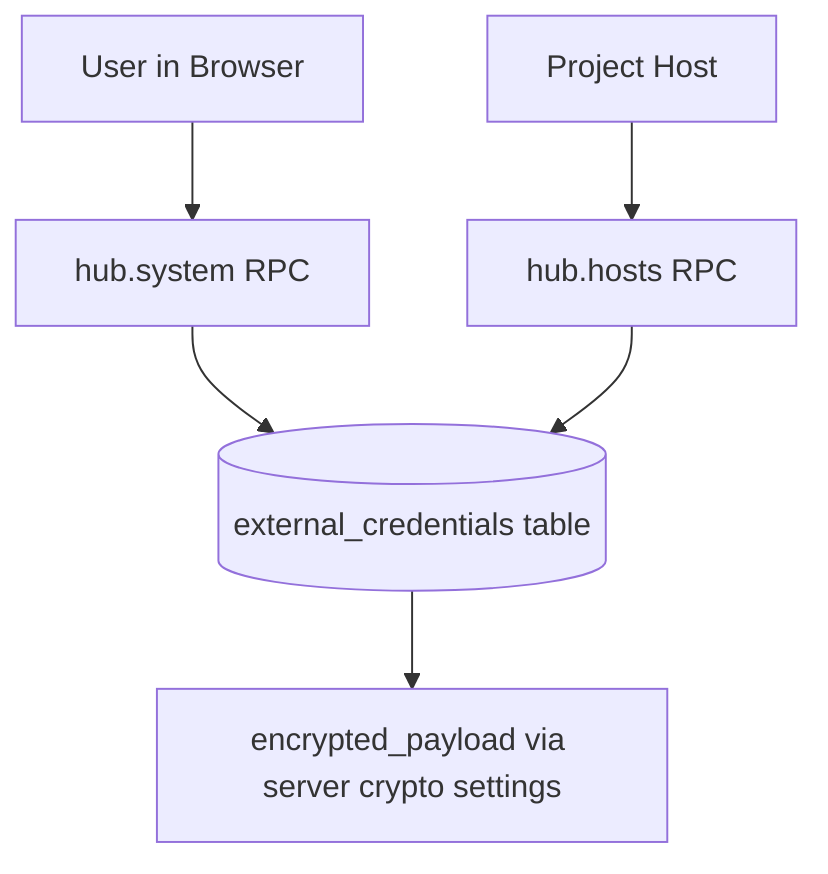
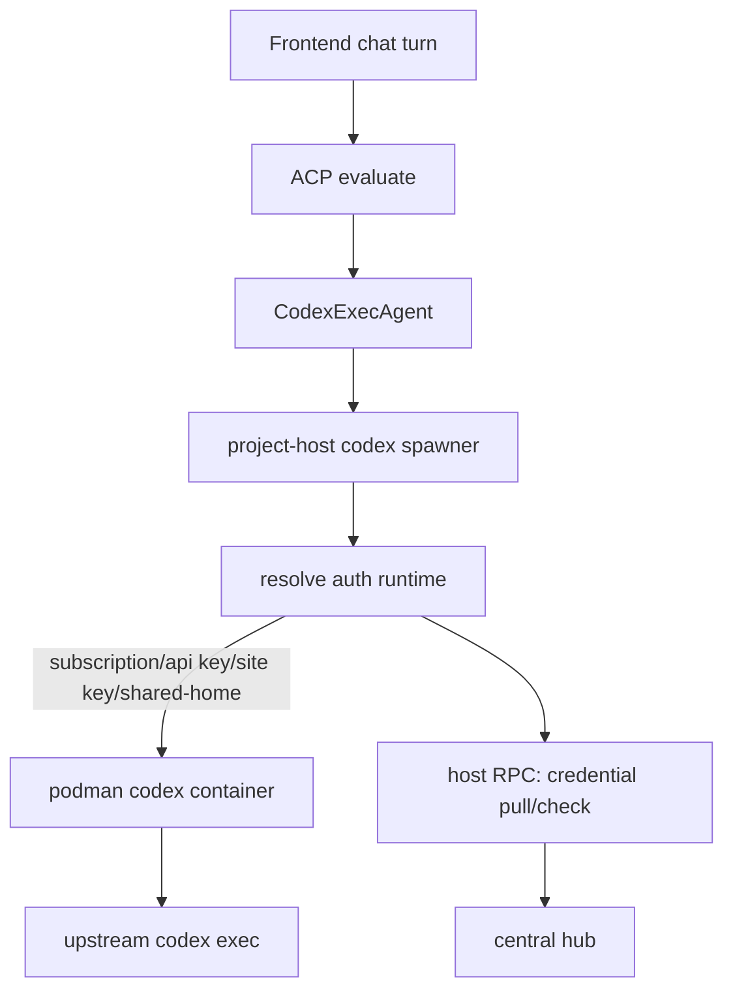

# Codex Auth Architecture

This document describes how Codex authentication currently works in CoCalc, in both cocalc-plus and launchpad/project-host deployments.

## Scope

This covers:

- Auth source resolution for Codex turns
- Credential storage and replication
- Project-host runtime materialization
- Site-key metering/throttling checks

This does not cover:

- A site-key proxy architecture (possible future work)

## Current Auth Sources and Precedence

For each Codex turn, project-host resolves auth in this order:

1. ChatGPT subscription (`subscription`)
2. Workspace OpenAI API key (`project-api-key`)
3. Account OpenAI API key (`account-api-key`)
4. Site OpenAI API key (`site-api-key`)
5. Shared `~/.codex` fallback (`shared-home`) only when explicitly enabled

Launchpad default:

- shared-home auth is disabled by default (`COCALC_PRODUCT=launchpad`)
- this avoids accidental collaborator auth leakage from workspace `~/.codex/auth.json`

Resolution code:

- [src/packages/project-host/codex/codex-auth.ts](../src/packages/project-host/codex/codex-auth.ts)

## Global Architecture (Hub + DB)

The central hub stores external credentials encrypted at rest, and exposes two API surfaces:

- User-facing system RPCs for settings UI (`hub.system.*`)
- Host-facing RPCs for project-hosts (`hub.hosts.*`)

Primary server modules:

- [src/packages/server/conat/api/system.ts](../src/packages/server/conat/api/system.ts)
- [src/packages/server/conat/api/hosts.ts](../src/packages/server/conat/api/hosts.ts)
- [src/packages/server/external-credentials/store.ts](../src/packages/server/external-credentials/store.ts)

## Local Runtime Architecture (Project Host)

Project-host resolves auth at turn start, then runs upstream `codex` inside a per-project/per-auth-context podman runtime.

Key modules:

- [src/packages/ai/acp/codex-exec.ts](../src/packages/ai/acp/codex-exec.ts)
- [src/packages/project-host/codex/codex-project.ts](../src/packages/project-host/codex/codex-project.ts)
- [src/packages/project-host/codex/codex-auth.ts](../src/packages/project-host/codex/codex-auth.ts)
- [src/packages/project-host/codex/codex-auth-registry.ts](../src/packages/project-host/codex/codex-auth-registry.ts)

## Credential Lifecycle

### ChatGPT subscription auth

Two supported paths:

1. Device auth from project-host runtime (`codex login --device-auth`)
2. Fallback upload of `auth.json` generated on user machine

Project-host handlers:

- [src/packages/project-host/hub/projects.ts](../src/packages/project-host/hub/projects.ts)
- [src/packages/project-host/codex/codex-device-auth.ts](../src/packages/project-host/codex/codex-device-auth.ts)

Frontend controls:

- [src/packages/frontend/chat/codex.tsx](../src/packages/frontend/chat/codex.tsx)

### OpenAI API keys (account/workspace)

Managed in account settings UI and stored as external credentials:

- [src/packages/frontend/account/codex-credentials-panel.tsx](../src/packages/frontend/account/codex-credentials-panel.tsx)
- [src/packages/server/conat/api/system.ts](../src/packages/server/conat/api/system.ts)

## Where Data Lives

### Central (authoritative)

- `external_credentials.encrypted_payload` in Postgres
- encrypted/decrypted by server credential helpers

### Project-host cache

Subscription auth cache directory:

- default root: `codexSubscriptionsPath` from [src/packages/backend/data.ts](../src/packages/backend/data.ts)
- default location on hosts: `/btrfs/data/secrets/codex-subscriptions/<account_id>/`

Typical files:

- `auth.json`
- `config.toml` (`cli_auth_credentials_store = "file"`)
- `.last_used` marker for GC

## `.codex` Semantics in Project-Host

In project-host mode, CoCalc intentionally separates auth material from session history.

- Auth source-of-truth:
  - subscription auth comes from host secrets (`/btrfs/data/secrets/codex-subscriptions/...`)
  - API-key auth comes from credential resolution and env injection
- Session history source-of-truth:
  - Codex session JSONL files live under workspace storage (`/root/.codex/sessions` in the runtime container, i.e. project volume)

Important behavior:

- Project-host ignores workspace `~/.codex/auth.json` for auth resolution in launchpad mode.
- For subscription auth, project-host mounts only auth files (`auth.json`, `config.toml`) from secrets into `/root/.codex`, while keeping `/root/.codex/sessions` in the workspace.
- Shared-home auth (`shared-home`) can still be explicitly enabled via `COCALC_CODEX_AUTH_SHARED_HOME_MODE` for single-user/plus-style deployments.

## Subscription Cache GC

Project-host runs periodic cleanup of stale local subscription caches.

- [src/packages/project-host/codex/codex-subscription-cache-gc.ts](../src/packages/project-host/codex/codex-subscription-cache-gc.ts)

Defaults:

- TTL: 72h (`COCALC_CODEX_SUBSCRIPTION_CACHE_TTL_MS`)
- Sweep interval: 1h (`COCALC_CODEX_SUBSCRIPTION_CACHE_SWEEP_MS`)

GC skips currently mounted `/root/.codex` paths from active `codex-*` containers.

## Site Key Metering and Throttling

When auth source is `site-api-key`, CodexExecAgent uses a governor:

- pre-check allowance before prompt
- periodic allowance polling during run
- usage report on successful completion
- optional hard max runtime (disabled by default, opt-in via env)

Modules:

- [src/packages/ai/acp/codex-site-key-governor.ts](../src/packages/ai/acp/codex-site-key-governor.ts)
- [src/packages/project-host/codex/codex-site-metering.ts](../src/packages/project-host/codex/codex-site-metering.ts)
- [src/packages/server/conat/api/hosts.ts](../src/packages/server/conat/api/hosts.ts)

Relevant host RPCs:

- `hosts.checkCodexSiteUsageAllowance`
- `hosts.recordCodexSiteUsage`
- `hosts.getSiteOpenAiApiKey`

## Site Key Refresh Behavior

Project-host caches site key fetches and refreshes on:

- cache expiry
- explicit force refresh after an auth failure retry path

Current intent:

- avoid frequent polling across many hosts
- recover quickly when key rotates or cache is stale

## Important Runtime Notes

- The user does not get shell access to the Codex runtime container.
- For API-key auth, project-host injects provider config and `OPENAI_API_KEY` into the Codex runtime.
- For subscription auth, Codex reads file-based auth from mounted `/root/.codex/auth.json` and `/root/.codex/config.toml` sourced from host secrets, not from workspace files.

## Known Limitations / Future Work

- No full site-key proxy yet; site key is injected in project-host runtime path.
- Mid-turn exact token cutoffs are coarse because upstream `codex exec --experimental-json` reports usage at turn completion.
- Strong end-to-end project-host websocket authz is still a separate hardening project.

## Fast Ban / Kill-Switch Approach

When an account must be disabled quickly (abuse, ToS violations, security response), we use a layered approach:

### Current behavior

- **New site-key turns can be blocked immediately** by denying allowance in host RPC checks (`hosts.checkCodexSiteUsageAllowance`).
- **Running site-key turns are cut off on the next governor check** (periodic allowance polling in the Codex site-key governor).
- **Credential-backed turns (ChatGPT plan / user API key) are not billed to CoCalc**, so the immediate financial risk is lower, but account-level enforcement still depends on connection/session auth controls.

### Intended end state (with project-host auth hardening)

- Central hub marks account as banned and stops issuing/refreshing project-host auth leases.
- Hub pushes a **kick event** to project-hosts to disconnect live sockets for that account.
- Project-host closes active Codex sessions/streams for the banned account.
- Reconnect and token refresh attempts fail, so access does not resume.

This gives both:

- low-friction long-lived sessions for legitimate users, and
- fast forced eviction for abuse cases without waiting for long token expiry windows.

## Quick Debug Checklist

If a turn uses the wrong auth source or fails unexpectedly:

1. Check current payment source in account settings UI panel.
2. Check host logs for resolved auth source (`project-host:codex-auth` and `project-host:codex-project`).
3. Verify presence/absence of local subscription auth files in `codex-subscriptions/<account_id>`.
4. Verify central credential existence via `hub.system.listExternalCredentials`.
5. For site key mode, verify `hosts.getSiteOpenAiApiKey` and allowance check responses.
