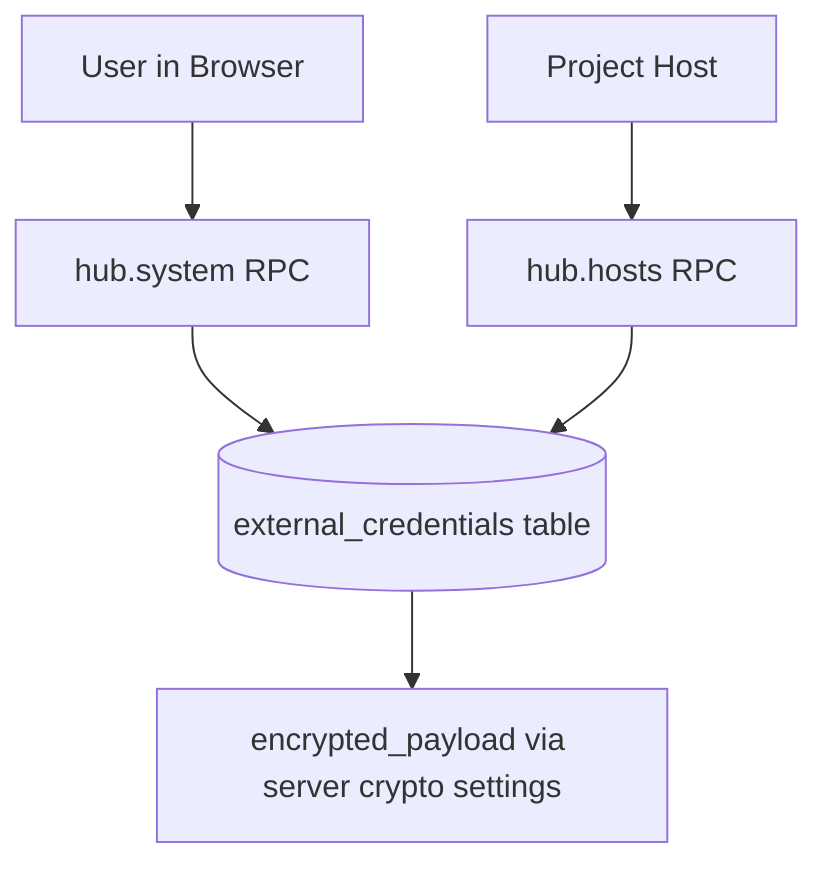
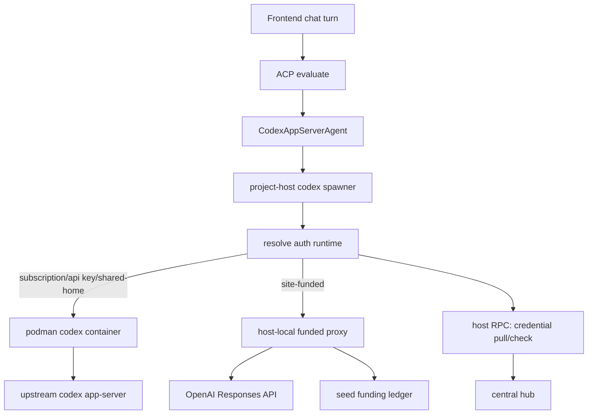

# Codex Auth Architecture

This document describes how Codex authentication currently works in CoCalc, in both cocalc-plus and launchpad/project-host deployments.

## Scope

This covers:

- Auth source resolution for Codex turns
- Credential storage and replication
- Project-host runtime materialization
- Site-funded Codex admission, proxy enforcement, and accounting

## Current Auth Sources and Precedence

Auth resolution first honors the selected payment-source preference. An
explicit subscription, project key, account key, or site-funded selection
fails when that source is unavailable instead of silently switching sources.

With `preference="auto"` and shared-home mode disabled or set to `fallback`,
the resolver tries:

1. ChatGPT subscription (`subscription`)
2. Registered workspace OpenAI API key (`project-api-key`)
3. Registered account OpenAI API key (`account-api-key`)
4. Compatibility environment-injected project key, then account key
5. Site OpenAI API key (`site-api-key`)
6. Shared home (`shared-home`), if the configured mode permits it

`COCALC_PRODUCT=launchpad` defaults shared-home mode to `disabled`; other
product values default to `fallback`. `COCALC_CODEX_AUTH_SHARED_HOME_MODE`
can select `disabled`, `fallback`, `prefer`, or `always`. In automatic mode,
`prefer` uses shared home first when it has `auth.json`, and `always` chooses
it first. An explicit `shared-home` preference still requires that auth file
and a mode that permits it. These compatibility settings change credential
selection and should not be confused with the default Launchpad behavior.

Resolution code:

- [src/packages/project-host/codex/codex-auth.ts](../src/packages/project-host/codex/codex-auth.ts)

## Global Architecture (Hub + DB)

The central hub stores external credentials encrypted at rest, and exposes two API surfaces:

- User-facing system RPCs for settings UI (`hub.system.*`)
- Host-facing RPCs for project-hosts (`hub.hosts.*`)


```mermaid
flowchart TD
  U[User in Browser] --> SYS[hub.system RPC]
  SYS --> DB[(external_credentials table)]

  PH[Project Host] --> HOSTS[hub.hosts RPC]
  HOSTS --> DB

  DB --> ENC[encrypted_payload via server crypto settings]
```

Primary server modules:

- [src/packages/server/conat/api/system.ts](../src/packages/server/conat/api/system.ts)
- [src/packages/server/conat/api/hosts.ts](../src/packages/server/conat/api/hosts.ts)
- [src/packages/server/external-credentials/store.ts](../src/packages/server/external-credentials/store.ts)

## Local Runtime Architecture (Project Host)

Project-host resolves auth at turn start, then runs upstream `codex` inside a per-project/per-auth-context podman runtime.


```mermaid
flowchart TD
  FE[Frontend chat turn] --> ACP[ACP evaluate]
  ACP --> CE[CodexAppServerAgent]
  CE --> SP[project-host codex spawner]
  SP --> AR[resolve auth runtime]
  AR -->|subscription/api key/shared-home| CT[podman codex container]
  AR -->|site-funded| FP[host-local funded proxy]
  FP --> OAI[OpenAI Responses API]
  FP --> SEED[seed funding ledger]
  CT --> CODEX[upstream codex app-server]

  AR --> REG[host RPC: credential pull/check]
  REG --> HUB[central hub]
```

Key modules:

- [src/packages/ai/acp/codex-app-server.ts](../src/packages/ai/acp/codex-app-server.ts)
- [src/packages/project-host/codex/codex-project.ts](../src/packages/project-host/codex/codex-project.ts)
- [src/packages/project-host/codex/codex-auth.ts](../src/packages/project-host/codex/codex-auth.ts)
- [src/packages/project-host/codex/codex-auth-registry.ts](../src/packages/project-host/codex/codex-auth-registry.ts)

## ACP Conat Authorization Boundary

Interactive ACP requests execute directly on the project host. Their Conat
subjects bind both security identities:

```text
acp.project-<project_id>.account-<account_id>.<operation>
```

The project remains the second subject segment so normal project-host routing
can resolve the destination. Project-host authorization then requires all of
the following:

- the authenticated principal is an account, not a project identity;
- the subject account equals the authenticated account;
- the account is a locally mirrored owner or collaborator of the subject
  project;
- the operation is a publication; replies use the caller's private inbox.

Viewer and public-share grants do not authorize ACP. The ACP server derives
both IDs from the subject and rejects any payload or nested chat project ID
that disagrees with it. This is important because `account_id` selects
credential, approval, admission, and attribution paths; it must never be
trusted solely from request data.

Legacy subjects of the form `acp.project-<project_id>.<operation>` are accepted
only for authenticated collaborators to reach a compatibility listener. That
listener returns `ACP_CLIENT_REFRESH_REQUIRED`, terminates the request, and
never calls ACP execution, session, control, or automation handlers.

Key modules:

- [src/packages/conat/ai/acp/subjects.ts](../src/packages/conat/ai/acp/subjects.ts)
- [src/packages/conat/ai/acp/server.ts](../src/packages/conat/ai/acp/server.ts)
- [src/packages/project-host/conat-auth.ts](../src/packages/project-host/conat-auth.ts)
- [src/packages/server/conat/socketio/auth.ts](../src/packages/server/conat/socketio/auth.ts)

## Credential Lifecycle

### ChatGPT subscription auth

Two supported paths:

1. Device auth from project-host runtime (`codex login --device-auth`)
2. Fallback upload of `auth.json` generated on user machine

Project-host handlers:

- [src/packages/project-host/hub/projects.ts](../src/packages/project-host/hub/projects.ts)
- [src/packages/project-host/codex/codex-device-auth.ts](../src/packages/project-host/codex/codex-device-auth.ts)

Frontend controls:

- [src/packages/frontend/chat/codex.tsx](../src/packages/frontend/chat/codex.tsx)

### OpenAI API keys (account/workspace)

Managed in account settings UI and stored as external credentials:

- [src/packages/frontend/account/codex-credentials-panel.tsx](../src/packages/frontend/account/codex-credentials-panel.tsx)
- [src/packages/server/conat/api/system.ts](../src/packages/server/conat/api/system.ts)

## Where Data Lives

### Central (authoritative)

- `external_credentials.encrypted_payload` in Postgres
- encrypted/decrypted by server credential helpers

### Project-host cache

Subscription auth cache directory:

- default root: `codexSubscriptionsPath` from [src/packages/backend/data.ts](../src/packages/backend/data.ts)
- default location on hosts: `/btrfs/data/secrets/codex-subscriptions/<account_id>/`

Typical files:

- `auth.json`
- `config.toml` (`cli_auth_credentials_store = "file"`)
- `.last_used` marker for GC

## `.codex` Semantics in Project-Host

In project-host mode, CoCalc intentionally separates auth material from session history.

- Auth source-of-truth:
  - subscription auth comes from host secrets (`/btrfs/data/secrets/codex-subscriptions/...`)
  - API-key auth comes from credential resolution and env injection
- Session history source-of-truth:
  - Codex session JSONL files live under workspace storage (`/home/user/.codex/sessions` in the runtime container, i.e. project volume)

Important behavior:

- With the default Launchpad shared-home mode disabled, project-host ignores workspace `~/.codex/auth.json` for auth resolution.
- For subscription auth, project-host mounts the subscription cache separately at `/run/cocalc/codex-subscription` for device login. It also mounts available auth files into `/home/user/.codex`, while keeping sessions in project storage. Normal app-server turns use host-supplied in-memory auth with ephemeral credential storage; token refresh updates the registry-backed subscription home.
- Shared-home auth follows the mode and preference rules above. `/home/user` is the current runtime home; `/root` remains a legacy home alias, not the default used by these paths.

## Subscription Cache GC

Project-host runs periodic cleanup of stale local subscription caches.

- [src/packages/project-host/codex/codex-subscription-cache-gc.ts](../src/packages/project-host/codex/codex-subscription-cache-gc.ts)

Defaults:

- TTL: 72h (`COCALC_CODEX_SUBSCRIPTION_CACHE_TTL_MS`)
- Sweep interval: 1h (`COCALC_CODEX_SUBSCRIPTION_CACHE_SWEEP_MS`)

GC protects subscription homes mounted at `/home/user/.codex` or `/run/cocalc/codex-subscription` in active `codex-*` containers. If container inspection fails, that sweep is skipped.

## Site-Funded Codex

When auth source is `site-api-key`, each turn uses the funded path:

- the project host requests an atomic seed-authoritative reservation;
- the project runtime receives a short-lived proxy token, never the site API key;
- a host-local OpenAI-compatible proxy forces the configured model, reasoning,
  service tier, output limit, request count, duration, and maximum cost;
- every provider response emits an idempotent exact usage event;
- completion, interruption, failure, and expiration all settle observed cost;
- unreported usage and finish events remain in a durable host SQLite outbox.

The initial policy is GPT-5.6 Luna, low reasoning, standard speed, no OpenAI
hosted paid tools, and a five-cent maximum reservation. The supported model and configurable limits are defined in
`site-funded-codex-policy.ts`; this is not unrestricted provider configuration. `site_funded_codex_enabled` disables only included access;
`launch_disable_ai` remains the complete AI kill switch.

Per-account 5-hour and 7-day allowances come exclusively from the account's
resolved membership `ai_limits`, including any account entitlement override.
There are no separate free/member fallback allowances in site settings. One AI
unit represents one cent of provider spend, so 100 units equals US$1; either
limit being zero disables included Codex for that account. The separate free
and paid weekly pools are aggregate site-wide spending circuit breakers.

Modules:

- [src/packages/ai/acp/codex-site-key-governor.ts](../src/packages/ai/acp/codex-site-key-governor.ts)
- [src/packages/project-host/codex/codex-site-metering.ts](../src/packages/project-host/codex/codex-site-metering.ts)
- [src/packages/project-host/codex/site-funded-proxy.ts](../src/packages/project-host/codex/site-funded-proxy.ts)
- [src/packages/server/ai/site-funded-codex-reservations.ts](../src/packages/server/ai/site-funded-codex-reservations.ts)
- [src/packages/server/ai/site-funded-codex-policy.ts](../src/packages/server/ai/site-funded-codex-policy.ts)
- [src/packages/server/conat/api/hosts.ts](../src/packages/server/conat/api/hosts.ts)

Exact funded host RPCs:

- `hosts.reserveSiteFundedCodexTurn`
- `hosts.heartbeatSiteFundedCodexTurn`
- `hosts.recordSiteFundedCodexUsageEvent`
- `hosts.finishSiteFundedCodexTurn`
- `hosts.getSiteFundedCodexPoolStatus`
- `hosts.getSiteOpenAiApiKey`

Legacy aggregate allowance/report RPCs remain only for compatibility with old
site-key runtimes and are deliberately bypassed by exact funded turns.

### Accounting and reconciliation

Funded costs use integer micro-US-dollars and a versioned Luna price catalog.
The ledger separately records ordinary input, cached input, cache writes,
output/reasoning, long-context pricing, provider request identity, and tool
fees. Prompt and response content is not stored in the funded ledger.

The admin Site Settings page shows free/member pool committed and reserved
exposure. For provider reconciliation, use a dedicated OpenAI project and set:

- `site_funded_codex_openai_project_id`;
- `site_funded_codex_openai_admin_key` (an organization admin key, not the
  normal provider API key).

Refresh the pool card to compare current-period local committed cost with the
OpenAI Costs API. OpenAI billing data can lag, so short-lived discrepancies are
expected; persistent discrepancies require investigation before widening a
rollout.

## Site Key Refresh Behavior

Project-host caches site key fetches and refreshes on:

- cache expiry
- explicit force refresh after an auth failure retry path

Current intent:

- avoid frequent polling across many hosts
- recover quickly when key rotates or cache is stale

## Important Runtime Notes

- The user does not get shell access to the Codex runtime container.
- For personal API-key auth, project-host injects provider config and
  `OPENAI_API_KEY` into the Codex runtime.
- For site-funded auth, the runtime only receives a turn-scoped local proxy
  token. The host forwards the real API key to OpenAI.
- For subscription auth, the host reads the registry-backed cache to supply app-server login tokens in memory. The app-server credential store is forced to ephemeral mode; device login uses the separate subscription mount described above.

## Known Limitations / Future Work

- OpenAI's Costs API requires a separate organization admin key and reports
  daily buckets, so reconciliation is not instantaneous.
- Account-home compatibility projection into the legacy `ai_usage_log` UI is
  separate from the exact seed ledger; the Codex UI reads exact funded
  remaining allowance directly.
- Strong end-to-end project-host websocket authz is still a separate hardening
  project.

## Fast Ban / Kill-Switch Approach

When an account must be disabled quickly (abuse, ToS violations, security response), we use a layered approach:

### Current behavior

- **New funded turns can be blocked immediately** with
  `site_funded_codex_enabled`, the global pool, an account hold, or
  `launch_disable_ai`.
- **Running funded turns remain bounded** by their local signed reservation,
  duration, request count, and cost limit even if the seed is unavailable.
- **Credential-backed turns (ChatGPT plan / user API key) are not billed to CoCalc**, so the immediate financial risk is lower, but account-level enforcement still depends on connection/session auth controls.

### Intended end state (with project-host auth hardening)

- Central hub marks account as banned and stops issuing/refreshing project-host auth leases.
- Hub pushes a **kick event** to project-hosts to disconnect live sockets for that account.
- Project-host closes active Codex sessions/streams for the banned account.
- Reconnect and token refresh attempts fail, so access does not resume.

This gives both:

- low-friction long-lived sessions for legitimate users, and
- fast forced eviction for abuse cases without waiting for long token expiry windows.

## Quick Debug Checklist

If a turn uses the wrong auth source or fails unexpectedly:

1. Check current payment source in account settings UI panel.
2. Check host logs for resolved auth source (`project-host:codex-auth` and `project-host:codex-project`).
3. Verify presence/absence of local subscription auth files in `codex-subscriptions/<account_id>`.
4. Verify central credential existence via `hub.system.listExternalCredentials`.
5. For site-funded mode, verify the Site Settings pool card, reservation denial
   code, project-host outbox, and `project-host:site-funded-codex-proxy` logs.
