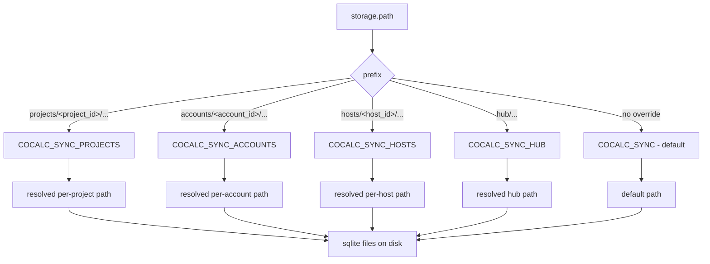

## Conat filesystem RPCs (sandbox)

- Frontends talk to the sandboxed filesystem over Conat using the `@cocalc/conat/files/fs` client. Each method is a request/response RPC to the backend `SandboxedFilesystem`.
- Paths are always sandbox-relative; the backend enforces safety via `safeAbsPath`.
- Common calls: `readFile`, `writeFile`, `writeFileDelta` (patch+etag helper), `watch` (proxied chokidar), and `syncFsWatch(path, active?)` to heartbeat or drop interest in a shared backend watcher.
- Watch streams use a Conat socket subject `watch-${service}`; the first `watch()` call stands up a server-side watch; subsequent calls reuse it.
- Errors propagate with codes (e.g., `ENOENT`, `ETAG_MISMATCH`, `PATCH_FAILED`) so callers can retry or fall back to full writes.

## Conat persistence storage layout

Persisted SQLite streams/kv live under a filesystem root that is resolved from
the Conat storage path (e.g., `projects/<project_id>/...`).

- **Default root**: `COCALC_SYNC` → `syncFiles.local` \(falls back to `${DATA}/sync`\).
- **Per\-subject overrides** \(optional\):
  - `COCALC_SYNC_PROJECTS` for `projects/<project_id>/...`
  - `COCALC_SYNC_ACCOUNTS` for `accounts/<account_id>/...`
  - `COCALC_SYNC_HOSTS` for `hosts/<host_id>/...`
  - `COCALC_SYNC_HUB` for `hub/...`
- Example placeholder overrides; the standard project-host bootstrap sets the project path as shown:
  - `COCALC_SYNC_PROJECTS=/mnt/cocalc/project-[project_id]/.local/share/cocalc/persist`
  - `COCALC_SYNC_ACCOUNTS=/data/accounts/[account_id]/persist`
  - `COCALC_SYNC_HOSTS=/data/hosts/[host_id]/persist`
- Archive/backup \(if configured; not used in project hosts\) mirror the same `storage.path` under
  `COCALC_SYNC_ARCHIVE` / `COCALC_SYNC_BACKUP`.

## Lifecycle progress streams

Project and host lifecycle progress uses long-running operations (LROs). Read
summaries through the authorized hub LRO API and open the operation's stream
with `@cocalc/conat/lro/client`, providing an explicit Conat client and the
operation's scope. Stream names are `lro.<op_id>`; the helper configures ephemeral
progress storage. Durable summaries and short-lived progress events have
different retention and recovery behavior.

See [Long-running operations](./long-running-operations.md),
[src/packages/conat/lro/client.ts](../src/packages/conat/lro/client.ts), and the
[frontend LRO helpers](../src/packages/frontend/lro/README.md).

Earlier versions used `bootlog.project.*`, `bootlog.host.*`, and a
`project/runner/bootlog` module. That module and the old frontend
`projectBootlog` wrapper are no longer the current integration surface. Do not
copy the former bootlog subject permissions into new LRO code: use the shared
authorization rules for the operation's scope.
