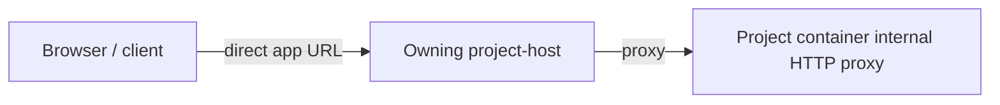
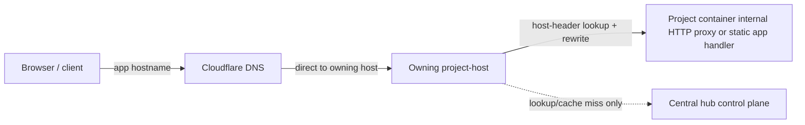

# CoCalc HTTP Proxying and Public App Traffic

This note summarizes the intended routing model for project-host HTTP traffic,
managed apps, and public app subdomains.

It is not just a description of current code. It also records a hard product
constraint that future changes must preserve.

## Hard Constraint

For Launchpad and Cloudflare-backed deployments, app traffic must not flow
through the central hub in the steady state.

That means:

- Private app traffic should go directly to the owning `project-host`.
- Public app subdomains must resolve directly to the owning `project-host`.
- The central hub may participate in control-plane decisions:
  - project placement
  - DNS reservation
  - lookup metadata
  - auth token minting
- The central hub must not sit in the hot data path for public app traffic.
- The central hub should not sit in the hot data path for private app traffic
  either.

Reason:

- routing all app bytes through the hub is a non-starter for performance,
  latency, and egress cost
- it would also make the hub a central bottleneck for unrelated project traffic

Exception:

- self-hosted / local-dev cases may temporarily accept central relays when the
  network environment forces that, but this is an exception for bring-up and
  debugging, not the target architecture

## Target Architecture

### Private app traffic

Target architecture:

- Browser should request a project-host URL directly for private app traffic.
- `project-host` authenticates the request and proxies into the project
  container's internal HTTP proxy.

Current status:

- some existing authenticated flows still enter via the hub first
- that is transitional behavior, not the desired final design

### Public app traffic

- Browser requests `https://<label>-app-<env>.<root>/...`
- Cloudflare DNS points that hostname at the owning `project-host` hostname
- Browser connects directly to `project-host`
- `project-host` maps `Host:` to `(project_id, app_id, base_path)`
- `project-host` rewrites the request to the canonical internal app path
- `project-host` serves static/public-viewer apps directly or proxies dynamic
  traffic to the project container

This keeps the control plane centralized while keeping the traffic path local to
the owning host.

## Diagrams

### Private app flow

### Public app flow

Important:

- the public app flow must not be `Browser -> DNS -> Hub -> project-host`
- the private app flow should also not be `Browser -> Hub -> project-host` in
  the final design
- if a design requires restarting the shared central `cloudflared` instance when
  a user exposes/unexposes an app, that design is wrong

## Why per-app tunnel config churn is wrong

Using a shared `cloudflared` process whose config changes whenever a user
exposes or unexposes an app is not acceptable.

Problems:

- config churn is driven by ordinary user actions
- restarting the shared tunnel risks breaking unrelated active connections
- even graceful shutdown would still terminate long-lived app sessions such as
  WebSockets
- forceful restart makes denial-of-service trivial

Therefore:

- app expose/unexpose must only change DNS / control-plane state
- it must not require shared tunnel daemon restart in the normal case

## Current implementation responsibilities

### Hub

- project placement lookup
- control-plane APIs for app exposure metadata
- public app hostname lookup APIs used by `project-host`
- auth minting and coordination

### Project-host

- public app hostname routing
- public app auth / policy enforcement
- static app serving
- Public Viewer Mode serving and redirects
- service proxying into the project container

### Cloudflare

- public DNS only
- stable tunnel / host entrypoints
- optional caching for public static content

## Design notes

- Public app DNS should target the owning `project-host` hostname, not the
  central site hostname.
- `project-host` should treat public app hostnames as a first-class input, not
  as a special hub-only feature.
- Public Viewer raw-domain traffic follows the same principle: centralized
  control plane is fine, but the content-serving path should avoid unnecessary
  hub bottlenecks.

## Relevant code

- Hub private/public proxying:
  - [src/packages/hub/proxy/project-host.ts](../src/packages/hub/proxy/project-host.ts)
  - [src/packages/hub/proxy/public-app-subdomain.ts](../src/packages/hub/proxy/public-app-subdomain.ts)
- Public app reservation and lookup:
  - [src/packages/server/app-public-subdomains.ts](../src/packages/server/app-public-subdomains.ts)
  - [src/packages/server/conat/api/system.ts](../src/packages/server/conat/api/system.ts)
- Project-host request handling:
  - [src/packages/project-host/main.ts](../src/packages/project-host/main.ts)
  - [src/packages/project-host/http-proxy-auth.ts](../src/packages/project-host/http-proxy-auth.ts)
- Container-side proxy behavior:
  - [src/packages/project/servers/proxy/proxy.ts](../src/packages/project/servers/proxy/proxy.ts)
