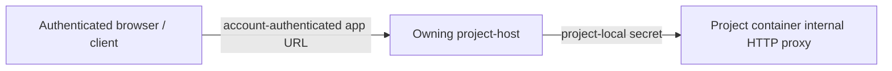

# CoCalc HTTP Proxying and Managed Apps

This note records the routing and product boundary for project-host HTTP
traffic and managed applications.

## Product Boundary

Managed project apps are private development services. They are available only
to authenticated project collaborators. CoCalc does not provide anonymous or
public project-app publishing, public app tokens, or public app subdomains.

Applications intended for anonymous or production use should be deployed to a
dedicated provider such as Cloudflare, Vercel, AWS, or a dedicated VM. This
keeps arbitrary public workloads out of the project collaboration trust model
and gives operators an explicit deployment, network, and abuse boundary.

This boundary is enforced in the product surface and the data plane:

- there are no expose/unexpose project RPCs or CLI commands;
- there is no public app hostname reservation or lookup API;
- app query parameters and host headers cannot bypass collaborator checks;
- project-host HTTP bearer tokens must identify an account;
- Hub and project-host proxies do not mint anonymous app credentials.

## Routing

The browser should send private app traffic directly to the owning
`project-host` whenever possible. The project host authenticates the account,
checks project collaboration, and proxies the request into the project
container's internal HTTP proxy.

```mermaid
flowchart LR
    Browser["Authenticated browser / client"]
    Host["Owning project-host"]
    Container["Project container internal HTTP proxy"]

    Browser -->|account-authenticated app URL| Host
    Host -->|project-local secret| Container
```

The Hub remains a control plane for project placement, account-scoped token
minting, and private hostname coordination. It should not be the steady-state
data path for project traffic.

## Security Invariants

- Every managed app request is associated with an authenticated account.
- The account must remain a collaborator on the target project.
- A stopped project may only be started through normal account admission.
- Project-host session and bearer credentials are stripped before proxying to
  user-controlled app code.
- Private hostname aliases do not weaken account or collaborator checks.
- Static app files remain descriptor-anchored inside the project filesystem.

Legacy `project_app_public_subdomains` rows are cleanup-only data. They are not
consulted for routing and no code creates new rows.

## Relevant Code

- Hub project-host proxy:
  [src/packages/hub/proxy/project-host.ts](../src/packages/hub/proxy/project-host.ts)
- Project-host request authentication:
  [src/packages/project-host/http-proxy-auth.ts](../src/packages/project-host/http-proxy-auth.ts)
- Project-host app matching and static serving:
  [src/packages/project-host/app-request-match.ts](../src/packages/project-host/app-request-match.ts)
  and
  [src/packages/project-host/static-apps.ts](../src/packages/project-host/static-apps.ts)
- Container-side app proxy:
  [src/packages/project/servers/proxy/proxy.ts](../src/packages/project/servers/proxy/proxy.ts)
