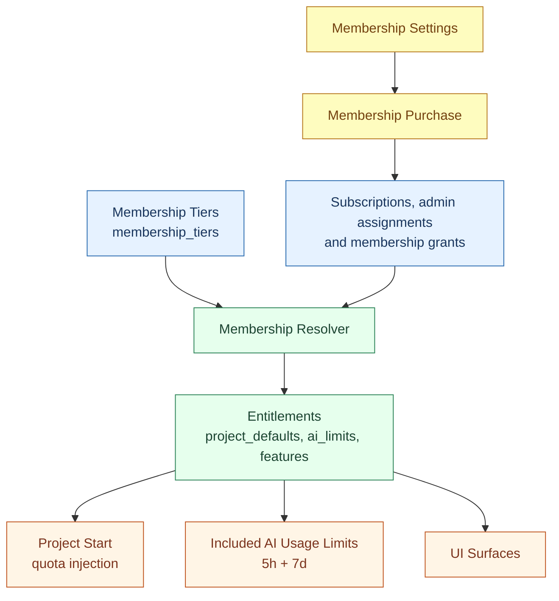

# Membership Implementation (CoCalc)

This document explains how membership is implemented in the current codebase. It is intended for developers and agents who need an overview and pointers to the relevant files.

## Overview

Membership replaces the legacy project license model for new work. A user’s effective membership class is resolved from subscriptions, admin assignments, and membership grants, then used to determine:

- Default project quotas when a project starts.
- Included AI usage limits (5-hour and 7-day windows).
- Feature flags and other entitlements.

Purchases and subscriptions are still handled by the existing billing system, but membership metadata drives behavior instead of license metadata.



## Data Model

### membership_tiers

Membership tiers live in a dedicated table with per-tier pricing and entitlements:

- Table schema: [src/packages/util/db-schema/membership-tiers.ts](../src/packages/util/db-schema/membership-tiers.ts)
- DB handler (history on update): [src/packages/database/postgres/membership-tiers.ts](../src/packages/database/postgres/membership-tiers.ts)
- Admin UI: [src/packages/frontend/admin/membership-tiers.tsx](../src/packages/frontend/admin/membership-tiers.tsx)

Each tier has:

- `id`, `label`, `priority`
- pricing (`price_monthly`, `price_yearly`)
- entitlements (`project_defaults`, `ai_limits`, `features`, `usage_limits`)

### subscriptions (membership metadata)

Membership subscriptions are stored in the existing subscriptions table, with metadata:

```
{ type: "membership", class: "<tier-id>" }
```

Schema: [src/packages/util/db-schema/subscriptions.ts](../src/packages/util/db-schema/subscriptions.ts)

## Resolver

The resolver computes a single effective membership class and entitlements:

- Resolver: [src/packages/server/membership/resolve.ts](../src/packages/server/membership/resolve.ts)
- Tier lookup/pricing: [src/packages/server/membership/tiers.ts](../src/packages/server/membership/tiers.ts)

The resolver considers current membership subscriptions (including canceled subscriptions whose period has not ended), admin assignments, an enabled admin tier for admin accounts, and active membership grants. It selects by tier priority, then applies the implemented tie-break rules. Account entitlement overrides are applied to the selected membership. Team/course packages and site licenses can supply grants; they are not future-only sources.

## Project Quotas

When a project starts, membership defaults are merged into project settings:

- Quota injection point: [src/packages/server/projects/control/base.ts](../src/packages/server/projects/control/base.ts)
- Membership defaults helper: [src/packages/server/membership/project-defaults.ts](../src/packages/server/membership/project-defaults.ts)

Runtime quotas use the runtime sponsor’s effective membership defaults; disk quota remains tied to the storage sponsor. Explicit run quotas and host runtime policy also affect the result. See `computeQuota` in the control module for the current resolution order.

## Included AI Usage Limits

Membership `ai_limits` governs included, site-funded AI usage. Personal
ChatGPT subscription or API-key authentication is a separate funding source;
this is not a blanket statement about every provider's billing model.

- Unit conversion: [src/packages/server/ai/usage-units.ts](../src/packages/server/ai/usage-units.ts)
- Account limits and usage status: [src/packages/server/ai/usage-status.ts](../src/packages/server/ai/usage-status.ts)
- Funded Codex admission and accounting: [Codex auth architecture](codex-auth.md#site-funded-codex)

The keys are `units_5h` (5-hour window) and `units_7d` (7-day window).
One AI unit represents one cent of provider spend (100 units = US$1).
Missing limits resolve to zero; either zero limit disables included Codex
for that account. Site funding settings and aggregate pools can impose
additional restrictions even when the account has allowance remaining.

## Membership Purchases

Memberships are purchased directly:

- One-person membership changes: [src/packages/server/purchases/membership-change.ts](../src/packages/server/purchases/membership-change.ts)
- Team/course/site membership packages: [src/packages/server/purchases/membership-package.ts](../src/packages/server/purchases/membership-package.ts)
- Pricing and proration: [src/packages/server/membership/tiers.ts](../src/packages/server/membership/tiers.ts)

Upgrades (e.g., member → pro) cancel the existing subscription and apply prorated credit in the first charge.

## API Surface

HTTP API endpoints (implemented in `@cocalc/http-api`; the legacy LLM endpoint name is retained):

- Membership status: [src/packages/http-api/pages/api/v2/purchases/get-membership.ts](../src/packages/http-api/pages/api/v2/purchases/get-membership.ts)
- Tier list: [src/packages/http-api/pages/api/v2/purchases/get-membership-tiers.ts](../src/packages/http-api/pages/api/v2/purchases/get-membership-tiers.ts)
- LLM usage status: [src/packages/http-api/pages/api/v2/purchases/get-llm-usage.ts](../src/packages/http-api/pages/api/v2/purchases/get-llm-usage.ts)

Conat API (typed RPC):

- Types + endpoints: [src/packages/conat/hub/api/purchases.ts](../src/packages/conat/hub/api/purchases.ts)
- Server implementation: [src/packages/server/conat/api/purchases.ts](../src/packages/server/conat/api/purchases.ts)

## UI

Key UI surfaces:

- Membership settings page: [src/packages/frontend/account/membership-page.tsx](../src/packages/frontend/account/membership-page.tsx)
- Subscriptions UI: [src/packages/frontend/purchases/subscriptions.tsx](../src/packages/frontend/purchases/subscriptions.tsx)
- AI usage display: [src/packages/frontend/misc/ai-usage-status.tsx](../src/packages/frontend/misc/ai-usage-status.tsx)
- Balance modal usage display: [src/packages/frontend/purchases/balance-modal.tsx](../src/packages/frontend/purchases/balance-modal.tsx)
- Chat usage indicator (compact): [src/packages/frontend/chat/chatroom.tsx](../src/packages/frontend/chat/chatroom.tsx)

## Tests

- Resolver tests: [src/packages/server/membership/resolve.test.ts](../src/packages/server/membership/resolve.test.ts)
- Membership package tests: [src/packages/server/membership/packages.test.ts](../src/packages/server/membership/packages.test.ts)
- Purchase RPC tests: [src/packages/server/conat/api/purchases.test.ts](../src/packages/server/conat/api/purchases.test.ts)

## Known Gaps / Planned Work

The admin tier editor already has structured fields for project, usage, and AI limits, plus advanced JSON editors. Membership settings also render tier benefits. Team seats and course/site grants are implemented; see the resolver and package modules before treating those capabilities as planned work. This overview does not establish that every legacy license workflow has been replaced.
