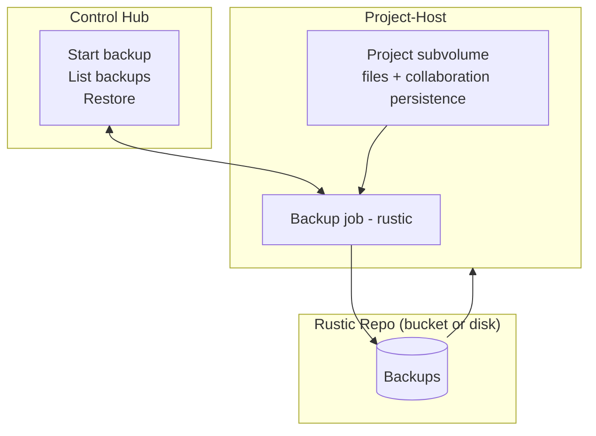

# Project Backups

CoCalc backs up projects asynchronously from the project-host that holds the live btrfs subvolume. Backups are taken from a read-only snapshot (files + per-project persist store) and pushed to a rustic repository (Cloudflare R2 on cocalc.ai; configurable elsewhere). Restores can target any project-host; archived projects may exist only as backups until restored.

## Mermaid Overview

## Scope

- Data included: a read-only snapshot of the project tree, including `.local/share/cocalc/persist` in the standard project-host configuration. Custom `COCALC_SYNC_PROJECTS` layouts need a matching backup plan.
- Data excluded: btrfs snapshots themselves; backups are file\-level.
- Frequency: daily per active/recent project \(host\-side scheduler\) plus on\-demand user triggers.
- Concurrency: one backup at a time per project; small per\-host cap to protect I/O and CPU.

## Behavior

- Backup flow: take a read-only Btrfs snapshot of the project tree, run Rustic against it, then remove the temporary snapshot. The standard project-host path requires Btrfs; it does not fall back to backing up a live non-Btrfs directory.
- Restore flow: any host can restore using repo \+ backup id, reconstructing the project tree and persist dir; archived projects can be rehydrated this way.
- Failure/restart: user-requested backups are tracked as `project-backup` LROs by the hub worker, with leases, progress, timeout and host-availability handling. A request being accepted is not backup completion; inspect the final operation result before relying on it for recovery.

## Storage / Repos

- [cocalc.ai](https://cocalc.ai): region buckets on Cloudflare R2. Projects are assigned to a shared rustic repo recorded in Postgres via `project_backup_repos` and `projects.backup_repo_id`.
  - Multiple active shards per region and capacity-aware assignments are implemented; full shards are sealed and new active shards created. See [Buckets](./buckets.md) for the current policy and assignment records.
- Untrusted-host isolation is a separate design question. Per-tenant credentials or signed-upload gateways must not be assumed from the shared-repository implementation.
  - Restores can target any host directly from the repo; no host\-to\-host SSH is required.
- On\-prem: repo location is configurable \(local/NAS/S3\-compatible\).

## Observability

- The hub backup worker records the durable LRO summary and publishes progress events. Backup listing and browsing use the configured Rustic repository. Host-scheduled snapshot/backup maintenance is a separate path; inspect its logs and recorded backup results rather than assuming it creates the same user-requested LRO. See [backup-worker.ts](../src/packages/server/projects/backup-worker.ts) and [snapshot-backup-maintenance.ts](../src/packages/project-host/snapshot-backup-maintenance.ts).

## Open Items

- Validate nonstandard persistence layouts; standard project-host backups already include the in-project persistence directory.
- Decide repo sharing model for untrusted hosts (per-bucket vs. brokered uploads).
- Further retention policy work; per-project backup retention and replacement-at-limit handling already exist.
