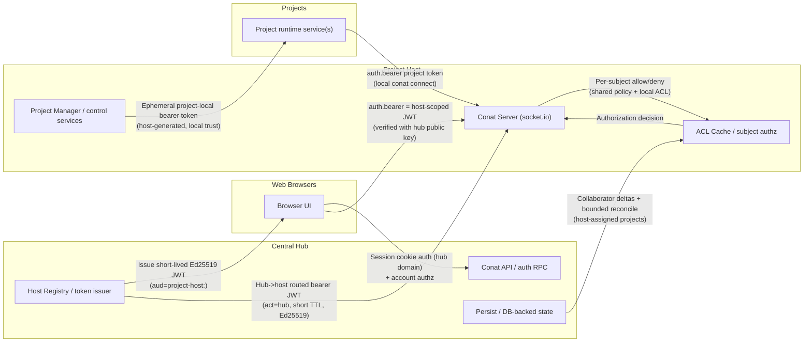
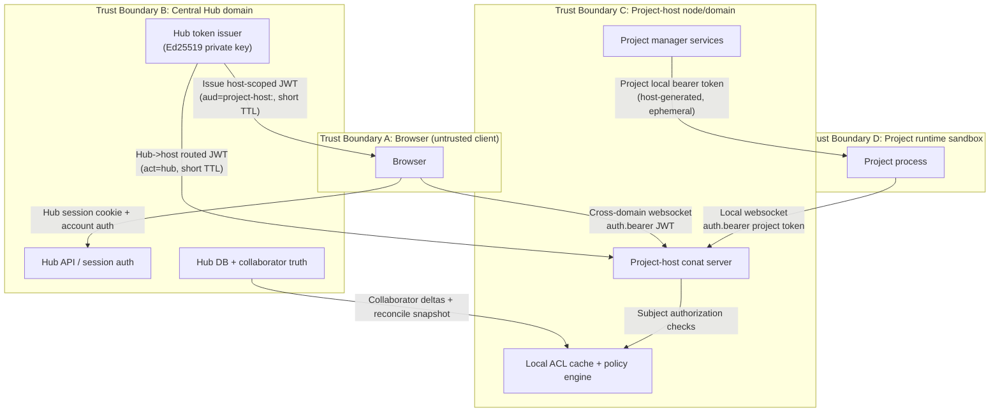
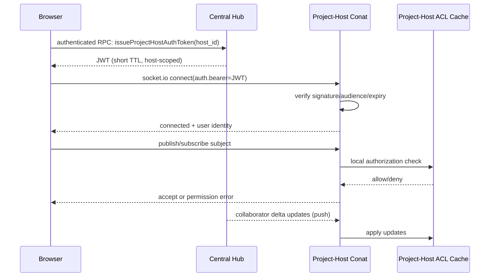

# Project-Host Conat Authentication

This document describes the intended authentication and authorization architecture for browser connections that go directly to project-host Conat servers.

It documents protocol and runtime behavior, not implementation task sequencing.

In short: the browser gets a short-lived, host-scoped identity token from the central hub, uses that token to connect directly to the target project-host websocket, and the project-host then authorizes each publish/subscribe request using a local collaborator ACL cache (kept fresh via hub deltas plus bounded reconcile). In production, project-hosts are expected to be on DNS domains distinct from the central hub domain, so cross-origin direct connectivity is a first-class part of the design. This gives low-latency local traffic while keeping access control centralized in policy and quickly updateable when collaborators change.

## Goals

- Strong user authentication for direct browser -> project-host websocket traffic.
- Low latency for active project traffic by avoiding round trips to central hub on every pub/sub.
- Fast grant behavior: when a collaborator is added, access should appear quickly (target: seconds).
- Reasonable revoke behavior: when removed, access should be removed without requiring long token expiry waits.
- Scalability to many hosts and large per-host project counts (e.g. 10k+ projects, mostly inactive).

## Non-Goals

- This does not cover API-key proxying for model provider requests.
- This does not replace central hub auth logic; it complements it for project-host direct paths.

## Components

- Browser client: opens socket.io websocket to project-host Conat.
- Central hub: authenticates user, issues short-lived host-scoped auth token.
- Project-host: verifies token locally and enforces per-subject authorization.
- Project-host ACL cache: collaborator/project membership data for hosted projects.

## System Auth Topology

Notes:

- Browser and hub are on one domain trust boundary; browser and project-host are cross-domain and always token-authenticated.
- JWTs establish identity (who/which host), while project/resource access is enforced by subject-level ACL checks on project-host.
- Hub services and host services are split in the diagram to show where authentication happens vs where ACL state originates.

## Trust Boundaries

Boundary-crossing summary:

- `Browser -> Hub`: cookie/session auth on hub domain.
- `Browser -> Project-host`: explicit bearer JWT (never cookie-trust).
- `Hub -> Project-host`: explicit bearer JWT signed by hub key.
- `Project runtime -> Project-host`: host-local ephemeral bearer token.

## High-Level Protocol

## Token Model

Project-host auth token is identity-only and host-scoped.

Signature model:

- `alg=EdDSA` (Ed25519)
- Hub signs with private key.
- Project-host verifies with public key only.
- A project-host cannot mint valid hub tokens (no signing key).

Suggested claims:

- `sub`: account id
- `aud`: `project-host:<host_id>`
- `iat`, `exp`: short lifetime (about 5-10 minutes)
- `jti`: unique token id
- optional `sid`: client session id

Important:

- Token does not include full project list claims.
- Authorization decisions are done using project-host local ACL state.

Key distribution:

- Hub needs `COCALC_PROJECT_HOST_AUTH_TOKEN_PRIVATE_KEY` (or private key file path).
- Project-host receives the public key from hub at runtime:
  - pull: `project-hosts.api.getProjectHostAuthPublicKey()` during startup
  - push: `project-hosts.keys` updates (`project_host_auth_public_key`) during register/heartbeat
- Project-host can still use `COCALC_PROJECT_HOST_AUTH_TOKEN_PUBLIC_KEY` (or public key file path) as a fallback if distributed key is not available yet.
- If public key is omitted but private key is present, public key is derived from private key for convenience (mainly launchpad/local setups).
- In launchpad mode (`COCALC_PRODUCT=launchpad`), if no private key is provided, CoCalc auto-generates an Ed25519 keypair under the secrets directory and reuses it thereafter.
- In rocket/k8s deployments, keys should be provisioned by deployment (e.g. Kubernetes secret mount), not generated at runtime.
- Recommended production posture is private key only on hub, public key only on project-hosts.

## Key Rotation

Current implementation uses a single active verification key on each project-host.
There is no multi-key (`kid`) verification ring yet.

What this means in practice:

- Rotating the hub signing key is a hard cutover.
- After a host receives the new public key, it will reject tokens signed by the old private key.
- Existing websocket sessions may continue until reconnect, but new/reconnecting auth must use newly signed tokens.

Operational expectation:

- Small, temporary disruption is expected during rotation (typically minutes, not hours).
- This is acceptable for now to keep protocol and implementation simpler.

Current rotation playbook:

1. Deploy/update hub with the new private key.
2. Distribute/refresh the matching public key to project-hosts (startup pull + key update push path).
3. Allow short-lived token caches to refresh naturally.
4. Verify new browser -> host and hub -> host connections.

Future improvement (deferred):

- Add `kid` plus dual-key acceptance window (old + new) for seamless/no-downtime rotation.

## Authorization Model on Project-Host

Project-host applies central-like subject policy, but scoped to locally hosted projects and authenticated account identity.

Examples:

- `hub.account.<account_id>.api`:
  - allow only when authenticated account matches `<account_id>`
- `_INBOX.*`:
  - allow publish; allow subscribe only to own inbox prefix
- `project.<project_id>.*` and `*.project-<project_id>.*`:
  - allow only if account is collaborator/owner in local ACL cache
- everything else:
  - deny by default

## ACL Data and Scale Strategy

Project-host keeps an in-memory ACL index for authorization checks.

Recommended indexes:

- `project_id -> Set(account_id)` (primary)
- optional `account_id -> Set(project_id)` (secondary for hot paths)

Given very large project counts on a host, reconcile should be bounded:

- Prefer push deltas from central hub for near real-time grant updates.
- Periodic reconcile should focus on:
  - recently modified projects (for example last 7 days), and
  - active/running projects.
- Unknown project during auth check can trigger one on-demand single-project refresh.

This keeps grant latency low while avoiding full host-wide sweeps.

## Grant vs Revoke Expectations

- Add collaborator: should propagate quickly (target seconds).
- Remove collaborator: should also propagate, but strict sub-second behavior is not required.

Because authorization is ACL-based (not project-list claims inside JWT), revocation does not depend solely on token expiration.

## Failure Behavior

- If token is invalid/expired/audience mismatch: deny connect.
- If ACL state is unavailable for a project:
  - optionally perform on-demand refresh once,
  - otherwise deny (fail closed) for unknown project state.
- If hub delta channel is temporarily unavailable:
  - continue using current cache,
  - reconcile when connectivity returns.

## Security Notes

- Browser direct path is protected by short-lived host-scoped token + local subject authz.
- Project-host websocket endpoints are expected to be served from DNS domains distinct from the central hub domain; authentication must therefore be explicit (token-based), not cookie/domain-implicit.
- No requirement for per-message central introspection (keeps latency low and reduces control-plane dependency).
- Fast-grant behavior depends on reliable hub -> host collaborator delta delivery.

## Embedded Dev Host Exception

The hub has a dev-only embedded project-host mode (`COCALC_EMBEDDED_PROJECT_HOST=1`).
That path is intentionally not production-hardened and is now explicitly gated.

Why this is different:

- Project containers connect back to host conat via `host.containers.internal` (podman slirp4netns path), not plain loopback.
- In current dev wiring, that requires embedded project-host bind host `HOST=0.0.0.0` so container -> host conat works reliably.

Enforcement:

- Embedded mode now fails fast unless `COCALC_ALLOW_INSECURE_HTTP_MODE=true`.
- This keeps insecure bind behavior opt-in and explicit for local development.
- Production project-host deployments should not rely on this dev exception.

## Hub -> Project-Host Routed Control Auth

In addition to browser -> host auth, we also authenticate routed control traffic from the central hub to project-hosts (for example, project control paths that still go through hub routing).

What this solves:

- The hub can open routed conat connections to any project-host it manages without using a long-lived shared password for that path.
- Each host accepts hub traffic only when the hub presents a valid, signed, host-scoped bearer token.

How it works:

- Hub mints short-lived JWTs (`act=hub`, `aud=project-host:<host_id>`) signed with hub Ed25519 private key.
- Hub presents this token as `auth.bearer` when connecting to that host.
- Project-host verifies signature + audience + expiry using the distributed hub public key, then treats that connection as hub identity.

Trust assumptions for this path:

1. The project-host can register to / communicate with the hub using the host registration trust model.
2. The project-host has the correct hub public key for signature verification.

Security properties versus long-lived random host tokens:

- No signing secret is shared to hosts (hosts only get verify key).
- Token replay window is bounded by short TTL.
- Compromising one host does not give capability to mint hub tokens.

Analogy to SSH Ed25519:

- Conceptually similar to placing a public key in `authorized_keys`: the verifier (project-host) trusts signatures from a specific private key holder (hub).
- Difference from SSH in our design: we use short-lived signed bearer tokens (with audience and expiry claims), not a single long-lived static presented secret.

## Master Conat Token Lifecycle (Hub <-> Host Control Channel)

This section is about the host bootstrap/control credential used by a project-host to authenticate to the central hub conat path.

Current model (as implemented now):

- A short-lived bootstrap token (`purpose=bootstrap`) is used only during host bootstrap.
  - Default TTL: 24 hours.
- During bootstrap, host fetches a separate `master-conat` token from hub (`/project-host/bootstrap/conat`) and stores it locally at:
  - `/btrfs/data/secrets/master-conat-token`
- The project-host then uses that `master-conat` token as a bearer credential for its outbound hub control connection.
- `master-conat` token TTL is currently long (about 1 year), and bootstrap code currently does not continuously refresh it once present.

Why this matters:

- Without rotation, very long-lived hosts can eventually fail when this token expires.
- In large fleets, expiry without automated renewal can cause many hosts to break around the same window.

### Automatic Rotation (Implemented)

Goal: fully automatic renewal with no manual intervention and no fleet-wide expiry surprises.

Implemented behavior:

1. Background renewal loop on each host.
   - Periodically check `master-conat` token expiry.
   - If token is within renewal window (for example 30 days before expiry), renew.
2. Renewal does not require rerunning full bootstrap.
   - Host asks hub `project-hosts.api.rotateMasterConatToken(...)` for a new token.
   - Hub verifies host identity token and returns a fresh `master-conat` token.
   - Host writes token atomically to `/btrfs/data/secrets/master-conat-token` with mode `0600`.
3. Existing connections continue; new connections use fresh token.
   - No immediate disconnect required solely due to token refresh.
4. On renewal failure:
   - Retry with exponential backoff + jitter.
   - Emit clear logs/metrics (`days_to_expiry`, renewal failures, next retry).
5. Emergency fallback:
   - If token is missing or status checks fail, host attempts bootstrap-endpoint recovery using bootstrap config (`bootstrap_token` + `conat_url`) and rewrites the token file.
   - This also covers host restart with missing token file, as long as bootstrap credential is still valid.

6. Missing-token auto-recovery:
   - If `/btrfs/data/secrets/master-conat-token` is missing while host is running, host detects this on a short probe interval and asks hub for a rotated `master-conat` token using its currently-authenticated host channel.
   - This gives a deterministic/manual rotation trigger.
   - If host starts and file is missing, host attempts bootstrap-token fallback (if available and still valid) to recover automatically.

Operator action:

- You can force immediate token renewal on a running host by moving/removing:
  - `/btrfs/data/secrets/master-conat-token`
- Host should recreate it automatically within the missing-token probe window (default about 30s).

Default parameters:

- Check interval: every 6-12 hours.
- Renewal window: 30 days before expiration.
- Retry backoff: 1m -> 5m -> 15m -> 1h (with jitter).
- Missing-token probe: every ~30s.

Security properties of this plan:

- No long-term static shared secret required for hub control auth.
- Token compromise impact remains bounded by expiration.
- Rotation is automatic and distributed, avoiding synchronized manual maintenance events.

Revocation timing when a new token is issued:

- Previous `master-conat` tokens for that host/purpose are revoked in the hub database immediately.
- New authentication attempts with the old token fail right away.
- Already-established websocket sessions may remain alive until they reconnect (standard websocket auth behavior).

## Code Organization Direction

To reduce policy drift and surprises, common conat auth policy logic should be shared.

Recommended layout:

- shared policy helpers in `src/packages/conat/auth/`
- central hub adapter in `src/packages/server/conat/socketio/auth.ts`
- project-host adapter in project-host package

Adapters provide environment-specific functions (for example collaborator lookup and host/project metadata access), while subject-policy and cache mechanics are shared.

## HTTP App Proxy Auth (Project Ports)

In addition to Conat websocket auth, direct browser access to project app ports
(JupyterLab, VSCode, etc.) on project-host is now authenticated at the
project-host proxy layer.

Flow:

1. Frontend asks hub for a short-lived host-scoped bearer (same JWT family used
   for browser -> project-host Conat auth).
2. Frontend app link URL includes that token once as query parameter
   (`cocalc_project_host_token`) when opening the project-host app URL.
3. Project-host proxy verifies token signature/audience/expiry, extracts
   `account_id`, verifies collaborator access against local `projects.users`,
   then mints a host-local HttpOnly session cookie
   (`cocalc_project_host_http_session`) and removes the query token from
   forwarded request path.
4. Subsequent HTTP and websocket requests for that project rely on the cookie,
   and are collaborator-checked on each request.

Notes:

- This closes the gap where direct host app URLs could bypass hub HTTP proxy checks.
- Hub local-proxy paths still perform their own collaborator checks in hub proxy code.

## Observability

Track and expose metrics/logs for:

- token verify failures by reason
- allow/deny counts by subject class
- collaborator delta apply lag
- reconcile coverage and duration
- on-demand ACL refresh frequency

## Relationship to Existing Docs

- Existing Codex auth and credentials architecture: [docs/codex-auth.md](./codex-auth.md)
- This document is specifically about websocket auth/authz between browser and project-host Conat.
