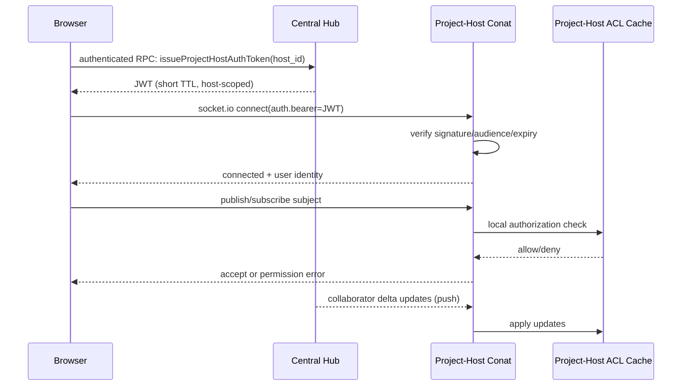

# Project-Host Conat Authentication

This document describes the intended authentication and authorization architecture for browser connections that go directly to project-host Conat servers.

It documents protocol and runtime behavior, not implementation task sequencing.

In short: the browser gets a short-lived, host-scoped identity token from the central hub, uses that token to connect directly to the target project-host websocket, and the project-host then authorizes each publish/subscribe request using a local collaborator ACL cache (kept fresh via hub deltas plus bounded reconcile). In production, project-hosts are expected to be on DNS domains distinct from the central hub domain, so cross-origin direct connectivity is a first-class part of the design. This gives low-latency local traffic while keeping access control centralized in policy and quickly updateable when collaborators change.

## Goals

- Strong user authentication for direct browser -> project-host websocket traffic.
- Low latency for active project traffic by avoiding round trips to central hub on every pub/sub.
- Fast grant behavior: when a collaborator is added, access should appear quickly (target: seconds).
- Reasonable revoke behavior: when removed, access should be removed without requiring long token expiry waits.
- Scalability to many hosts and large per-host project counts (e.g. 10k+ projects, mostly inactive).

## Non-Goals

- This does not cover API-key proxying for model provider requests.
- This does not replace central hub auth logic; it complements it for project-host direct paths.

## Components

- Browser client: opens socket.io websocket to project-host Conat.
- Central hub: authenticates user, issues short-lived host-scoped auth token.
- Project-host: verifies token locally and enforces per-subject authorization.
- Project-host ACL cache: collaborator/project membership data for hosted projects.

## High-Level Protocol

## Token Model

Project-host auth token is identity-only and host-scoped.

Signature model:

- `alg=EdDSA` (Ed25519)
- Hub signs with private key.
- Project-host verifies with public key only.
- A project-host cannot mint valid hub tokens (no signing key).

Suggested claims:

- `sub`: account id
- `aud`: `project-host:<host_id>`
- `iat`, `exp`: short lifetime (about 5-10 minutes)
- `jti`: unique token id
- optional `sid`: client session id

Important:

- Token does not include full project list claims.
- Authorization decisions are done using project-host local ACL state.

Key distribution:

- Hub needs `COCALC_PROJECT_HOST_AUTH_TOKEN_PRIVATE_KEY` (or private key file path).
- Project-host needs `COCALC_PROJECT_HOST_AUTH_TOKEN_PUBLIC_KEY` (or public key file path).
- If public key is omitted but private key is present, public key is derived from private key for convenience.
- In launchpad mode (`COCALC_PRODUCT=launchpad`), if no private key is provided, CoCalc auto-generates an Ed25519 keypair under the secrets directory and reuses it thereafter.
- In rocket/k8s deployments, keys should be provisioned by deployment (e.g. Kubernetes secret mount), not generated at runtime.
- Recommended production posture is private key only on hub, public key only on project-hosts.

## Authorization Model on Project-Host

Project-host applies central-like subject policy, but scoped to locally hosted projects and authenticated account identity.

Examples:

- `hub.account.<account_id>.api`:
  - allow only when authenticated account matches `<account_id>`
- `_INBOX.*`:
  - allow publish; allow subscribe only to own inbox prefix
- `project.<project_id>.*` and `*.project-<project_id>.*`:
  - allow only if account is collaborator/owner in local ACL cache
- everything else:
  - deny by default

## ACL Data and Scale Strategy

Project-host keeps an in-memory ACL index for authorization checks.

Recommended indexes:

- `project_id -> Set(account_id)` (primary)
- optional `account_id -> Set(project_id)` (secondary for hot paths)

Given very large project counts on a host, reconcile should be bounded:

- Prefer push deltas from central hub for near real-time grant updates.
- Periodic reconcile should focus on:
  - recently modified projects (for example last 7 days), and
  - active/running projects.
- Unknown project during auth check can trigger one on-demand single-project refresh.

This keeps grant latency low while avoiding full host-wide sweeps.

## Grant vs Revoke Expectations

- Add collaborator: should propagate quickly (target seconds).
- Remove collaborator: should also propagate, but strict sub-second behavior is not required.

Because authorization is ACL-based (not project-list claims inside JWT), revocation does not depend solely on token expiration.

## Failure Behavior

- If token is invalid/expired/audience mismatch: deny connect.
- If ACL state is unavailable for a project:
  - optionally perform on-demand refresh once,
  - otherwise deny (fail closed) for unknown project state.
- If hub delta channel is temporarily unavailable:
  - continue using current cache,
  - reconcile when connectivity returns.

## Security Notes

- Browser direct path is protected by short-lived host-scoped token + local subject authz.
- Project-host websocket endpoints are expected to be served from DNS domains distinct from the central hub domain; authentication must therefore be explicit (token-based), not cookie/domain-implicit.
- No requirement for per-message central introspection (keeps latency low and reduces control-plane dependency).
- Fast-grant behavior depends on reliable hub -> host collaborator delta delivery.

## Code Organization Direction

To reduce policy drift and surprises, common conat auth policy logic should be shared.

Recommended layout:

- shared policy helpers in `src/packages/conat/auth/`
- central hub adapter in `src/packages/server/conat/socketio/auth.ts`
- project-host adapter in project-host package

Adapters provide environment-specific functions (for example collaborator lookup and host/project metadata access), while subject-policy and cache mechanics are shared.

## Observability

Track and expose metrics/logs for:

- token verify failures by reason
- allow/deny counts by subject class
- collaborator delta apply lag
- reconcile coverage and duration
- on-demand ACL refresh frequency

## Relationship to Existing Docs

- Existing Codex auth and credentials architecture: [docs/codex-auth.md](./codex-auth.md)
- This document is specifically about websocket auth/authz between browser and project-host Conat.
