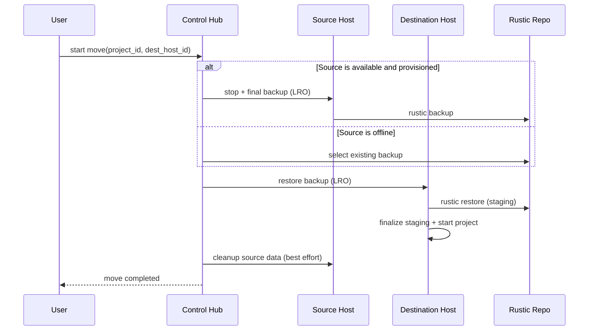

# Project Move (Current)

The default move is **backup -> restore -> start** using Rustic repositories. There is no direct host-to-host file transfer in this move path. The control plane also supports offline-source and placement-only cases described below.

## Summary

- The control hub orchestrates a move as an LRO (`project-move`).
- For an available, provisioned source, the host stops the project and takes a final backup. An offline source cannot be stopped or backed up by this operation; the move instead uses an existing backup.
- The destination host restores the backup into a staging subvolume before installing it as the project home.
- In the default flow, source cleanup follows destination startup and restoration verification. Inspect the final LRO result: a verification failure preserves destination placement and reports failure.
- If the source host is offline, cleanup is deferred until it next starts.

## High-level flow

## Restore staging

Restores populate a staging subvolume before it is moved into the project-home path. When a home already exists, finalization first moves that home aside and then moves staging into place. These are separate operations; an interrupted finalization is not a verified completed restore. Inspect the final operation result and the host's restore state before proceeding with cleanup or recovery. See [restore-staging.ts](../src/packages/file-server/btrfs/restore-staging.ts).

## Failure behavior

- **Backup fails:** an ordinary backup error fails the move. Source data is retained, but the runtime may already have stopped; failure does not mean the source remained running. Missing-volume and unprovisioned cases have explicit skip handling.
- **Restore fails:** move fails; the destination is cleaned if possible.
- **Destination start fails:** move fails and source cleanup is skipped. The move attempts to revert placement and clean destination data; recovery can also fail, so inspect the final error and placement.
- **Source host offline:** a provisioned project needs a usable existing backup. If that backup predates recorded changes, the move requires explicit offline confirmation. Changes absent from the backup cannot be recovered by this move; source cleanup is deferred.

## Notes

- The move pipeline is LRO-driven; UI shows progress and errors from the LRO stream.
- Available, provisioned sources get a final backup even if `last_edited <= last_backup`; offline, unprovisioned, and missing-volume paths are exceptions.
- `start_dest: false` is a placement-only option: it skips destination startup and restore during this operation. Source cleanup can still run after placement changes, so it must not be treated as a verified destination restore.
- `stop_dest_after_start` starts and restores the destination, then stops its runtime.
- Changing backup regions requires explicit `backup_region_cutover` and destination startup; it is not implied by selecting another host.
- Btrfs `.snapshots` history is excluded from backups and is not transferred by a move.

The authoritative orchestration and failure branches are in
[src/packages/server/projects/move.ts](../src/packages/server/projects/move.ts).
