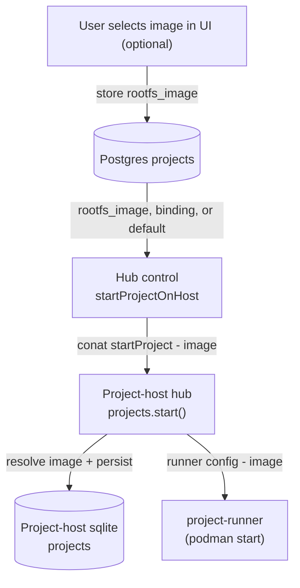

# Project RootFS Image Flow

This doc explains how a project's root filesystem image is selected, cached,
preflighted, and launched by the project-host stack. Sources include Docker/OCI
images and managed RootFS releases.

The hub reads `projects.rootfs_image`. If it is empty, it tries the current
RootFS binding and then `DEFAULT_PROJECT_IMAGE`. The host validates an explicit
image name and caches the selected image. Invalid references, failed pulls, or
failed preflight checks are errors; they do not silently select another image.

Projects use an overlay whose writable upperdir lives in `.local/share/overlay/`
inside the project, keyed by image. First-start bootstrap prepares the runtime
user, sudo, and CA certificates in that overlay before launching the project
daemon. Changes in the upperdir survive runtime restarts and are included in
project snapshots, backups, and moves. Moving the files does not transfer the
source host's Btrfs snapshot history.

## Data sources

- Project startup reads `projects.rootfs_image`; it does not use a SQL `COALESCE` with the legacy `compute_image` field.
- Project-host sqlite stores the resolved `image` for each project.
- The final startup fallback is `DEFAULT_PROJECT_IMAGE`; a current managed RootFS binding is checked first when the project field is empty.

## Onboarding image tags

The first-run project wizard selects images by catalog tags rather than by a
hard-coded image id or registry reference. This lets each site change its
available images without shipping new frontend code. Assign at most one
preferred image per onboarding tag when possible:

| Tag                         | First-run path                    |
| --------------------------- | --------------------------------- |
| `onboarding:jupyter-python` | Python Jupyter notebook           |
| `onboarding:jupyter-r`      | R Jupyter notebook                |
| `onboarding:jupyter-julia`  | Julia Jupyter notebook            |
| `onboarding:jupyter`        | Fallback for any Jupyter notebook |
| `onboarding:sage`           | SageMath notebook                 |
| `onboarding:math`           | Fallback computational-math image |
| `onboarding:code`           | Terminal/code project             |
| `onboarding:codex`          | Codex-guided project              |
| `onboarding:latex`          | LaTeX document project            |
| `onboarding:documents`      | Fallback technical-document image |
| `onboarding:teaching`       | Course project                    |

Only official images are eligible for onboarding tag selection. The publish
modal suggests the `onboarding:*` tags only to admins, since only admins can
publish official images. Among eligible images, the selector prefers the most
specific tag, then a non-deprecated image, catalog priority, and newest creation
date. Existing broad tags such as `jupyter`, `sage`, `latex`,
`preset:standard`, and `preset:teaching` remain compatibility fallbacks. If no
official tagged image is available, the site's normal project-creation default
is used.

## End-to-end flow

## Key steps and files

- Load from Postgres: the hub reads `rootfs_image AS image`, then resolves an empty value from the current binding or default.
  See [src/packages/server/project-host/control.ts](../src/packages/server/project-host/control.ts).
- Send to host: `startProjectOnHost` includes `image` in the conat request to the project-host.  
  See [src/packages/conat/project-host/api.ts](../src/packages/conat/project-host/api.ts) and handler wiring in [src/packages/project-host/master.ts](../src/packages/project-host/master.ts).
- Persist and resolve on host: the host trims the supplied name, uses the default only when empty, and validates nonempty names before startup.
  See [src/packages/project-host/hub/projects.ts](../src/packages/project-host/hub/projects.ts).
- Host-side cache/preflight: project-runner pulls/extracts the image into the host cache and runs a lightweight RootFS preflight that verifies glibc plus either preinstalled `sudo` + CA certificates or a supported package manager.
- Runner launch: `getRunnerConfig` returns the resolved image to project-runner, which uses it when creating the podman container.
- First-start runtime bootstrap: the container starts as root in rootless Podman, installs only the missing runtime prerequisites in the writable overlay, writes the canonical `user:2001:2001` entries, configures passwordless sudo, then drops privileges and launches the project daemon as `user`.

## Notes & compatibility

- Use `rootfs_image` or the managed image-selection APIs for current startup.
- An explicit image name must pass RootFS-name validation. Correct an invalid
  reference instead of relying on an automatic default-image substitution.
- A failed pull or preflight needs diagnosis for the selected image; a cache
  miss does not mean the host will use an unrelated default.

## RootFS sources and layout

- **Container image:** `image` is treated as a Docker/OCI reference; if no registry is present, Docker Hub is assumed. Images must include a reasonably recent glibc and either already contain `sudo` + CA certificates or have a supported package manager so first-start bootstrap can install them.
- **Managed RootFS release:** names under `cocalc.local/rootfs/` resolve through the control plane to managed artifacts, which the host downloads/restores into its cache. This implemented path is distinct from supplying an arbitrary local directory. See [rootfs-cache.ts](../src/packages/project-host/rootfs-cache.ts).
- **Arbitrary local directory:** not an input documented by this startup flow; do not substitute a host filesystem path for an image reference.
- **Local RootFS store + overlayfs:** the pulled (or provided) rootfs is copied into a local cache on the project-host. Projects run with overlayfs; the upperdir lives inside the project at `.local/share/overlay/`, keyed per image. User changes (e.g., `apt-get install`) are written to that upperdir, persist across restarts, are captured in snapshots/backups, and follow the project when moved. Switching images selects a different overlay namespace so base image changes do not clobber other overlays.
