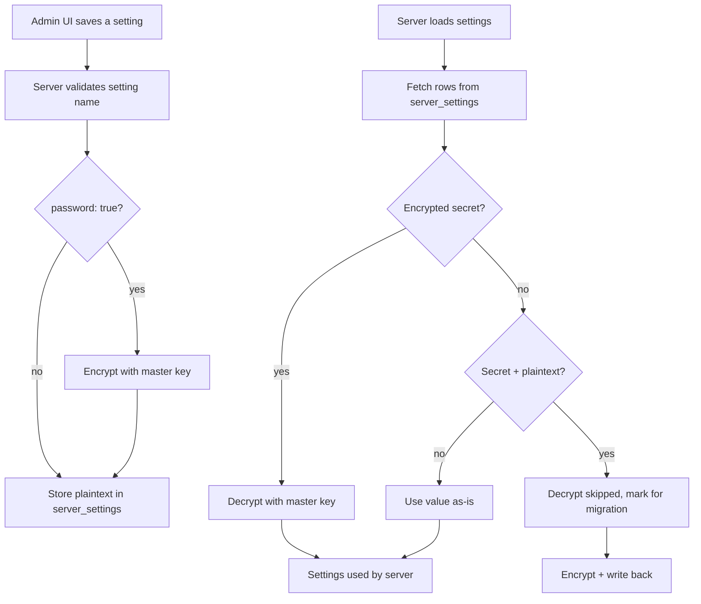

# Secrets in CoCalc

This document describes how CoCalc stores and protects admin secrets (API keys,
private keys, tokens, etc.) in the database and UI.

## Overview

- Secret settings are defined as those with `password: true` in the site settings
  schema.
- Secrets are encrypted at rest before being stored in `server_settings`.
- The admin UI treats secret values as **write-only**. Existing secret values are
  never returned to the browser.
- A per-install master key stored on disk is used for encryption/decryption.

## Master Key

- Default path: `$COCALC_ROOT/data/secrets/server-settings-key`
- Override: `COCALC_SECRET_SETTINGS_KEY_PATH`
- Behavior:
  - If the file does not exist, a random 32-byte key is generated and written
    with `0600` permissions.
  - In Kubernetes, mount the key via a secret.

## Encryption Format

Secrets are encrypted using AEAD (AES-256-GCM), with the setting name used as
associated data to prevent swapping values between fields.

Encoded format:

```
enc:v1:<key-id>:<nonce-b64>:<tag-b64>:<ciphertext-b64>
```

## Data Flow (Write and Read)



## Admin UI Behavior

- Secret values are **never** returned to the browser.
- For secret settings:
  - The UI shows "Stored (not shown)" when a value already exists.
  - The UI allows entering a new value to replace the stored secret.
  - Confirmation dialogs show `[updated]` or `[cleared]` instead of the secret.

## Backups and Migration

- Database backups do **not** include the master key by default.
- On startup, plaintext secret values in the DB are automatically migrated to
  encrypted form.
- Restoring the database without the key will prevent decryption of existing
  secrets.

## Security Notes

- Limit file access to the master key file; it is the root of trust.
- Never expose decrypted secrets in logs or client responses.
- For stronger protection, consider layering an optional passphrase to decrypt
  the master key at process startup.

