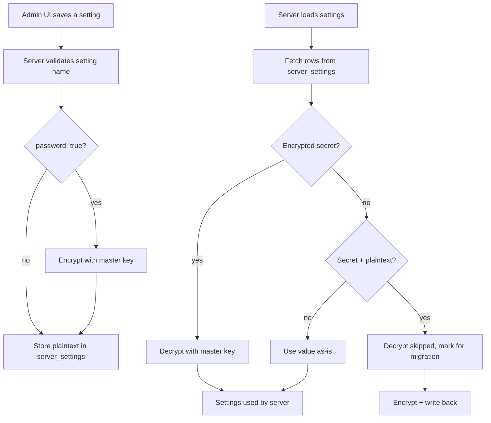

# Secrets in CoCalc

This document describes how CoCalc stores and protects admin secrets (API keys,
private keys, tokens, etc.) in the database and UI.

## Overview

- Secret settings are defined as those with `password: true` in the site settings
  schema.
- Secrets are encrypted at rest before being stored in `server_settings`.
- The admin UI treats secret values as **write-only**. Existing secret values are
  never returned to the browser.
- A per-install master key stored on disk is used for encryption/decryption.

## Master Key

Secret settings use a purpose-specific key derived from the site master key
with the purpose `secret-settings:v1`.

- Default site key: `${SECRETS}/site-master-key`. `SECRETS` defaults to
  `${DATA}/secrets`; `COCALC_DATA_DIR` takes precedence over `DATA`.
- A configured systemd credential at `${CREDENTIALS_DIRECTORY}/site-master-key`
  takes precedence over the `COCALC_SITE_MASTER_KEY_PATH` environment override.
- `COCALC_SECRET_SETTINGS_KEY_PATH` remains a legacy fallback for selecting the
  site key. It also selects the legacy secret-settings decryption file; without
  that override, the legacy file defaults to `${SECRETS}/server-settings-key`.
  Values decrypted with the legacy key are marked for migration to the derived
  site key.
- A missing writable site key is generated with 32 random bytes and mode `0600`.
  With `COCALC_REQUIRE_SITE_MASTER_KEY` enabled, or a systemd credential selected,
  a missing key is an error: startup does not generate a replacement.
- Back up the site key separately from Postgres. Keep legacy keys needed by
  retained database backups or unmigrated ciphertext; a new random key cannot
  decrypt old data.

The path and lifecycle implementation is
[src/packages/util/master-key-lifecycle.ts](../src/packages/util/master-key-lifecycle.ts).
Secret-settings derivation and legacy migration are in
[src/packages/database/settings/secret-settings.ts](../src/packages/database/settings/secret-settings.ts).

## Encryption Format

Secrets are encrypted using AEAD (AES-256-GCM), with the setting name used as
associated data to prevent swapping values between fields.

Encoded format:

```
enc:v1:site-master-key-v1:<nonce-b64>:<tag-b64>:<ciphertext-b64>
```

## Data Flow (Write and Read)


```mermaid
flowchart TD
  A[Admin UI saves a setting] --> B[Server validates setting name]
  B --> C{password: true?}
  C -- no --> D[Store plaintext in server_settings]
  C -- yes --> E[Encrypt with master key]
  E --> D

  F[Server loads settings] --> G[Fetch rows from server_settings]
  G --> H{Encrypted secret?}
  H -- yes --> I[Decrypt with master key]
  H -- no --> J{Secret + plaintext?}
  J -- yes --> K[Decrypt skipped, mark for migration]
  K --> L[Encrypt + write back]
  J -- no --> M[Use value as-is]
  I --> N[Settings used by server]
  M --> N
```

## Admin UI Behavior

- Secret values are **never** returned to the browser.
- For secret settings:
  - The UI shows "Stored (not shown)" when a value already exists.
  - The UI allows entering a new value to replace the stored secret.
  - Confirmation dialogs show `[updated]` or `[cleared]` instead of the secret.

## Backups and Migration

- Database backups do **not** include the master key by default.
- On startup, plaintext secret values in the DB are automatically migrated to
  encrypted form.
- Restoring the database without the key will prevent decryption of existing
  secrets.

## Security Notes

- Limit file access to the master key file; it is the root of trust.
- Never expose decrypted secrets in logs or client responses.
- For stronger protection, consider layering an optional passphrase to decrypt
  the master key at process startup.
