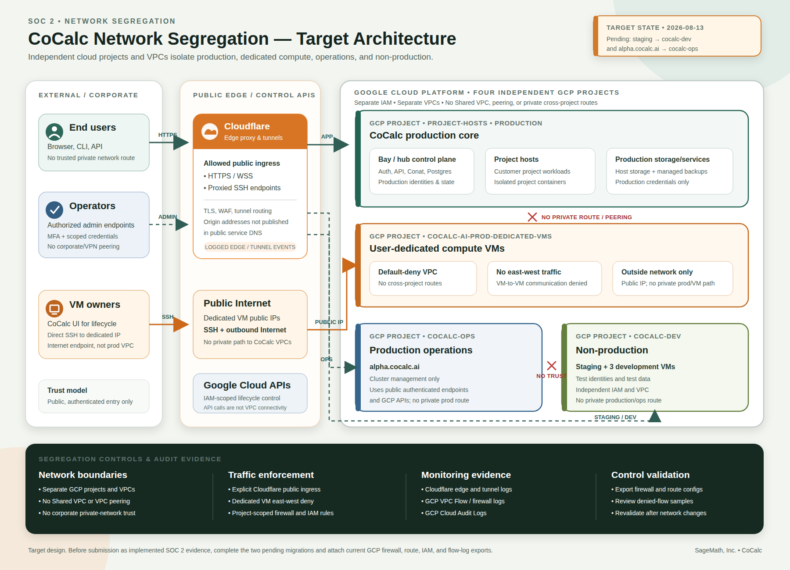

# CoCalc Network Segregation Target Architecture

**Document date:** 2026-08-13

**Status:** Target architecture; not yet implementation evidence

## Scope

This diagram documents the intended segregation among four independent Google
Cloud projects and their VPC networks:

| Environment                | GCP project                    | Intended contents                                                                                                                  |
| -------------------------- | ------------------------------ | ---------------------------------------------------------------------------------------------------------------------------------- |
| Production core            | `project-hosts`                | Production bay/hub, Postgres, project hosts, and production services                                                               |
| Dedicated customer compute | `cocalc-ai-prod-dedicated-vms` | User-dedicated VMs with public Internet connectivity, no private path to CoCalc production, and no VM-to-VM east-west connectivity |
| Production operations      | `cocalc-ops`                   | `alpha.cocalc.ai` and production cluster management tooling                                                                        |
| Non-production             | `cocalc-dev`                   | Staging and three development environments                                                                                         |

The target architecture does not use Shared VPC, VPC peering, private routing,
or corporate-network trust between these projects. GCP API calls authorized by
project-scoped IAM control infrastructure lifecycle; they do not establish VPC
connectivity.

## Allowed Network Flows

| Source                          | Destination                        | Allowed path                                         | Purpose                           |
| ------------------------------- | ---------------------------------- | ---------------------------------------------------- | --------------------------------- |
| End users                       | Production CoCalc services         | Public HTTPS/WSS through Cloudflare edge and tunnels | Application access                |
| Authorized operators            | Production and operations services | Public authenticated HTTPS/SSH through Cloudflare    | Administration                    |
| Dedicated VM owners             | Their dedicated VM                 | Public IP, principally SSH; outbound public Internet | Direct VM use                     |
| CoCalc production control plane | Google Cloud APIs                  | IAM-authenticated public Google API endpoints        | Dedicated VM lifecycle management |
| Developers/testers              | Staging and development services   | Public authenticated non-production endpoints        | Development and testing           |

All private cross-project paths are denied by absence of routes/peering and by
project firewall policy. The dedicated-VM VPC additionally denies east-west
traffic between VMs.

## Migration Status

As of the document date:

- staging still needs to move from the production `project-hosts` project to
  `cocalc-dev`;
- `alpha.cocalc.ai` still needs to move from `project-hosts` to `cocalc-ops`.

This diagram is suitable as deployment/design evidence now. It should only be
submitted to Vanta as evidence of the implemented architecture after both moves
are complete and the controls below have been validated.

## Evidence To Attach After Implementation

1. GCP project and VPC inventory showing the four independent projects.
2. Route and VPC-peering exports showing no cross-project private routes,
   Shared VPC, or peering.
3. Firewall exports for each VPC, including the dedicated-VM east-west deny
   policy and the explicit allowed ingress rules.
4. Project-scoped service-account/IAM exports for infrastructure lifecycle
   operations.
5. Recent GCP VPC Flow Logs, firewall logs, and Cloud Audit Logs demonstrating
   the expected allowed and denied flows.
6. Cloudflare tunnel/DNS configuration and recent edge or tunnel logs for
   production and operations ingress.
7. A dated validation note confirming staging and `alpha.cocalc.ai` are in their
   target projects.

The SVG is the editable source. The PNG is intended for direct upload to Vanta.
