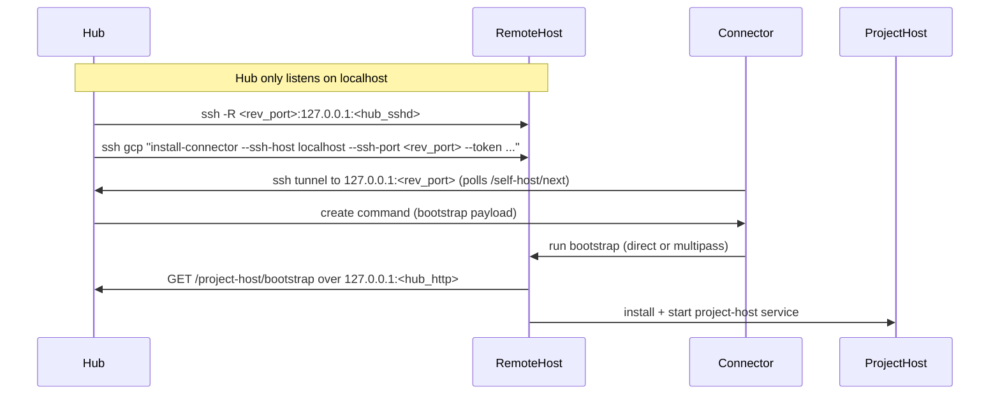

# Self-Hosted Project Hosts

This document describes how CoCalc Launchpad provisions **self-hosted** project
hosts and how the connector + SSH tunnels fit together. The goal is:

- minimal requirements on the remote machine,
- no public exposure of the hub,
- only SSH required for control/bootstrapping.

## Summary

Self-hosted hosts can run in two flavors:

- **Direct**: run the project-host directly on a Linux machine (no managed VM).
- **Multipass**: run the project-host inside a managed VM.

In both cases, the hub drives everything through a connector running on the
target machine. The connector talks to the hub through an SSH tunnel and
maintains a stable local port for hub access (by default the hub’s HTTP port),
so bootstrap can talk to the hub over `127.0.0.1` without exposing the hub
publicly.

## Sequence (Local/SSH-Tunnel Mode)



## Key Pieces

### 1) Reverse SSH tunnel from hub to remote host

When a host has an SSH target, the hub starts:

```
ssh -R <rev_port>:127.0.0.1:<hub_sshd_port> <ssh-target>
```

This exposes the hub’s SSH server **on the remote host** at
`127.0.0.1:<rev_port>`. The reverse port is stored in
`project_hosts.metadata.self_host.ssh_reverse_port`.

### 2) Connector install over SSH

The hub installs the connector on the remote host:

```
ssh <ssh-target> bash -lc "curl ... | bash -s -- --ssh-host localhost --ssh-port <rev_port> --token ..."
```

This makes the connector poll via `http://127.0.0.1:<local_port>`, where that
port is locally forwarded to the hub through the reverse tunnel.

### 3) Bootstrap uses the connector tunnel

The connector maintains a local forward from `127.0.0.1:<hub_http_port>` to the
hub via SSH, so bootstrap can simply access:

```
http://127.0.0.1:<hub_http_port>/project-host/bootstrap
```

This works even if the remote host cannot reach the hub directly.

### 4) Direct vs Multipass

- **Direct**: connector runs the bootstrap script with `sudo` on the machine.
- **Multipass**: connector launches a VM with cloud-init, then bootstrap runs
  inside the VM.

## Notes / Assumptions

- The hub SSH server is required for local/SSH-tunnel self-hosting.
- The hub HTTP server is local-only and reached via SSH tunnels.
- The reverse tunnel port is dynamic; always use the stored
  `metadata.self_host.ssh_reverse_port`.
- The connector uses a stable local port for the hub (defaults to the hub HTTP
  port). Use a non-privileged port (>=1024) to avoid permission errors.
- The connector install uses `--replace` and should be non-interactive. If
  passwordless `sudo` is not available on the remote host, the install will
  fail (with a timeout).

## Related Files

- SSH tunnel + install logic: [src/packages/server/self-host/ssh-target.ts](./src/packages/server/self-host/ssh-target.ts)
- Bootstrap script generation: [src/packages/server/cloud/bootstrap-host.ts](./src/packages/server/cloud/bootstrap-host.ts)
- Connector implementation: [src/packages/cloud/self-host/go/main.go](./src/packages/cloud/self-host/go/main.go)
