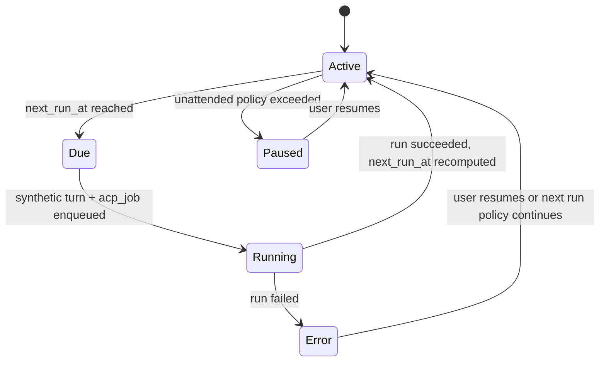
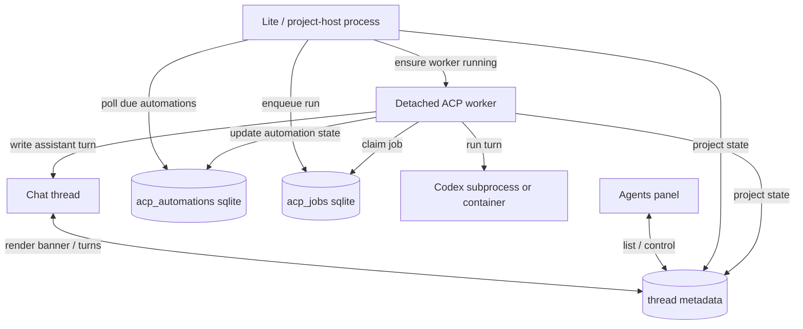

# Codex Automations

Status: Phase 1 done. Daily thread-attached automations are implemented.

Next high-priority work:

- finish Launchpad move/delete/clone lifecycle and scheduler rehydration
- keep clone/fork handling as best-effort until project cloning itself is fixed
- then add richer recurrence, starting with weekdays-only schedules

Goal: add durable scheduled Codex automations to chat threads, while keeping
the thread itself as the delivery surface and the Agents panel as the control
surface.

## Product Direction

Do not copy the Codex app "findings inbox" model.

In CoCalc, the better model is:

- a schedule is attached to a chat thread
- each scheduled run produces a normal assistant turn in that thread
- the existing activity log, links, diffs, and follow-up conversation all stay
  in the same place
- the Agents panel provides visibility, filtering, pause/resume, and "run now"

This fits the current ACP architecture much better than a separate inbox.

## Acceptance Scenarios

### Daily Briefing

1. User opens an ACP chat thread and configures:
   - prompt: `What is the exact status of the project we're working on? What should we do next?`
   - schedule: daily at `05:00`
   - timezone: `America/Los_Angeles`
2. The backend persists the automation.
3. The next day at 5:00 AM, a normal Codex turn is created in that thread.
4. When the user opens the thread in the morning, the full answer is already
   there, with the usual activity log and observability.
5. The thread banner says when it last ran and when it will run next.

### Hacker News Monitor

1. User configures a thread to run daily with:
   `Tell me about recent articles on Hacker News that are relevant to my work in this git repo at ...`
2. Every run appends a normal assistant answer to the same thread.
3. The user can continue the conversation about any one run in that same
   thread.
4. If the user stops looking at the thread, the automation becomes easy to
   discover and optionally pauses itself after a configurable unattended period.

### Restart Safety

1. A project-host or Lite restart happens while an automation is idle and
   waiting for its next scheduled time.
2. The automation is not lost because its config and next run time are durable.
3. After restart, due or overdue automations are detected and enqueued.
4. If a restart happens while a scheduled run is actively executing, the
   durable ACP worker/job path handles it the same way as ordinary Codex turns.

### Daily Security Checkup

1. User configures a thread to run daily with a prompt like:
   `Check all running exposed apps in this project for obvious security issues, risky configuration, missing auth, stale dependencies, or suspicious logs. Summarize concrete findings and recommended fixes.`
2. Each day, Codex inspects the current exposed services and app configuration
   and appends a normal assistant turn to the same thread.
3. If there are no findings, phase 1 can still post the full result; later
   phases may support "only post when materially changed".
4. The user can then discuss or act on the findings directly in the same
   thread.

### Weekly System Maintenance

1. User configures a thread to run weekly with a prompt like:
   `Do routine system maintenance for this project: check for upgrades, excessive log growth, unhealthy services, container issues, disk pressure, and obvious cleanup opportunities. Recommend or apply safe maintenance steps.`
2. The run happens on a weekly schedule and leaves a full normal Codex turn in
   the thread.
3. The thread becomes the durable maintenance record, including follow-up
   discussion and decisions.

## Why This Is Not Just "Loop With a Longer Sleep"

The current loop system is close in spirit but not the right persistence model.

Today:

- loop config is explicitly "for this send" in
  `src/packages/frontend/chat/composer.tsx`
- loop state is consumed inside one ACP evaluation loop in
  `src/packages/lite/hub/acp/index.ts`
- `scheduled` currently means "persist state and then `sleep(...)` in memory"
- there is no durable `next_run_at_ms`
- there is no persistent automation prompt separate from the one-shot send

That is fine for short autonomous reruns. It is not a real durable daily
scheduler.

The right approach is:

- keep the current loop feature as one-shot autonomous continuation
- add a separate thread-level automation layer for recurring schedules
- reuse the existing durable ACP jobs/workers for actual execution

## Core Design Principles

- Thread is the delivery surface.
- Agents panel is the control surface.
- Scheduled runs should look like normal Codex turns once they fire.
- Schedules must be durable across browser close and server restart.
- The system must never require a Lite ACP worker to stay alive all day just to
  wait for the next run time.
- Attention policy should be separate from schedule policy.
- Default behavior should make forgotten automations visible and easy to pause.

## Product Model

Introduce a new thread-scoped concept:

- `automation_config`
- `automation_state`

This should be separate from:

- `loop_config`
- `loop_state`

Reason:

- loops are per-send autonomous continuation
- automations are persistent recurring schedules

The schedule should belong to the thread, not to any one message.

## UX

### Thread Configuration

Add a new "Schedule" / "Automation" control near the existing Codex loop
controls in `src/packages/frontend/chat/composer.tsx` or in the thread header.

Suggested first automation form:

- enabled
- title
  - e.g. `Daily HN scan`
- prompt
  - stored with the automation, not inferred from the last user send
- schedule type
  - MVP: `daily`
- local time
  - e.g. `05:00`
- timezone
  - explicit, not implicit browser-local only
- run mode
  - MVP: `append a normal turn every run`
- attention policy
  - pause after `N` unattended runs
  - or require acknowledgment every `N` days

### Thread Surface

Show a persistent thread banner in `src/packages/frontend/chat/chatroom.tsx`
when the selected thread has an automation.

Suggested content:

- `Scheduled daily at 5:00 AM`
- `Next run <TimeAgo ... />`
- `Last run <TimeAgo ... />`
- `Paused because no acknowledgment for 7 days`
- buttons: `Run now`, `Pause`, `Resume`, `Edit`

Use:

- `TimeAgo`
- existing time formatting helpers or `Time`

### Delivery in the Thread

When a run fires, create:

- a compact synthetic user/system row such as
  `Scheduled run: Daily HN scan`
- followed by a normal assistant turn

Important:

- do not re-post the full automation prompt text every day unless explicitly
  desired
- keep the thread readable
- keep the assistant turn fully normal, with the same observability as any
  ordinary Codex turn

### Agents Panel

Add a dedicated Automations section to the existing Agents UI in:

- `src/packages/frontend/project/page/flyouts/agents.tsx`
- possibly also `src/packages/frontend/project/page/agent-dock.tsx`

This section should list:

- title
- thread link
- enabled / paused / error state
- next run
- last run
- unread automated outputs
- last error
- quick actions: `Open`, `Run now`, `Pause`, `Resume`

Do not force this into `AgentSessionRecord` if it makes the model confusing.
Automations are not the same thing as live session records.

## Attention Policy

Do not make "must confirm every 3 days" the only behavior.

Treat attention as a separate policy with explicit state.

Recommended MVP policy:

- automation keeps running normally
- every automated run increments `unacknowledged_runs`
- a human reply in the thread or an explicit `Acknowledge` action resets it
- if `unacknowledged_runs >= limit`, automation pauses and surfaces in the
  Agents panel and thread banner

Also track:

- `last_acknowledged_at_ms`
- `last_human_message_at_ms`

Possible later options:

- pause after `N` days without acknowledgment
- "only post if materially changed"
- auto-archive no-op runs

## Durable Data Model

### Chat Thread Metadata

Extend `src/packages/chat/src/index.ts` with new types roughly like:

```ts
export interface ChatThreadAutomationConfig {
  enabled: boolean;
  automation_id?: string;
  title?: string;
  prompt: string;
  schedule_type: "daily";
  local_time: string; // "HH:MM"
  timezone: string; // IANA tz, e.g. America/Los_Angeles
  pause_after_unacknowledged_runs?: number;
}

export interface ChatThreadAutomationState {
  automation_id: string;
  status: "active" | "running" | "paused" | "error";
  next_run_at_ms?: number;
  last_run_started_at_ms?: number;
  last_run_finished_at_ms?: number;
  last_acknowledged_at_ms?: number;
  last_human_message_at_ms?: number;
  unacknowledged_runs?: number;
  paused_reason?: string;
  last_error?: string;
  last_job_op_id?: string;
  last_message_id?: string;
}
```

Store the authoritative automation definition in the thread config row, and
also mirror enough runtime state there for the chat UI and host recovery logic
to render/use it without querying a separate admin-only table.

### Durable Scheduler Table

Add a new sqlite table in:

- `src/packages/lite/hub/sqlite/acp-automations.ts`

Suggested fields:

- `automation_id`
- `project_id`
- `path`
- `thread_id`
- `account_id`
- `title`
- `prompt`
- `schedule_type`
- `timezone`
- `local_time`
- `enabled`
- `status`
- `next_run_at`
- `last_run_started_at`
- `last_run_finished_at`
- `last_acknowledged_at`
- `last_human_message_at`
- `unacknowledged_runs`
- `pause_after_unacknowledged_runs`
- `paused_reason`
- `last_error`
- `last_job_op_id`
- `updated_at`
- `created_at`

Constraints:

- unique on `(project_id, path, thread_id)` for MVP, i.e. one automation per
  thread
- index on `(enabled, status, next_run_at)`

Reason for a dedicated table instead of only syncdb:

- scheduler code must scan/filter due automations efficiently
- sqlite is already the durable ACP control plane
- thread metadata remains the authoritative project-scoped automation config,
  while sqlite is the host-local scheduler index and execution cache

### Authority Model

Automation configuration must move with the project.

Therefore:

- thread metadata stored with the project is the authoritative source of
  automation definition
- host-local sqlite is a derived scheduler index / execution cache
- host-local rows must be rebuildable from project data

This matters for Launchpad because projects can be deleted, moved between
hosts, and cloned/forked.

## Scheduling Semantics

### Daily Time Computation

For a daily schedule:

1. Parse local time like `05:00`.
2. Combine it with the configured IANA timezone.
3. Compute the next future wall-clock occurrence.
4. Persist the resulting `next_run_at_ms`.

Rules:

- if current time is before the target today, schedule today
- otherwise schedule tomorrow
- after each run completes, compute the next future occurrence again
- if the server was down and the run is overdue, execute once on recovery and
  then schedule the next future occurrence

Do not enqueue multiple catch-up runs for days that were missed while the host
was down.

## Execution Architecture

### Separation of Responsibilities

Use three layers:

1. durable automation ledger (`acp_automations`)
2. durable execution queue (`acp_jobs`)
3. detached ACP worker for actual Codex execution

### Who Waits for the Next Scheduled Time?

Do not keep the ACP worker alive for hours just to wait.

Instead:

- the next run time is persisted in sqlite
- a lightweight scheduler poller in the main Lite / project-host process checks
  for due automations
- when a due automation is found, it enqueues a normal ACP job and ensures the
  detached worker is running
- if the main process restarts, it rescans on startup and picks up overdue
  automations

This preserves the current Lite worker idle-exit design.

### Enqueueing a Scheduled Run

When an automation is due:

1. create a compact synthetic user/system chat row for the scheduled run
2. enqueue a normal ACP job into `acp_jobs`
3. link the job back to `automation_id`
4. mark automation state `running`
5. project the updated `automation_state` into the thread config row

The actual assistant turn should use the same durable ACP path as any other
Codex turn.

### Completion

When the job finishes:

1. mark automation `last_run_finished_at_ms`
2. update `last_job_op_id` and `last_message_id`
3. increment `unacknowledged_runs`
4. compute and persist the next `next_run_at_ms`
5. if attention policy is exceeded, pause instead of scheduling the next run
6. mirror the new `automation_state` into thread metadata

### Acknowledgment

Reset `unacknowledged_runs` when:

- the user explicitly clicks `Acknowledge`
- or the user sends a human-authored message in the thread

This is more reliable than trying to infer true "read" semantics from tab
visibility alone.

## Project Lifecycle Semantics

### Delete

If a project is deleted:

- project-stored automation metadata disappears with the project
- host-local scheduler rows for that project are removed during cleanup

### Move to Another Host

If a Launchpad project moves to another host:

- automation definitions move with the project because they live in project
  metadata
- the source host drops its local scheduler/runtime rows for that project
- the destination host rebuilds its local scheduler index from project metadata
- enabled automations remain enabled and continue normally

Do not attempt to migrate a live in-flight automation run across hosts. Treat an
active move as interrupting the current run, then let the destination host
resume future scheduled runs from durable state.

Policy:

- move preserves and reactivates automations

### Clone / Fork

If a project is cloned or forked:

- clone the automation definitions
- clear runtime state such as `last_run_*`, `last_job_op_id`,
  `unacknowledged_runs`, and `last_error`
- do not leave the cloned automation enabled by default
- mark it as paused/disabled until explicitly confirmed in the new project

Suggested paused reason:

- `cloned_project_requires_confirmation`

Policy:

- clone/fork preserves definitions, but requires explicit re-enable

## Failure Semantics

If a scheduled run fails:

- keep the failed assistant turn/error visible in the thread
- persist `last_error`
- surface the automation as `error` in the Agents panel
- keep `Run now` available

Suggested default:

- do not disable the automation after a single transient error
- leave it enabled unless the user pauses it
- still compute the next daily run unless repeated-failure policy is later
  added

## State Machine



## Component Diagram



## Recommended Implementation Phases

### Phase 1: Daily Schedule MVP

Status: done.

Deliver:

- one automation per thread
- daily schedule only
- explicit timezone
- compact scheduled-run row in thread
- full normal assistant turn output
- thread banner with next/last run
- Agents panel listing
- pause/resume/run-now
- pause after `N` unacknowledged runs

Files likely touched:

- `src/packages/chat/src/index.ts`
- `src/packages/frontend/chat/actions.ts`
- `src/packages/frontend/chat/chatroom.tsx`
- `src/packages/frontend/chat/composer.tsx`
- `src/packages/frontend/project/page/flyouts/agents.tsx`
- `src/packages/lite/hub/sqlite/acp-automations.ts`
- `src/packages/lite/hub/acp/index.ts`
- `src/packages/conat/ai/acp/types.ts`

### Phase 2: Delivery Refinements

Possible additions:

- only post when materially changed
- explicit no-op result mode
- richer pause policies
- richer banner and notifications

### Phase 3: Richer Recurrence

Possible additions:

- weekdays only
- multiple times per day
- weekly schedules
- cron-like advanced mode

Do not start with cron syntax.

## Detailed Plan: Command Automations

Goal: extend the existing thread-attached automation system so a scheduled run
can either:

- run Codex with a stored prompt
- or run an explicit bash command in the project

This should work in both Codex and non-Codex chat threads. The schedule,
banner, acknowledgment policy, Agents-panel listing, sqlite durability, and
thread delivery surface should stay the same.

### Why This Should Be A First-Class Mode

Asking Codex to run a bash command works, but it has important drawbacks:

- it consumes model tokens for a task that does not need a model
- it is less deterministic than directly executing the command
- it is slower
- it makes stdout/stderr formatting and exit-code reporting indirect
- it forces command automations to live only in Codex threads

Command automations should therefore be an explicit automation mode, not a
prompting trick layered on top of Codex.

### Chosen Architecture

Do not build a second scheduler.

Do not build a second attention/acknowledgment system.

Do not create a separate "automation inbox".

Instead:

- keep `acp_automations` as the durable schedule and runtime-state table
- keep thread metadata as the authoritative project-scoped definition
- reuse the same detached ACP worker / queue ownership model
- generalize queued execution from "Codex only" to "automation run"

Concretely:

- the scheduler still polls `acp_automations`
- when a run is due, it enqueues a durable job
- the job payload says whether the run is `codex` or `command`
- the detached worker claims the job and dispatches accordingly

This keeps restart recovery, queue ordering, interrupt semantics, and host
ownership in one place.

### Product Model

Extend the automation definition with an explicit run kind:

```ts
type AutomationRunKind = "codex" | "command";
```

For `codex`:

- use the existing `prompt`
- continue to inherit the thread's persisted Codex session config

For `command`:

- store an explicit bash command string
- run it directly in the project
- write the results back into the thread without involving Codex

Recommended config shape:

```ts
export interface ChatThreadAutomationConfig {
  enabled?: boolean;
  automation_id?: string;
  title?: string;
  run_kind?: "codex" | "command";

  // codex mode
  prompt?: string;

  // command mode
  command?: string;
  command_cwd?: string;
  command_timeout_ms?: number;

  // shared schedule
  schedule_type?: "daily" | "interval";
  days_of_week?: number[];
  local_time?: string;
  interval_minutes?: number;
  window_start_local_time?: string;
  window_end_local_time?: string;
  timezone?: string;
  pause_after_unacknowledged_runs?: number;
}
```

Notes:

- `command_cwd` should default to the chat's containing directory.
- `command_timeout_ms` should default to something conservative such as
  `10 * 60_000`.
- do not add arbitrary env editing in the first pass.
- do not add streaming terminal emulation in the first pass.
- do not try to support interactive stdin in the first pass.

### Thread Eligibility Rules

Command automations should be allowed in any chat thread.

Codex automations should remain restricted to threads that are configured to
use Codex / ACP.

UI policy:

- in a Codex thread, show a mode selector:
  - `Codex`
  - `Command`
- in a non-Codex thread, show only `Command`
- if a user converts a thread from Codex to non-Codex later, preserve the
  stored automation config but block `run_kind = "codex"` until the thread is
  Codex-capable again

### Durable Data Model Changes

#### Thread Metadata

Extend:

- `src/packages/chat/src/index.ts`
- `src/packages/conat/ai/acp/types.ts`

with the new command-automation fields:

- `run_kind`
- `command`
- `command_cwd`
- `command_timeout_ms`

#### Scheduler Table

Extend:

- `src/packages/lite/hub/sqlite/acp-automations.ts`

with matching durable columns:

- `run_kind TEXT NOT NULL DEFAULT 'codex'`
- `command TEXT`
- `command_cwd TEXT`
- `command_timeout_ms INTEGER`

Validation rules:

- `run_kind = 'codex'` requires non-empty `prompt`
- `run_kind = 'command'` requires non-empty `command`
- only one of `prompt` / `command` should be semantically active at a time

### Execution Queue Design

Keep the existing durable queue ownership model, but generalize the queued
request type from "ACP request" to "queued automation run request".

Recommended first implementation:

- keep the current `acp_jobs` table for now to minimize churn
- widen the stored request payload into a discriminated union

Example:

```ts
type QueuedAutomationRequest =
  | (AcpRequest & { request_kind?: "codex" })
  | {
      request_kind: "command";
      project_id: string;
      account_id: string;
      chat: AcpChatContext;
      command: string;
      command_cwd?: string;
      command_timeout_ms?: number;
    };
```

This means:

- existing Codex queued turns continue to work with `request_kind` omitted or
  equal to `"codex"`
- command automations enqueue a durable `"command"` request into the same queue
- the detached worker claims jobs exactly as it does now
- worker dispatch becomes:
  - `codex` -> existing ACP execution path
  - `command` -> new command execution path

Do not rename `acp_jobs` in the first pass. The table name is imperfect but the
blast radius of a rename is not worth it initially.

### Command Execution Path

Add a new backend helper, likely under:

- `src/packages/lite/hub/acp/command-automation.ts`

Responsibilities:

1. Resolve the effective command cwd:
   - `command_cwd` if provided
   - otherwise the chat directory
2. Resolve the existing executor:
   - reuse `ContainerExecutor` / `LocalExecutor`
   - reuse the same workspace-root and host/runtime logic already used by ACP
3. Execute:
   - `/bin/bash -lc <command>`
4. Enforce timeout:
   - kill the subprocess if it exceeds `command_timeout_ms`
5. Capture:
   - stdout
   - stderr
   - exit code
   - runtime duration
6. Post a normal assistant-like automation result into the chat thread

First-pass output format should be simple and robust:

````md
Command: `git fetch --all --prune && git status --short`

Exit code: `0`
Duration: `12.4s`

## stdout

```text
...
```

## stderr

```text
...
```
````

If one stream is empty, omit that section.

If output is very large:

- cap persisted output to a reasonable size
- note that truncation occurred
- optionally attach/store the full log later as a follow-up enhancement

### Chat Attribution

Do not attribute command automations to the human user.

Add a dedicated synthetic sender identity, similar to scheduled Codex runs,
for example:

- `cocalc-automation-command`

This should render:

- on the left side
- with a stable automation/system visual identity
- not as a viewer message

Recommended message pattern when a run fires:

1. synthetic compact kickoff row:
   - `Scheduled command run: Nightly git health check`
2. result row with stdout/stderr/exit code

This keeps parity with Codex automations and preserves thread readability.

### Interrupt and Restart Semantics

For the first pass:

- support pause/resume/run-now exactly as existing automations do
- do not support mid-command interrupt from the chat UI yet unless it is
  already easy through the executor abstraction
- if the host restarts during a running command automation, treat it the same
  way as a detached-worker interruption:
  - mark the run interrupted/error
  - keep the automation definition
  - compute the next future run normally

The command automation must never disappear because the process restarted.

### Frontend Changes

#### Automation Form

Extend:

- `src/packages/frontend/chat/automation-form.tsx`

Add:

- run-kind segmented control or radio group
- `Command` textarea/input when `run_kind = "command"`
- optional cwd input
- optional timeout input

Behavior:

- if `run_kind = "codex"`, keep the current prompt field
- if `run_kind = "command"`, hide the Codex prompt field
- preserve shared schedule fields exactly as they are now

#### Thread Banner

Extend:

- `src/packages/frontend/chat/chatroom.tsx`

to clarify what kind of automation is configured:

- `Scheduled Codex automation. Every 2 hours from 06:00 to 20:00.`
- `Scheduled command automation. Daily at 05:00.`

#### Agents Panel

Extend:

- `src/packages/frontend/project/page/flyouts/agents.tsx`

so the automation list shows:

- title
- run kind
- next run
- last run
- last error
- thread link

### Backend API Changes

Extend the automation request/response shapes in:

- `src/packages/conat/ai/acp/types.ts`

so `run_kind`, `command`, `command_cwd`, and `command_timeout_ms` round-trip
between:

- frontend form
- thread metadata
- sqlite scheduler table
- Agents panel projection

### Validation Plan

Add focused tests in:

- `src/packages/lite/hub/acp/__tests__/automation-schedule.test.ts`
  - unchanged scheduling behavior for command automations
- `src/packages/lite/hub/acp/__tests__/acp-automations.test.ts`
  - sqlite round-trip for `run_kind = "command"`
- new test, likely:
  - `src/packages/lite/hub/acp/__tests__/command-automation.test.ts`

Core cases:

1. command automation config persists and reloads
2. due command automation enqueues a durable queued request
3. worker executes `/bin/bash -lc`
4. stdout/stderr/exit code are written to chat
5. attention policy still increments / pauses correctly
6. non-Codex threads can own command automations
7. host restart leaves the automation definition intact

Frontend tests:

- `src/packages/frontend/chat/__tests__/automation-form.test.ts`
  - mode switch
  - validation rules
  - command-specific fields

### Suggested Implementation Order

#### Step 1: Type and sqlite plumbing

- extend automation config/state types
- extend `acp_automations` sqlite schema and normalization
- keep frontend hidden for the moment

#### Step 2: Backend execution branch

- add `request_kind = "command"` queue payload
- add command execution helper using the existing executor abstraction
- add chat result formatting

#### Step 3: Automation scheduler integration

- make due automations enqueue either Codex or command runs
- make `Run now` use the same branching logic

#### Step 4: Frontend form and thread UX

- expose the run-kind selector
- expose command input / cwd / timeout
- update the banner and Agents panel labels

#### Step 5: Non-Codex thread enablement

- lift any remaining frontend gating that assumes automations are Codex-only
- keep Codex mode hidden unless the thread is Codex-capable

### Explicit Non-Goals for the First Pass

Do not include these initially:

- interactive shell sessions
- streamed terminal output into chat while the command is running
- arbitrary env var editing
- cron syntax
- multiple commands as structured steps
- approval prompts during command execution
- interrupt/cancel support if it complicates the worker model

### Example MVP Scenarios

#### Morning Repo Status

- thread type: ordinary chat
- title: `Morning repo status`
- run kind: `command`
- command:
  `git fetch --all --prune && git status --short && git log --oneline -5`
- schedule: daily at `06:00`

Result: the chat gets a compact kickoff row and a left-side result row with the
command output.

#### Security Check Script

- thread type: ordinary chat
- title: `Daily security check`
- run kind: `command`
- command: `./scripts/security-check.sh`
- cwd: project root
- schedule: weekdays at `05:00`

Result: the same automation scheduler and acknowledgment policy are reused,
without involving Codex.

### Recommendation

Implement command automations as a new `run_kind` on the existing thread
automation system, not as a separate feature. Keep scheduling and attention
policy shared, generalize the durable job payload, and add a direct command
execution branch in the detached worker.

## Open Questions

- whether the synthetic scheduled-run row should be a normal chat row with a
  special sender or a dedicated event type
  - ANS: I think normal chat row - that means it is automatically searchable (which could be useful) and it is just a message after all.
- whether `Run now` should preserve the normal daily anchor or reset the next
  run relative to "now"
  - ANS: I think preserve. If use wants to change params, they can just change them directly.
- whether "unacknowledged" should reset only on explicit acknowledgment or also
  on any human reply in the thread
  - ANS: any human reply; the goal is just preventing pointless work that is never used
- whether a thread should ever support more than one automation
  - ANS: I think no. It's easy to have lots of threads. If you really needed more than one in a thread, there's probably better ways to share that context (e.g., a shared markdown file) or put in a conditional.

## Recommendation

Implement Phase 1 exactly as a thread-attached daily automation feature,
separate from loop mode.

This gives:

- the right user experience for scheduled Codex work
- strong reuse of the durable ACP jobs/workers architecture
- good visibility in both the thread and the Agents panel
- a clean path to richer recurrence and delivery policies later
