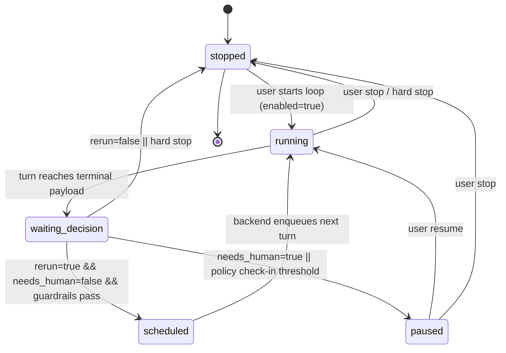

# Codex Loop State Machine (Phase 1)

This is the contract for backend-driven Codex loop execution.

## Shared Types

Defined in `src/packages/conat/ai/acp/types.ts`:

- `AcpLoopConfig`
- `AcpLoopState`
- `AcpLoopContractDecision`
- `AcpLoopStopReason`

`AcpChatContext` now carries:

- `loop_config?: AcpLoopConfig`
- `loop_state?: AcpLoopState`

Chat thread-config rows may persist:

- `loop_config`
- `loop_state`

via `src/packages/chat/src/index.ts` (`ChatThreadConfigRecord`).

## Runtime Contract

Assistant output should include a decision payload:

```json
{"loop":{"rerun":true,"needs_human":false,"next_prompt":"...", "blocker":"...", "confidence":0.7}}
```

The backend parses this payload and applies loop guardrails.

## State Transitions



1. `stopped -> running`
- Trigger: user starts a looped turn with `loop_config.enabled=true`.
- Action: create `loop_id`, set `iteration=1`, persist `loop_state`.

2. `running -> waiting_decision`
- Trigger: turn reaches terminal payload (`summary` or `error`).
- Action: parse loop contract JSON and update `loop_state.updated_at_ms`.

3. `waiting_decision -> scheduled`
- Trigger: contract says `rerun=true`, `needs_human=false`, and guardrails pass.
- Action: set `next_prompt`, increment `iteration`, optionally apply sleep.

4. `waiting_decision -> paused`
- Trigger: contract says `needs_human=true` or policy check-in threshold reached.
- Action: persist pause reason and await user resume.

5. `waiting_decision -> stopped`
- Trigger: `rerun=false` or any hard stop condition (`max_turns`, `max_wall_time`, invalid/missing contract, repeated blocker, user stop).
- Action: persist `stop_reason`, clear `next_prompt`.

6. `scheduled -> running`
- Trigger: backend enqueues next turn.
- Action: submit next turn with updated `loop_state`.

## Guardrails

- Hard stop on:
  - `max_turns`
  - `max_wall_time_ms`
  - repeated blocker signature count
  - malformed contract payload
  - explicit user stop
- Interrupt semantics:
  - user interrupt should pause/stop loop, not only stop one active turn.

## Persistence / Recovery

`loop_state` should be treated as authoritative backend state for recovery after project-host restart.

On boot:

1. Scan active loops (`running` / `scheduled`).
2. Reconcile with ACP turn leases.
3. Requeue idempotently using `(loop_id, iteration)`.
