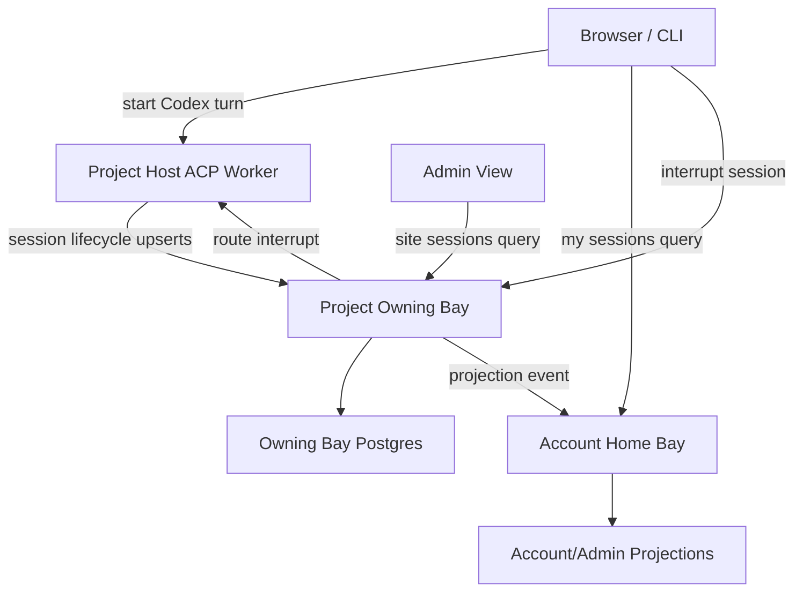

# Global Codex Session Visibility Plan

Date: 2026-06-17

Status: implementation in progress. The backend registry, lifecycle publication,
user-scoped listing, account-scoped interrupt/interrupt-all contract, and basic
stale/host-stopped reconciliation helpers are implemented. UI, CLI, admin
views, payment-source filtering, and scheduled reconciliation wiring remain. A
minimal account AI settings panel now exposes current/recent Codex sessions and
account-scoped stop-all.

## Objective

Give users, account owners, and site administrators a reliable answer to:

- Is anything currently running that might be spending AI money?
- What ran recently?
- Which account/project/chat started it?
- Which payment source is being used?
- Can I stop all currently active or possibly active Codex sessions?

This is important even though cocalc-ai does not currently do pay-as-you-go AI
metering. A user on a fixed monthly plan still wants confidence that the plan
is not being drained by forgotten or stuck sessions. A user with their own API
key wants visibility into what is consuming it. A site with a global API key
needs operational visibility into all recent and active sessions using that
shared key.

This should be a trust/safety feature, not just an admin debugging page.

## Product Invariant

Never hide a session from the money-risk view unless the backend has written a
terminal state.

Terminal states:

- `completed`
- `failed`
- `interrupted`
- `canceled`
- `host_stopped`

Non-terminal or money-risk states:

- `queued`
- `running`
- `interrupting`
- `possibly_active`
- `orphaned`
- `unknown`

If an interrupt RPC times out, a project host disconnects, or a browser loses
contact with the backend, the UI must not pretend the session stopped. It should
remain visible as `possibly_active` or `orphaned` until a backend reconciliation
process proves otherwise.

## User-Facing Surfaces

### Account View

Add a user/account-facing "AI activity" or "Codex sessions" page. It should be
easy to reach from account settings, usage/billing, and the chat UI when a run
is active.

Primary sections:

- `Active now`
  - sessions that are definitely queued/running/interrupting.
- `Possibly active`
  - stale sessions where a backend has not written a terminal state.
- `Recently finished`
  - completed, failed, interrupted, and canceled sessions from a recent
    retention window.

Each row should include:

- status
- project title/id
- chat file path
- thread/session link
- model
- started time
- duration or age
- last heartbeat/activity time
- prompt/title snippet
- payment source
- token/usage summary when available
- visible warning if the session may still be spending money
- actions: open chat, interrupt, copy diagnostic id

### Global Site Admin View

Add an admin view for site-wide visibility:

- all active and possibly-active sessions;
- all recent sessions using the site/global API key;
- filters by account, project, host, bay, payment source, model, state, and
  time window;
- aggregate counts by payment source and model;
- "interrupt selected" and "interrupt all visible" admin operations with
  explicit fresh-auth and audit requirements.

The admin view should make it obvious whether the shared site key is being used
by:

- normal user sessions backed by a membership;
- site/admin/test sessions;
- anonymous or unexpected sessions, which should normally not exist.

### Chat-Level Surface

The existing chat thread UI should link to the global/session row for the
active turn. When a chat believes a turn is running but the global registry says
the turn is terminal, the chat can use that registry state as a repair signal.

Do not make the registry a replacement for the `.chat` history. The registry is
for lifecycle/observability/control; `.chat` remains the conversation record.

### CLI Surface

Add an operator/user CLI surface. Suggested commands:

```sh
cocalc codex sessions
cocalc codex sessions --active
cocalc codex sessions --recent --limit 50
cocalc codex sessions --project <project_id>
cocalc codex sessions --payment-source site
cocalc codex interrupt <session_id>
cocalc codex interrupt --all-active
```

Admin-only extensions:

```sh
cocalc codex admin sessions --active
cocalc codex admin sessions --payment-source site --recent 24h
cocalc codex admin interrupt <session_id>
cocalc codex admin interrupt --all-active --payment-source site
```

JSON output should be agent-friendly and include exact ids, state, timestamps,
payment source, host/bay routing, and whether each session is terminal.

## Architecture

Codex/ACP execution is project-host data-plane work. The project host should
remain authoritative for live execution. The global visibility layer should be
small lifecycle metadata replicated to the owning bay and projected to account
home bays/admin views.

High-level flow:



Multibay rules:

- The owning bay for the project is authoritative for session lifecycle rows.
- The project host writes lifecycle updates to the owning bay, not to arbitrary
  home bays.
- A user's home bay can serve a "my sessions" view from projections or by
  routed queries to owning bays.
- Site/global admin queries may require seed/global aggregation or fanout
  across bays, depending on the final deployment topology.
- Steady-state Codex traffic remains browser/project-host direct where possible.
  Do not proxy streaming Codex output through the hub just to support this
  registry.

## Data Model

Add formal schema entries instead of inferring state from `.chat` files.

Suggested primary table: `acp_sessions`.

Authoritative location:

- project owning bay Postgres.

Retention:

- active and possibly-active rows are retained until terminal plus retention.
- terminal rows retained for at least 30 days initially.
- consider longer retention for admin/account usage history if storage volume is
  modest.

Suggested columns:

- `session_id TEXT PRIMARY KEY`
  - stable backend session/job id; not necessarily a UUID because ACP/Codex
    session ids may be non-UUID strings.
- `run_id UUID`
  - optional generated UUID for DB identity if we prefer not to key by
    `session_id`.
- `project_id UUID NOT NULL`
- `owning_bay_id UUID`
- `host_id UUID`
- `account_id UUID`
  - initiating account, if known.
- `approver_account_id UUID`
  - account whose auth/payment approval was used, if different.
- `path TEXT`
  - chat file path, e.g. `home/user/sage/sage.chat`.
- `thread_id TEXT`
- `message_id TEXT`
- `parent_message_id TEXT`
- `operation_id UUID`
  - long-running operation id when available.
- `state TEXT NOT NULL`
  - enum-like value: `queued`, `running`, `interrupting`, `completed`,
    `failed`, `interrupted`, `canceled`, `host_stopped`, `possibly_active`,
    `orphaned`, `unknown`.
- `terminal BOOLEAN NOT NULL DEFAULT false`
- `payment_source_kind TEXT NOT NULL`
  - `user_api_key`, `account_plan`, `site_api_key`, `project_secret`,
    `unknown`.
- `payment_source_id TEXT`
  - stable opaque id for the payment source. Do not store raw API keys.
- `payment_source_label TEXT`
  - user/admin-safe label, e.g. `OpenAI key ending ...abcd`,
    `CoCalc AI membership`, `site default OpenAI key`.
- `payment_source_owner_account_id UUID`
  - if the key/plan is owned by a specific account.
- `model TEXT`
- `agent_kind TEXT`
  - initially `codex`; leaves room for future ACP agents.
- `run_kind TEXT`
  - `interactive`, `automation`, `command`, etc.
- `title TEXT`
  - short safe display title; not necessarily full prompt.
- `prompt_snippet TEXT`
  - optional short sanitized snippet.
- `started_at TIMESTAMPTZ`
- `queued_at TIMESTAMPTZ`
- `running_at TIMESTAMPTZ`
- `updated_at TIMESTAMPTZ NOT NULL`
- `last_heartbeat_at TIMESTAMPTZ`
- `last_event_at TIMESTAMPTZ`
- `finished_at TIMESTAMPTZ`
- `interrupt_requested_at TIMESTAMPTZ`
- `interrupt_requested_by UUID`
- `interrupted_at TIMESTAMPTZ`
- `error TEXT`
- `error_code TEXT`
- `usage_input_tokens BIGINT`
- `usage_output_tokens BIGINT`
- `usage_cached_input_tokens BIGINT`
- `usage_reasoning_tokens BIGINT`
- `usage_total_tokens BIGINT`
- `estimated_cost_usd NUMERIC`
  - optional; useful when using a metered external API key, but not required for
    initial release.
- `metadata JSONB`
  - small bounded diagnostic metadata only.

Indexes:

- `(account_id, terminal, updated_at DESC)`
- `(account_id, started_at DESC)`
- `(project_id, updated_at DESC)`
- `(payment_source_kind, terminal, updated_at DESC)`
- `(payment_source_id, terminal, updated_at DESC)`
- `(host_id, terminal, updated_at DESC)`
- `(state, updated_at DESC)`
- partial index for `terminal = false`

### Payment Source Model

The registry must record the payment source as explicit structured metadata.

Initial source kinds:

- `user_api_key`
  - user configured their own OpenAI/Anthropic/etc. key.
- `account_plan`
  - CoCalc-managed AI access through a membership/plan.
- `site_api_key`
  - global/shared site key.
- `project_secret`
  - project-level secret or provider credential.
- `unknown`
  - fallback, should be rare and visible.

Do not store secrets. Store opaque ids, safe labels, and ownership references.

Examples:

```json
{
  "payment_source_kind": "user_api_key",
  "payment_source_id": "external_credential:openai:account:...",
  "payment_source_label": "OpenAI API key ending ...abcd",
  "payment_source_owner_account_id": "..."
}
```

```json
{
  "payment_source_kind": "site_api_key",
  "payment_source_id": "site:openai:default",
  "payment_source_label": "Site default OpenAI key"
}
```

The admin view should be able to answer:

- show all active sessions using the site key;
- show all recent sessions using a given user key;
- show all sessions where the payment source is unknown.

## Lifecycle Events

Project-host ACP code should upsert lifecycle state at these points:

1. `queued`
   - after the backend accepts the ACP request and before expensive work can
     begin.
2. `running`
   - immediately before starting Codex/app-server/provider work.
3. `heartbeat`
   - periodically while the session is running, e.g. every 10-30 seconds.
4. `usage_update`
   - when usage information is available.
5. `interrupting`
   - when an interrupt request is accepted for this session.
6. `interrupted`
   - only after backend confirmation that the session was interrupted or a
     stale queued/running record was durably repaired.
7. `completed`
   - after a normal terminal response is committed.
8. `failed`
   - after a terminal error is committed.
9. `host_stopped`
   - after the owning bay has authoritative proof that the project host was
     stopped, destroyed, or deprovisioned.
10. `orphaned` or `possibly_active`

- by reconciliation when the backend cannot prove a terminal state.

Important rule:

- Browser/UI state may optimistically display "interrupt requested", but the
  registry row must not become terminal unless the backend has actually written
  a terminal state.

## Heartbeats And Reconciliation

Heartbeats are what turn "currently running" into a trustworthy product
surface.

Recommended initial policy:

- while running, update `last_heartbeat_at` every 15 seconds;
- if no heartbeat for 2 minutes, show `possibly_active`;
- if the owning bay's authoritative host lifecycle state says the project host
  is stopped, destroyed, or deprovisioned, mark all non-terminal sessions on
  that host `host_stopped` with a reason. No user process or Codex provider
  subprocess can still be running on a host that no longer exists or is
  definitely powered off, so this is a real terminal money-risk state;
- if the owning bay confirms the host process/worker is gone and no matching
  live session exists, mark `orphaned` or `interrupted` depending on what can be
  proven;
- if the session later reports terminal state, overwrite with the real terminal
  state.

Reconciliation jobs:

- project-host startup reconciliation:
  - scan local active sessions/jobs;
  - mark DB rows for missing local jobs as `possibly_active` or repair them if
    the `.chat` turn is clearly terminal.
- owning-bay periodic reconciliation:
  - find non-terminal rows with stale heartbeat;
  - query host liveness/session status where possible;
  - use authoritative host lifecycle state to mark sessions `host_stopped` when
    the host is definitely stopped or deprovisioned;
  - mark uncertain rows `possibly_active`;
  - mark proven-dead rows `orphaned` or `interrupted` with a reason.
- admin repair:
  - allow a fresh-auth admin action to mark a session resolved only with an
    audit reason.

Do not use a stale heartbeat alone as proof that spending stopped. It is only
proof that visibility is degraded.

Also do not confuse "temporarily unreachable" with "off". A network partition,
Conat routing failure, or timed-out host-status RPC should keep sessions
visible as `possibly_active`. Only authoritative host lifecycle state from the
owning bay/host controller should produce `host_stopped`.

## Interrupt Semantics

Interrupt by session should route through the owning bay to the project host.

Suggested API response:

```ts
type InterruptSessionResponse = {
  ok: boolean;
  state: "interrupted" | "repaired" | "queued" | "missing" | "not_authorized";
  terminal: boolean;
  session_id: string;
  message?: string;
};
```

Frontend behavior:

- `interrupted`, `repaired`, explicit `missing`:
  - terminal from a UI/money-risk perspective;
  - clear active warning.
- `queued`:
  - show "interrupt requested";
  - keep in active/possibly-active until terminal update.
- transport failure/timeout:
  - show "could not confirm interrupt";
  - keep in active/possibly-active.

Global stop-all behavior:

- gather active and possibly-active rows for the account;
- send interrupt requests to each owning bay/host;
- report per-session outcomes:
  - stopped;
  - interrupt requested;
  - could not confirm;
  - not authorized.

This is the critical user-trust feature: "Stop all" should not lie. It should
make uncertainty explicit.

## API Design

### User RPC

Add Conat RPCs, likely under account/home bay API:

- `aiSessions.list`
- `aiSessions.get`
- `aiSessions.interrupt`
- `aiSessions.interruptAll`

Request fields:

- `state_filter`
- `active_only`
- `recent_window`
- `project_id`
- `payment_source_kind`
- `payment_source_id`
- `limit`
- `cursor`

Authorization:

- account user can see sessions they initiated or sessions in projects where
  they have sufficient project access;
- project owner/admin can see project sessions, depending on policy;
- payment source owner can see sessions using their key, even if initiated in a
  shared project, subject to privacy constraints around prompt snippets.

This last point is important: if my API key is paying, I need visibility into
that usage. But I may not be allowed to see full prompt content from someone
else's private project. The safe default is to show metadata and links only
when the viewer also has project access.

### Admin RPC

Add fresh-auth admin RPCs:

- `aiSessions.adminList`
- `aiSessions.adminInterrupt`
- `aiSessions.adminInterruptMany`
- `aiSessions.adminMarkResolved`

All admin mutation actions require:

- fresh auth;
- admin permission;
- reason string;
- audit log row.

## Frontend Design

### Account Page

Suggested entry point:

- Account settings -> AI -> Activity
- Usage/plan page -> "View AI activity"
- Chat active-run banner -> "View all running Codex sessions"

Page layout:

```text
AI Activity

Status card:
  Nothing appears to be running.
  or
  3 sessions may be spending AI resources.

Actions:
  Stop all active sessions
  Refresh

Tabs:
  Active now
  Possibly active
  Recent

Table:
  State | Project | Chat | Model | Payment Source | Started | Last Activity | Tokens | Actions
```

The warning language should distinguish certainty:

- "Running" means a backend heartbeat is recent.
- "Possibly active" means CoCalc cannot prove it stopped.
- "Interrupted" means the backend wrote terminal state.

### Admin Page

Admin page should include:

- global status cards:
  - active sessions;
  - possibly active sessions;
  - active site-key sessions;
  - unknown payment-source sessions.
- filters and table;
- bulk interrupt controls;
- export JSON/CSV for incident review.

## CLI Design

Human output should be terse and operational:

```text
Active Codex sessions for account ...

STATE       AGE   LAST    PROJECT       PATH              MODEL     PAYMENT
running     2m    12s     sage-dev      sage/sage.chat    gpt-5.1   site key
possible   18m    14m     docs          notes.chat        gpt-5.1   user key ...abcd

2 sessions may still be spending AI resources.
Run: cocalc codex interrupt --all-active
```

JSON output should include:

- exact IDs;
- terminal boolean;
- money-risk boolean;
- payment source object;
- routing info;
- authorization flags;
- next recommended action.

## Privacy And Security

The registry must be useful without leaking private project content.

Rules:

- prompt snippets are optional and should be short and sanitized;
- hide snippets unless the viewer has project/chat access;
- show payment-source metadata to the payment-source owner even if prompt
  content is hidden;
- never store raw API keys;
- do not store full prompts in the session table;
- use existing project membership/authorization checks for chat/project links;
- admin reads are audited if they expose cross-account metadata.

## Observability

Add metrics:

- active sessions by state/model/payment source;
- stale heartbeat count;
- interrupt requested count;
- interrupt terminal success count;
- interrupt uncertain count;
- unknown payment source count;
- site-key active session count.

Add logs:

- lifecycle write failures;
- heartbeat write failures;
- reconciliation state changes;
- admin interrupt/resolve actions.

## Migration And Rollout

### Phase 1: Registry MVP

- [x] Add `acp_sessions` schema.
- [x] Write lifecycle rows for new Codex turns.
- [x] Add heartbeat updates.
- [x] Add terminal updates for normal completion, failure, and interrupt.
- [x] Add user RPC list for current account.
- Add CLI list for current account.
- [x] Add minimal account UI table.

Success criteria:

- a user can see every new active/recent Codex turn for their account;
- active rows disappear from money-risk view only after terminal state.

### Phase 2: Interrupt From Registry

- [x] Add interrupt by `session_id`, `session_key`, or `op_id`.
- [x] Add stop-all active for user.
- [x] Make interrupt results explicitly terminal vs uncertain.
- [x] Add account UI stop-all that reports terminal vs uncertain outcomes.
- Connect chat "Interrupt" and global "Stop all" to the same backend contract.

Success criteria:

- interrupting a live session updates registry to terminal;
- interrupt timeout leaves row visible as possibly active.

### Phase 3: Payment Source Visibility

- Resolve payment source at session start.
- Add payment-source filters.
- Add account visibility for "sessions using my API key".
- Add admin visibility for site/global key sessions.

Success criteria:

- site admins can see all active/recent sessions using the global key;
- users can see active/recent sessions using their own key.

### Phase 4: Reconciliation

- [x] Add stale heartbeat detection helper.
- [x] Add helper to mark active sessions terminal when authoritative host state
      says the project host is stopped.
- Add project-host startup reconciliation.
- Add owning-bay periodic reconciliation.
- Add admin mark-resolved with audit.

Success criteria:

- worker crashes and host disconnects become visible as possibly active or
  orphaned;
- no non-terminal stale row silently disappears.

### Phase 5: Polish And Usage

- Add token/usage/cost estimates where provider usage data exists.
- Add charts by day/model/payment source.
- Add notifications when a session is possibly active for too long.
- Integrate with account usage/limits page.

## Testing Plan

Unit tests:

- lifecycle state transition helper tests;
- payment-source redaction tests;
- interrupt response state tests;
- authorization tests for project member, payment-source owner, and admin.

Integration tests:

- start a Codex turn and verify registry row appears as queued/running;
- complete turn and verify terminal state;
- interrupt turn and verify terminal state only after backend ack;
- simulate interrupt timeout and verify row remains money-risk visible;
- simulate stale heartbeat and verify possibly-active state;
- simulate host restart and reconciliation.

Manual tests:

- run multiple sessions across projects and hosts;
- verify account UI;
- verify admin site-key view;
- verify stop-all reports uncertainty honestly;
- verify no prompt leakage across project boundaries.

## Open Decisions

- Table name: `acp_sessions`, `codex_sessions`, or more generic
  `ai_sessions`.
  - Recommendation: `acp_sessions` internally because the execution primitive is
    ACP; label it "Codex sessions" in the UI while Codex is the only paid agent. (USER: yes)
- Should project collaborators see all sessions in a project or only their own?
  - Recommendation: project owner/admin sees project-level rows; ordinary
    collaborators see their own rows plus rows using their payment source. (USER: agreed; only their own)
- How long should terminal rows be retained?
  - Recommendation: 30 days for MVP, configurable later. (USER: sounds good)
- Should prompt snippets be stored?
  - Recommendation: store only a short sanitized title/snippet, and make it
    hidden unless the viewer has project access. (USER: agreed; some minimal snippet to identify it)
- Should estimated cost be computed at write time or display time?
  - Recommendation: store raw usage tokens and payment source/model; compute
    display estimate dynamically until pricing configuration is stable.
- How should non-Codex ACP agents appear?
  - Recommendation: same registry with `agent_kind`, but only Codex sessions are
    emphasized as money-risk initially. (ANS: we don't support anything non-codex right now, so not too important)

## Non-Goals

- Do not build pay-as-you-go AI billing in this feature.
- Do not proxy Codex streaming through the hub.
- Do not reconstruct historical sessions by scraping every `.chat` file for the
  MVP.
- Do not expose full prompt/output contents in the global registry.
- Do not use missing heartbeat alone as proof that spending stopped.
