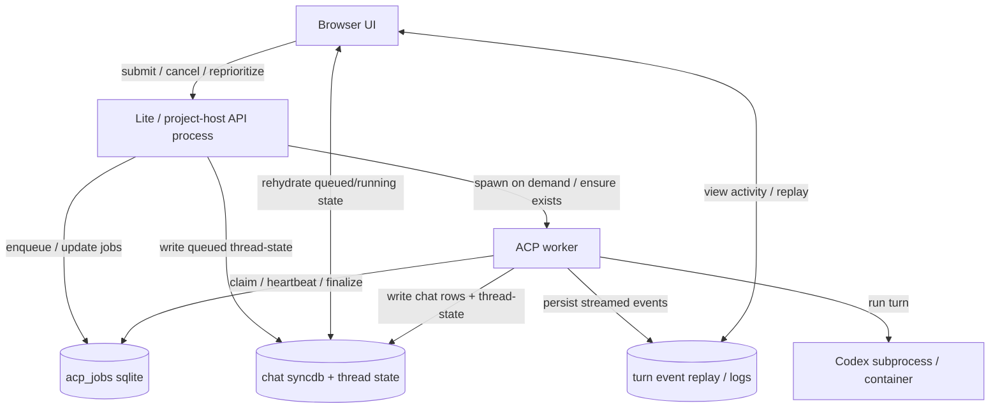
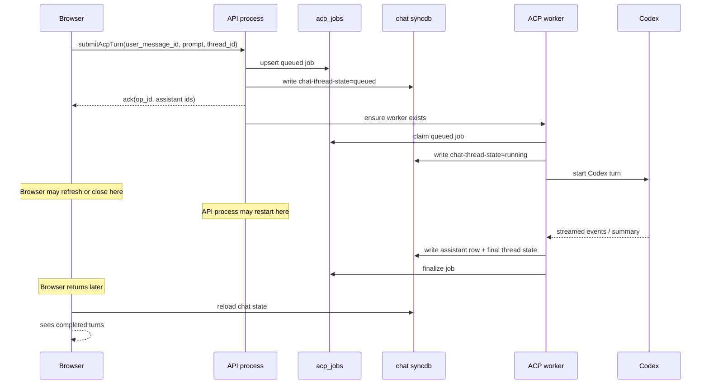
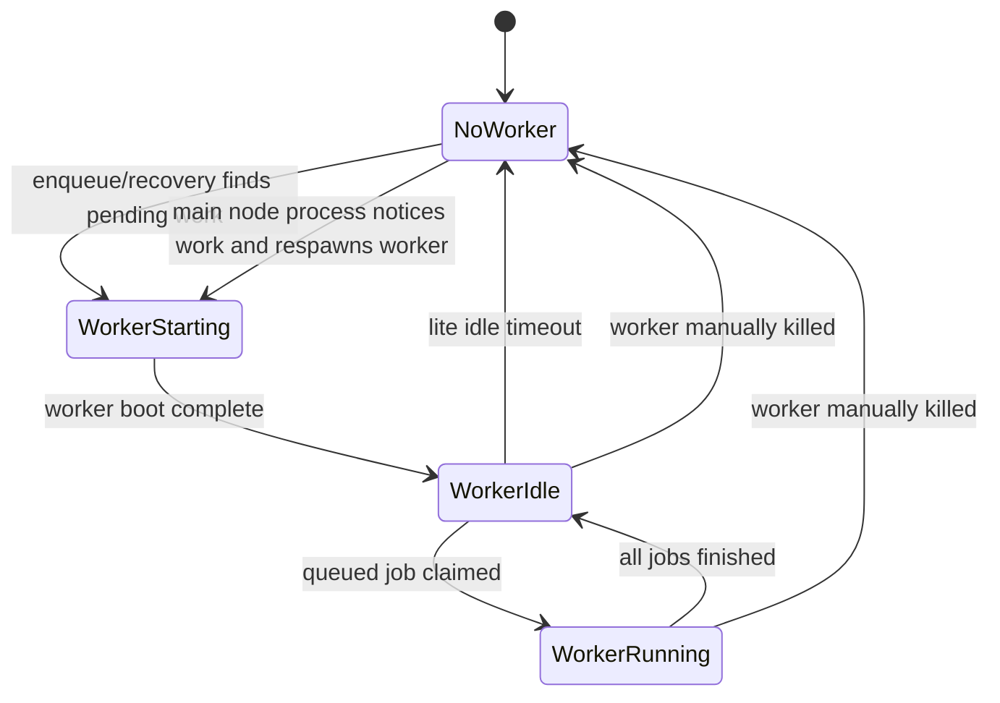

DONE

# Durable Codex Turns

Status: complete for the intended product scope.

The core durability goals in this plan are implemented and working in
practice:

- queued turns are backend-owned and durable
- browser refresh/close no longer loses queued work
- Lite API restarts no longer kill active turns
- project-host API restarts no longer kill active turns
- detached ACP workers exist in both Lite and project-host
- interrupt and `Send immediately` semantics work through the durable path

Remaining follow-up debt is minor and non-blocking:

- `acp_turns` still exists as a lease/recovery compatibility layer instead of
  being fully folded into `acp_jobs`
- restart durability is validated by real testing, but not yet fully covered by
  automated end-to-end tests

If new bugs arise, reopen this plan around the specific regression instead of
restarting the architecture work from scratch.

Goal: make Codex turns durable across browser refresh/close and across Lite / project-host API restarts.

## Acceptance Scenario

This plan is aimed at making the following work reliably:

1. Open browser and send a Codex turn, e.g. `sleep 60 seconds`.
2. Queue up a second turn, e.g. `sleep 30 seconds`.
3. Close the browser completely.
4. Restart the Lite server or project-host during the run.
5. Come back later and see both turns completed correctly.

## Current Problems

- The queue is browser RAM only in `src/packages/frontend/chat/acp-api.ts`.
- Assistant turn identity is partly created in the browser today.
- The backend persists running-turn leases and streamed payloads, but it does not own a durable request queue.
- Restart recovery in `src/packages/lite/hub/acp/index.ts` intentionally marks running turns interrupted and aborts them.
- Codex execution is one subprocess per turn in `src/packages/ai/acp/codex-exec.ts`, so API-process restart kills the turn.

## Design Principles

- Backend owns queue state.
- Browser is a client of queue state, not the source of truth.
- A queued turn must exist durably before the submit call returns success.
- A running turn must not be a child of the restartable web/API process.
- Chat rows and `chat-thread-state` are UI projections, not the primary job ledger.
- Idempotency is mandatory. Retrying submit after refresh/network loss must not create duplicate turns.
- Do not persist bearer tokens or other short-lived secrets in the durable queue.

## Diagrams

### Component Model

### Submit, Queue, Restart, Resume

### Worker Supervision Model

## Recommended Architecture

### 1. Add a Durable ACP Job Table

Create `src/packages/lite/hub/sqlite/acp-jobs.ts` backed by the same sqlite db as current ACP tables.

Each row represents one submitted user turn.

Suggested fields:

- `op_id`
- `project_id`
- `chat_path`
- `thread_id`
- `user_message_id`
- `assistant_message_id`
- `assistant_message_date`
- `session_id`
- `state`: `queued | starting | running | succeeded | failed | canceled | interrupted`
- `send_mode`
- `priority`
- `prompt`
- `config_json`
- `loop_config_json`
- `loop_state_json`
- `account_id`
- `browser_id`
- `created_at`
- `started_at`
- `heartbeat_at`
- `finished_at`
- `worker_id`
- `pid_or_container_id`
- `error`
- `result_summary`
- `dedupe_key`

Constraints:

- Unique on `(project_id, chat_path, user_message_id)`.
- Index on `(project_id, thread_id, state, created_at)`.
- Index on `(state, heartbeat_at)`.

Notes:

- `assistant_message_id` and `assistant_message_date` should be allocated by the backend at enqueue time, not by the browser.
- `prompt` may later move to a blob/offload table if size becomes a concern.

### 2. Make Submit a Backend Operation

Replace the browser-owned queue in `src/packages/frontend/chat/acp-api.ts` with an enqueue RPC:

- `submitAcpTurn`
- `cancelAcpTurn`
- `sendAcpTurnImmediately`
- optional: `listAcpTurns(thread_id)`

On `submitAcpTurn`, the backend must atomically:

- validate project/chat/thread context
- dedupe on `user_message_id`
- create or return the durable job row
- allocate `assistant_message_id` and `assistant_message_date`
- snapshot config/session metadata needed to run later
- write `chat-thread-state = queued`
- set `active_message_id = user_message_id`

The frontend should only show optimistic UI until the backend ack arrives. After that, all state should come from persisted thread state / job state.

### 3. Add a Separate ACP Worker

Introduce a dedicated ACP worker process:

- Lite: `cocalc-lite-acp-worker`
- Project-host: `cocalc-project-host-acp-worker`

This worker must be outside the restart domain of the Lite / project-host API process while work is active.

Worker lifetime policy:

- Lite: demand-spawned, and it should exit automatically after a short idle timeout once there are no queued/running ACP jobs. It should not sit around forever after the main Lite process is gone.
- Project-host: long-lived worker/service, because project-host is expected to host many concurrent and long-running turns and survive routine API/web restarts.
- In both modes, the main node process remains responsible for ensuring a worker exists when work needs to run. If a worker is manually killed for an upgrade or maintenance action, the main process should start a fresh worker on the next enqueue/recovery cycle.

Responsibilities:

- poll or subscribe for queued ACP jobs
- claim jobs by lease
- serialize jobs per thread/session
- run Codex
- heartbeat the durable job row
- persist streamed events / logs / chat updates
- finalize the job row
- start the next queued job for that thread

Important:

- The current `acp_turns` lease table can either be replaced by `acp_jobs` lease fields or kept as a thin compatibility layer.
- The current `acp_queue` table stores turn payload replay, not request queueing. Keep it for streamed output replay, but stop treating it as a queue abstraction.

### 4. Make the Worker the Execution Owner

The worker should own:

- Codex subprocess/container lifetime
- session serialization
- interruption and cancel behavior
- loop rescheduling

The API server should not own live Codex children.

This is the key to surviving API restarts.

### 5. Treat Chat State as a Projection

Use the durable job row as the source of truth.

Mirror into chat state:

- `chat-thread-state = queued` when waiting
- `chat-thread-state = running` when executing
- `chat-thread-state = interrupted | error | complete` on terminal states

This matches the existing frontend hydration logic in `src/packages/frontend/chat/sync.ts`, so refresh-safe queued/running UI should mostly fall out naturally once the backend writes those rows.

### 6. LRO Integration

ACP turns should have LRO semantics, but the current LRO stream layer is not sufficient as the durable source of truth.

Recommended approach:

- make `op_id` the ACP job id
- optionally expose each ACP job as an LRO to generic UI
- keep durability in `acp_jobs`, not in ephemeral LRO streams

In short:

- LRO is a good interface
- `acp_jobs` is the durable implementation

## Restart Model

### Browser Refresh / Close

Supported.

Why:

- queue lives in backend sqlite
- UI rehydrates from persisted `chat-thread-state`
- reopened browser can query jobs and attach to logs

### API Server Restart

Supported.

Why:

- worker is separate
- running Codex child is owned by the worker
- worker keeps writing durable state while API is down

### Worker Restart

Not fully recoverable in the general case.

Reason:

- Codex does not provide exact mid-turn checkpoint/resume
- replaying a half-completed prompt is not idempotent because files/commands may already have run

Practical policy:

- surviving API restart is required
- surviving worker restart is best-effort only unless we later add a deeper detached-runner + reattach model

### Host Reboot

Out of scope for phase 1 and phase 2.

If exact host-reboot durability is ever required, that is a larger problem and should be treated separately.

## Implementation Phases

### Phase 1: Durable Queue, Same-Process Worker

Goal: fix browser refresh/close for queued turns first.

- add `acp_jobs`
- move queue ownership to backend
- backend allocates assistant turn identity
- backend writes `chat-thread-state = queued`
- frontend removes in-memory queue as source of truth

Expected outcome:

- queued turns survive refresh/close
- running turns still die on API restart

### Phase 2: Split Out ACP Worker

Goal: survive Lite / project-host API restarts.

- create ACP worker process
- Lite worker should auto-exit after a few seconds of global ACP idleness
- main node process should respawn or recreate the worker on demand if it has been manually killed
- move scheduling/execution ownership into worker
- API process only enqueues/cancels/reprioritizes
- worker writes durable results directly
- change startup/recovery so API restart does not abort running turns

Expected outcome:

- acceptance scenario works for API restarts

### Phase 3: Harden Recovery and Operations

- add worker drain mode for deploys
- add stale-job reconciliation
- add admin/debug tooling
- add durable metrics and queue inspection
- optionally expose ACP jobs as first-class LROs in generic ops UI

## Concrete Code Changes

### Frontend

- `src/packages/frontend/chat/acp-api.ts`
  - remove in-memory queue ownership
  - call backend enqueue/cancel/reprioritize APIs
  - stop allocating assistant turn identity in browser

- `src/packages/frontend/chat/message.tsx`
  - continue rendering queued/running from persisted state

- `src/packages/frontend/chat/sync.ts`
  - extend state mapping if needed for canceled/interrupted/error

### Backend / Lite ACP

- `src/packages/lite/hub/sqlite/acp-jobs.ts`
  - new durable job table

- `src/packages/lite/hub/acp/index.ts`
  - split API-facing control plane from execution path
  - remove restart recovery behavior that always aborts running turns
  - add enqueue/cancel/send-immediately handlers

- `src/packages/lite/hub/sqlite/acp-turns.ts`
  - either retire or reduce to compatibility with `acp_jobs`

- `src/packages/lite/hub/sqlite/acp-queue.ts`
  - keep as streamed event replay store
  - optionally rename later to avoid queue-name confusion

### Worker / Runtime

- new ACP worker entrypoint in Lite
- new ACP worker entrypoint in project-host
- process supervision so API deploys do not restart the worker

### Project-host

- startup/wiring in `src/packages/project-host/main.ts`
- deployment model that allows API restart without killing the ACP worker

## Behavioral Requirements

- Submitting the same user message twice must return the same durable job, not create a duplicate run.
- `Send immediately` must become a backend reorder/priority operation.
- `Cancel` must work without the original browser session being alive.
- Queue order must be per thread/session, not global across the whole project-host.
- Multi-browser tabs must show the same queued/running state.
- Loop-generated follow-up turns must also go through the durable job path.

## Security Notes

- Do not persist bearer tokens in `acp_jobs`.
- Reacquire runtime auth/token material when the worker is about to run the job.
- Persist only stable identifiers needed to reacquire auth and route work.

## Validation Plan

- Focused integration test: enqueue two turns, refresh after first enqueue, assert second remains queued and later runs.
- Focused integration test: close browser, reopen, queued/running state is reconstructed.
- Focused integration test: restart Lite/project-host API mid-turn, assert turn completes and next queued turn starts.
- Focused integration test: `send immediately` reorders durable queued jobs correctly.
- Focused integration test: `cancel` works from a second browser tab.
- Manual smoke test with a long-running command and visible activity logs.

## Open Questions

- Should the worker write chat/log state directly to local storage, or reconnect through local conat services when they come back?
  - Recommendation: durable writes should not depend on the restartable API service.
  - USER: definitely don't depend on the conat api service for this.  It seems like writing the events to some sort of local storage such as sqlite (or jsonl) makes sense?   It's likely not too much data.

- Should `acp_jobs` fully replace `acp_turns`, or should we keep `acp_turns` as a smaller lease table?
  - Recommendation: keep one durable ledger if possible; avoid duplicated state machines.
  - USER: replace acp_turns with acp_jobs, for clarity and to avoid confusion.

- Should ACP jobs be surfaced through the generic LRO UI?
  - Recommendation: yes eventually, but only after durability is implemented in `acp_jobs`.
  - USER: not needed given our requirements.

## Recommendation

Do this in two real steps:

1. Move queue ownership to the backend now.
2. Split out an ACP worker process next.

That is the smallest path that solves the real problem without pretending that ephemeral browser state or current subprocess ownership can ever satisfy the acceptance scenario.
