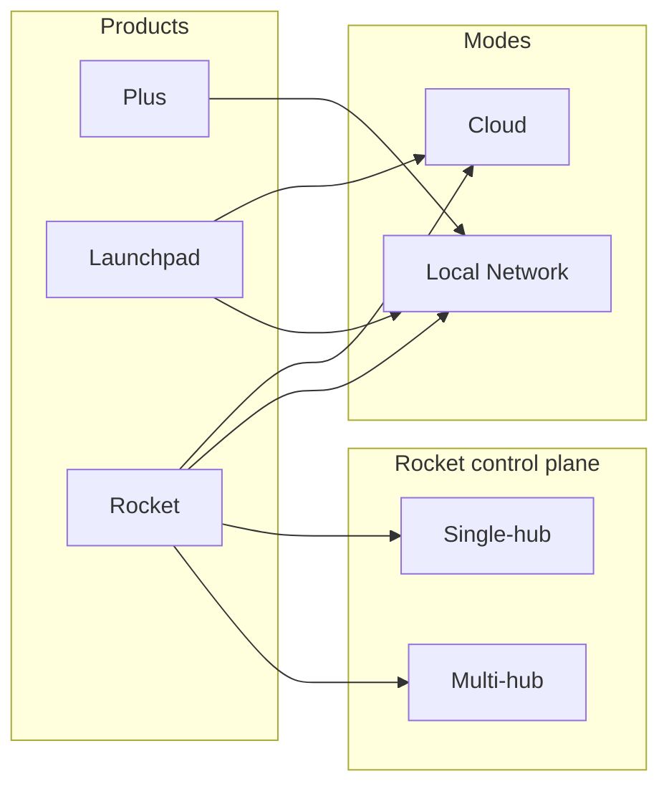
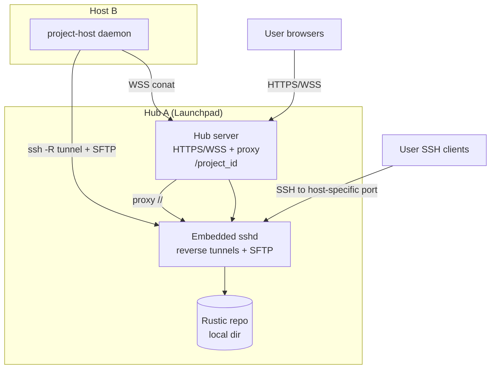

# Support Minimal OnPrem Cloud

## TODO:

- [ ] make btrfs disk image size a function of the available disk space.

- [ ] switch from `ws://[server]/{project_id}` to `ws://[server}/{host_id}` because otherwise with 50 open projects on the same host, we would have 50 distinct websockets, which is not efficient.

- [ ] app servers http server proxying of web servers running inside the project

- [ ] backing up and restoring to rustic repo, so backup, file copy, etc. is all unlocked

lifecycle questions:

- provisioning of the sparse image file (size).
- nail down "deprovisioning" and where data is stored.
- how do we reuse an existing host? 
- Should we move all config to be in ~/.local/share/cocalc... instead of system-wide, if possible?  
- what happens on machine reboot

---

- [x] harden bootstrap: Right now if I get this "Please contact your system administrator.
  Add correct host key in /home/wstein/.ssh/known_hosts to get rid of this message.
  Offending ECDSA key in /home/wstein/.ssh/known_hosts:41
  Password authentication is disabled to avoid man-in-the-middle attacks." then the bootstrap properly fails, but there is NO indication whatever in the UI.  There should be a clear error. We did try to implement this, but there must bie a bug.

- [x] harden the connector:
  - [x] retry to keep ssh tunnels alive instead of just die
  - [x] keep intended state of project-host on disk and maintain it
  - [x] monitor project-host

- [x] implement ability to upgrade connector
- [x] uploading/downloading files doesn't work -- wrong url "dropzone.js:9617  POST http://localhost:9200/upload?project_id=171411ac-45e1-4d80-982b-166e0cf1203d&path= 500 (Internal Server Error)"

- [x] ssh to the project (need to provide the ip and port) in project settings

---

## Finish Direct Ssh Controlled Hosts

---

## Goal

Provide a clean, minimal set of host types with max simplicity:

- CoCalc Plus (single project, sqlite, local)
- Launchpad host types (self‑hosted local, self‑hosted Cloudflare, cloud provider)

Key requirement: no mixed modes and no confusing legacy options.

## Project Host Types (User-Facing)

### CoCalc Plus

- Single project + frontend + sqlite
- No cloud services or launchpad services

### Self hosted (Local Network)

- Multipass or manual VM
- Local SSH reverse tunnel to hub
- Local rustic via SSH/SFTP repo

### Self hosted (Cloudflare Tunnel)

- Multipass or manual VM
- Cloudflare tunnel for hub + host routing
- Cloud S3-compatible bucket

### Cloud providers (GCP/Nebius/Lambda/Hyperstack)

- Cloudflare tunnel for hub + host routing
- Cloud S3-compatible bucket

### Capability unlocking

- Cloudflare credentials unlock the Cloudflare host types.
- Cloud provider credentials unlock provider-specific host types.
- The hub starts Cloudflare tunnels whenever configured (even if no hosts use them),
  since users may connect through the tunnel.

## Product + Mode Matrix (Rocket Alignment)

We treat product and deployment mode as orthogonal axes. Rocket adds a
control-plane scale axis.

### Axes

- Product: plus | launchpad | rocket
- Deployment mode: cloud | local
- Rocket control plane: single | multi

### Mermaid diagram

### Summary table

| Product | Cloud Mode | Local Network Mode | Control Plane |
| --- | --- | --- | --- |
| Plus | N/A (single project) | Default | Single (embedded) |
| Launchpad | Hub + Cloudflare + bucket | Hub + SSH tunnels + local repo | Single hub |
| Rocket | Cloud infra + external DB | Local infra + external DB | Single or Multi hub |

## Summary Architecture

- Mermaid diagram:

- Single hub runs:
  - Launchpad hub server (HTTPS + WebSocket)
  - sshd (embedded, user-mode, for host reverse tunnels + SFTP)
  - http-proxy-3 (or equivalent) for host WebSocket/HTTP proxying
- Project hosts run:
  - project-host daemon (includes sshpiperd for user SSH)
  - reverse SSH tunnel to hub’s embedded sshd (one port for HTTP proxy, one port for SSH)
  - outbound WSS to hub for conat
- Backups:
  - rustic uses SFTP to hub sshd
  - single repo for all projects (use host tag per project)
- No wildcard DNS required; use path-based routing:
  - /<project_id>/... proxied to a local tunnel port

## Networking Model (Hub A + Host B behind NAT)

- Host B only needs outbound access to Hub A:
  - HTTPS/WSS to hub port
  - SSH to sshd port (reverse tunnel; publishes two ports on hub)
- Hub can reach Host B via the reverse tunnel for:
  - WebSocket proxy to project-host services
  - per-host SSH ports forwarded to host sshpiperd

## Configuration Simplification Plan (Target State)

Replace the current env sprawl with a small set of top-level selectors and a
derived config. Env vars only provide defaults; admin settings are the source
of truth.

### Required (minimal)

- COCALC_PRODUCT=plus|launchpad|rocket (default: plus)
- COCALC_ROCKET_CONTROL_PLANE=single|multi (only when product=rocket)
- COCALC_DATA_DIR (default: ~/.local/share/cocalc/launchpad)
- COCALC_BASE_PORT (default: 9200)

Note: Launchpad should not require a global deployment mode. Host type selection
and configured capabilities (Cloudflare, providers) determine behavior. Rocket
may still expose explicit deployment modes.

### Optional (local network)

- COCALC_PUBLIC_HOST (bootstrap URL + connector)

### Optional (cloud)

- Cloudflare credentials
- Rustic repo target \(S3\-style bucket or possibly anything rustic supports\) \+ credentials

### Derived defaults (base port model)

- HTTPS port = COCALC_BASE_PORT
- SSHD port = COCALC_BASE_PORT + 1
- Project-host HTTP port = 9002 (internal only)
- Proxy prefix uses /<project_id>/… (no host prefix)

## Cleanup / Code Deletion (Important)

Once the simplified config is implemented, delete legacy/overlapping code
paths to keep the system understandable:

- Remove legacy COCALC\_MODE single\-user semantics from production paths and the `--mode` flag.
- Drop mixed\-mode fallbacks and conflicting env overrides.
- Remove unused /host/<id> proxy prefix logic.
- Remove routing branches that bypass local\-network tunnels.
- Simplify bootstrap logic in src/packages/server/cloud/bootstrap\-host.ts.

## SSH Key & Access Model

Host generates and manages:

- host tunnel key (private key stays on host; hub only stores public key)

Hub generates and manages:

- sftp key (for rustic SFTP access)
- user SSH keys for sshpiperd (existing behavior on the host)

sshd config highlights (user-mode safe):

- GatewayPorts clientspecified (allow public reverse ports per host)
- AllowTcpForwarding yes for host tunnel keys
- PermitOpen/permitlisten restrictions per key
- ForceCommand internal-sftp -d <repo> for SFTP keys
- no-pty, no-agent-forwarding, no-X11-forwarding for tunnel/SFTP keys

## Host Tunnel Mapping

- Host metadata includes `self_host_mode` for `machine.cloud="self-host"`.
  - `local` => use SSH reverse tunnel + local rustic repo.
  - `cloudflare` => use Cloudflare tunnel + S3 bucket.

## Plan: Remove Global Modes (Host-Type Driven)

- [x] Add `self_host_mode` to self-host creation UI (local vs cloudflare).
- [x] Gate self-host “cloudflare” option on Cloudflare configuration.
- [x] Persist `self_host_mode` in `machine.metadata` on host create.
- [ ] Bootstrap host based on `self_host_mode` (local done; cloudflare pending):
  - [x] local => emit SSH tunnel bootstrap vars + local rustic config.
  - [ ] cloudflare => emit cloudflared setup + bucket config.
- [x] Routing uses host metadata (no global “launchpad mode”):
  - [x] project-host conat routes use local tunnel only for local self-host.
  - [x] project-host HTTP proxy uses tunnel only for local self-host.
- [x] Start sshd whenever at least one self-host `local` host exists.
- [x] Remove launchpad mode gates in self-host pairing and tunnel registration.
- [x] Update logs + docs to reflect host-type driven behavior.
Hub assigns two ports per host:

- one for HTTP/WS proxy traffic
- one for SSH (host sshpiperd)
  Example:

- Host B connects with ssh -N -R 0.0.0.0:<http_port>:127.0.0.1:<host_service_port>
  and ssh -N -R 0.0.0.0:<ssh_port>:127.0.0.1:<host_sshpiperd_port>.
- Hub proxy routes /<project_id>/... to localhost:<http_port>.
  - Optimization: if host and hub are on the same machine, skip SSH tunnel and
    proxy directly to localhost host_service_port.

## Rustic Repo Layout

- Single repo, e.g. sftp://<hub>:<port>/<LP_SFTP_ROOT>
- Use host=project-<project_id> tags (already used)
- No per-project repo needed

## Implementation Plan

### A) Eliminate hub modes → host-type driven behavior

- [x] Introduce `self_host_mode` on self-hosted hosts (`local` | `cloudflare`).
- [x] Update host creation UI:
  - Self hosted (Local Network) sets `self_host_mode=local`.
  - Self hosted (Cloudflare) sets `self_host_mode=cloudflare`.
  - Only show Cloudflare option once Cloudflare is configured.
- [x] Persist `self_host_mode` in `project_hosts.metadata.machine.metadata`.
- [x] Remove Launchpad “mode” checks from self-host endpoints:
  - `self-host` pairing/token endpoints should allow either local or cloudflare.
  - Local-only SSH pairing should be gated by `self_host_mode=local`.
- [ ] Bootstrap logic uses `self_host_mode` (local done; cloudflare pending):
  - [x] `local` → SSH tunnel bootstrap URL + local rustic.
  - [ ] `cloudflare` → Cloudflare URL + bucket.
- [x] Project-host runtime uses `self_host_mode`:
  - Start on-prem tunnel + SFTP only when `self_host_mode=local`.
  - Skip on-prem tunnel/SFTP when `self_host_mode=cloudflare`.
- [x] Update routing/proxy resolution to derive from host type (not hub mode).

### 0) Unify config surface (done)

- Introduce a single normalized config object (product + launchpad mode).
- Enforce explicit mode selection when product=launchpad.
- Remove legacy COCALC_MODE from production logic (keep dev-only).

### 1) Add Local Network Mode Config (done)

- Add new Launchpad config block: minimal_local or local_mode.
- Map env vars to config with defaults (base port derived ports).
- Define and validate ports and data_dir.

### 2) Embedded sshd Lifecycle (done)

- Require system OpenSSH (sshd + ssh-keygen + sftp-server); fail fast if missing.
- On hub startup:
  - create data_dir/ssh/ for keys \+ configs
  - render sshd_config for:
    - reverse tunnel keys
    - SFTP keys
    - pairing key (optional)
  - spawn sshd as a child process
  - supervise \+ restart on crash

### 3) Reverse Tunnel Registration (done)

- Extend hub to allocate reverse_port per host.
- Host registers public key via conat; hub returns assigned ports + sshd endpoint.
- Host connects with ssh -N -R 0.0.0.0:<http_port>:127.0.0.1:<project_host_port>
  and ssh -N -R 0.0.0.0:<ssh_port>:127.0.0.1:<host_sshpiperd_port>.
- Hub stores mapping host_id -> (http_port, ssh_port) for proxy routing.

### 4) Proxy Integration (done)

- Hub uses http-proxy-3 to route:
  - /<project_id>/... to localhost:<reverse_port>.
- Ensure WebSocket upgrade support.
- Avoid URL conflicts by reserving the project-id path segment.
- Rewrite /<project_id>/conat -> /conat when proxying to the host.

### 4.1) Proxy user servers (pending)

- Proxy /<project_id>/proxy/<port>/ routes to the correct host HTTP tunnel.
- Ensure websocket upgrades and path rewriting behave the same as in cloud mode.
- Verify JupyterLab, VSCode, and other proxied servers work in local mode.

### 5) Rustic SFTP Integration (pending)

- Generate SFTP key and write to project-host config.
- SFTP repo path defaults to data_dir/backup-repo.
- Keep repo single; rely on tags for per-project separation.

### 6) Host Provisioning / Connector (partial)

- Connector handshake includes:
  - hub host+port
  - sshd port
  - assigned reverse port
  - SFTP credentials
- Use a single join token: host fetches all connection details from hub
  (minimizes admin input). (local done; cloudflare pending)
- If changing ports is too complex, require explicit config at first bootstrap.

### 6.1) SSH Pairing (done)

- Add an ssh-only pairing path:
  - `pair-ssh` runs `ssh` to hub sshd and streams JSON payload to a forced
    command that returns JSON (no HTTP required).
  - Connector writes an ssh tunnel config and forwards
    `https://127.0.0.1:<local>` to `127.0.0.1:<hub_https_port>`.
- Auth:
  - Hub writes authorized_keys entries for token-derived keys (no
    AuthorizedKeysCommand or preloaded key list).
  - Connector derives the same key from the token and uses it for SSH pairing.

### 7) Health & Diagnostics (pending)

- Hub exposes:
  - sshd running
  - tunnel connectivity per host
  - proxy route test
  - SFTP write check

### 8) Documentation & Defaults (partial)

- Document minimal on\-prem mode:
  - single hub \+ hosts local LAN setup
  - required open ports
  - how to override ports
  - where backups are stored
- Design decision \-\- there are two separate modes for CoCalc launchpad and you can ONLY use one \(if you want both, run two separate servers\):
  - cloud: you configure cloudflare, r2, etc.
  - local: what is described here

## Open Questions

- Do we allow dynamic port changes after install, or require restart?
  - ANSWER: let's require restart. This should be rare, and we need to keep scope manageable.
- Should LP_HTTP_PORT be disabled by default?
  - ANSWER: yes and when enabled it should just be a redirect.
- Do we need a simple built\-in UI to view tunnel status?
  - ANSWER: I think the current host drawer / host page can do this.

## TODO (Later)

- Add a dedicated admin guidance UI for selecting modes, validating config, and
  onboarding (defer until core plumbing is complete).
- After local-network bootstrap is stable, nail down the minimal config surface.
  - For local-network project-hosts we likely only need `HOST=127.0.0.1` and
    `PORT=9002` (except local dev); simplify inputs and
    `src/packages/server/cloud/bootstrap-host.ts` accordingly.

## Remaining Local-Network Work (Short List)

- Rustic backups in local mode (SFTP repo wiring).
- HTTP proxy for user servers (jupyter/vscode).
- Cleanup pass to remove unused legacy cloud/local mix paths.
- Security review: ensure projects can’t access each other’s host ports.
- Admin UX: guided setup + health checks for local network mode.

## Near-Term Execution Plan

- [ ] Test local-network mode with a host VM on another machine (not localhost).
- [ ] Test Cloudflare mode:
  - add Cloudflare credentials
  - run a remote cloud VM host
  - use a manually created local Cloudflare tunnel
- [ ] Automate Cloudflare tunnel provisioning next to the hub:
  - user installs Launchpad
  - user configures Cloudflare API support for tunnels + DNS
  - hub creates/owns a local Cloudflare tunnel and exposes Launchpad
- [ ] Fix remaining local-network gaps:
  - [ ] provide clear SSH instructions for workspace access
  - [ ] proxy apps (e.g., VSCode/Jupyter) running in a workspace
  - [ ] fix rustic backups (stop silent failures)
- [ ] Further polish onboarding for new admins/users.