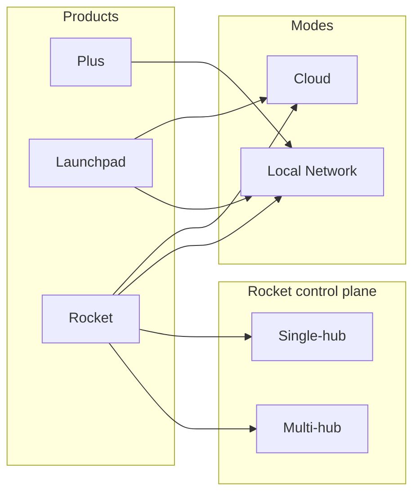
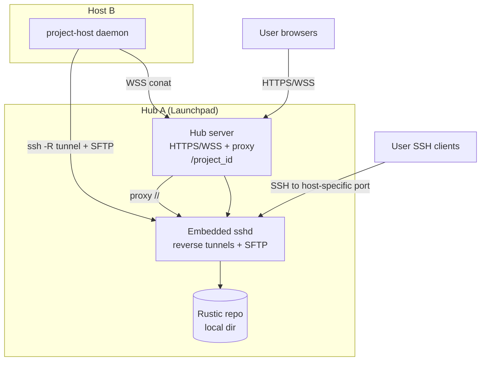

# Support Minimal OnPrem Cloud

## Goal

Provide a clean, minimal set of modes with max simplicity:

- CoCalc Plus (single project, sqlite, local)
- Launchpad Cloud Mode (Cloudflare + bucket)
- Launchpad Local Network Mode (all data local, hub‑centric routing)

Key requirement: no mixed modes and no confusing legacy options.

## Target Modes (User-Facing)

### CoCalc Plus

- Single project + frontend + sqlite
- No cloud services or launchpad services

### Launchpad Cloud Mode

- Hub and all VM hosts only listen on localhost behind firewall
- All routing/DNS/HTTPS via Cloudflare tunnels
- All non-disk data stored in remote S3-style bucket
- No public IPs exposed
- All traffic flows through Cloudflare

### Launchpad Local Network Mode

- All data stays local
- Hub acts as the sole entry point
- VM hosts connect back to hub via SSH reverse tunnel
- Hub proxies HTTP/WSS to hosts
- Rustic uses SFTP to a local repo next to hub
- Optional custom TLS cert; otherwise auto self-signed

## Product + Mode Matrix (Rocket Alignment)

We treat product and deployment mode as orthogonal axes. Rocket adds a
control-plane scale axis.

### Axes

- Product: plus | launchpad | rocket
- Deployment mode: cloud | local
- Rocket control plane: single | multi

### Mermaid diagram

### Summary table

| Product | Cloud Mode | Local Network Mode | Control Plane |
| --- | --- | --- | --- |
| Plus | N/A (single project) | Default | Single (embedded) |
| Launchpad | Hub + Cloudflare + bucket | Hub + SSH tunnels + local repo | Single hub |
| Rocket | Cloud infra + external DB | Local infra + external DB | Single or Multi hub |

## Summary Architecture

- Mermaid diagram:

- Single hub runs:
  - Launchpad hub server (HTTPS + WebSocket)
  - sshd (embedded, user-mode, for host reverse tunnels + SFTP)
  - http-proxy-3 (or equivalent) for host WebSocket/HTTP proxying
- Project hosts run:
  - project-host daemon (includes sshpiperd for user SSH)
  - reverse SSH tunnel to hub’s embedded sshd (one port for HTTP proxy, one port for SSH)
  - outbound WSS to hub for conat
- Backups:
  - rustic uses SFTP to hub sshd
  - single repo for all projects (use host tag per project)
- No wildcard DNS required; use path-based routing:
  - /<project_id>/... proxied to a local tunnel port

## Networking Model (Hub A + Host B behind NAT)

- Host B only needs outbound access to Hub A:
  - HTTPS/WSS to hub port
  - SSH to sshd port (reverse tunnel; publishes two ports on hub)
- Hub can reach Host B via the reverse tunnel for:
  - WebSocket proxy to project-host services
  - per-host SSH ports forwarded to host sshpiperd

## Configuration Simplification Plan (Target State)

Replace the current env sprawl with a small set of top-level selectors and a
derived config. Env vars only provide defaults; admin settings are the source
of truth.

### Required (minimal)

- COCALC_PRODUCT=plus|launchpad|rocket (default: plus)
- COCALC_DEPLOYMENT_MODE=cloud|local (launchpad + rocket)
- COCALC_ROCKET_CONTROL_PLANE=single|multi (only when product=rocket)
- COCALC_DATA_DIR (default: ~/.local/share/cocalc/launchpad)
- COCALC_BASE_PORT (default: 9200)

### Optional (local network)

- COCALC_PUBLIC_HOST (bootstrap URL + connector)
- COCALC_TLS_CERT / COCALC_TLS_KEY (if unset, auto self-signed)
- COCALC_CONNECTOR_INSECURE=1 (only with self-signed)

### Optional (cloud)

- Cloudflare credentials
- Rustic repo target \(S3\-style bucket or possibly anything rustic supports\) \+ credentials

### Derived defaults (base port model)

- HTTPS port = COCALC_BASE_PORT
- SSHD port = COCALC_BASE_PORT + 1
- Project-host HTTP port = 9002 (internal only)
- Proxy prefix uses /<project_id>/… (no host prefix)

## Cleanup / Code Deletion (Important)

Once the simplified config is implemented, delete legacy/overlapping code
paths to keep the system understandable:

- Remove legacy COCALC\_MODE single\-user semantics from production paths and the `--mode` flag.
- Drop mixed\-mode fallbacks and conflicting env overrides.
- Remove unused /host/<id> proxy prefix logic.
- Remove routing branches that bypass local\-network tunnels.
- Simplify bootstrap logic in src/packages/server/cloud/bootstrap\-host.ts.

## SSH Key & Access Model

Host generates and manages:

- host tunnel key (private key stays on host; hub only stores public key)

Hub generates and manages:

- sftp key (for rustic SFTP access)
- user SSH keys for sshpiperd (existing behavior on the host)

sshd config highlights (user-mode safe):

- GatewayPorts clientspecified (allow public reverse ports per host)
- AllowTcpForwarding yes for host tunnel keys
- PermitOpen/permitlisten restrictions per key
- ForceCommand internal-sftp -d <repo> for SFTP keys
- no-pty, no-agent-forwarding, no-X11-forwarding for tunnel/SFTP keys

## Host Tunnel Mapping

Hub assigns two ports per host:

- one for HTTP/WS proxy traffic
- one for SSH (host sshpiperd)
  Example:

- Host B connects with ssh -N -R 0.0.0.0:<http_port>:127.0.0.1:<host_service_port>
  and ssh -N -R 0.0.0.0:<ssh_port>:127.0.0.1:<host_sshpiperd_port>.
- Hub proxy routes /<project_id>/... to localhost:<http_port>.
  - Optimization: if host and hub are on the same machine, skip SSH tunnel and
    proxy directly to localhost host_service_port.

## Rustic Repo Layout

- Single repo, e.g. sftp://<hub>:<port>/<LP_SFTP_ROOT>
- Use host=project-<project_id> tags (already used)
- No per-project repo needed

## Implementation Plan

### 0) Unify config surface (done)

- Introduce a single normalized config object (product + launchpad mode).
- Enforce explicit mode selection when product=launchpad.
- Remove legacy COCALC_MODE from production logic (keep dev-only).

### 1) Add Local Network Mode Config (done)

- Add new Launchpad config block: minimal_local or local_mode.
- Map env vars to config with defaults (base port derived ports).
- Define and validate ports and data_dir.

### 2) Embedded sshd Lifecycle (done)

- Require system OpenSSH (sshd + ssh-keygen + sftp-server); fail fast if missing.
- On hub startup:
  - create data_dir/ssh/ for keys \+ configs
  - render sshd_config for:
    - reverse tunnel keys
    - SFTP keys
    - pairing key (optional)
  - spawn sshd as a child process
  - supervise \+ restart on crash

### 3) Reverse Tunnel Registration (done)

- Extend hub to allocate reverse_port per host.
- Host registers public key via conat; hub returns assigned ports + sshd endpoint.
- Host connects with ssh -N -R 0.0.0.0:<http_port>:127.0.0.1:<project_host_port>
  and ssh -N -R 0.0.0.0:<ssh_port>:127.0.0.1:<host_sshpiperd_port>.
- Hub stores mapping host_id -> (http_port, ssh_port) for proxy routing.

### 4) Proxy Integration (done)

- Hub uses http-proxy-3 to route:
  - /<project_id>/... to localhost:<reverse_port>.
- Ensure WebSocket upgrade support.
- Avoid URL conflicts by reserving the project-id path segment.
- Rewrite /<project_id>/conat -> /conat when proxying to the host.

### 5) Rustic SFTP Integration (pending)

- Generate SFTP key and write to project-host config.
- SFTP repo path defaults to data_dir/backup-repo.
- Keep repo single; rely on tags for per-project separation.

### 6) Host Provisioning / Connector (partial)

- Connector handshake includes:
  - hub host+port
  - sshd port
  - assigned reverse port
  - SFTP credentials
- Use a single join token: host fetches all connection details from hub
  (minimizes admin input).
- If changing ports is too complex, require explicit config at first bootstrap.

### 6.1) SSH Pairing (done, manual key for now)

- Add an ssh-only pairing path:
  - `pair-ssh` runs `ssh` to hub sshd and streams JSON payload to a forced
    command that returns JSON (no HTTP required).
  - Connector writes an ssh tunnel config and forwards
    `https://127.0.0.1:<local>` to `127.0.0.1:<hub_https_port>`.
- Current auth:
  - Hub reads pairing public keys from
    `COCALC_CONNECTOR_SSH_PUBLIC_KEY(S)` and injects them into authorized_keys
    with `command=<ssh-pair>` and no forwarding.
- Future improvement:
  - derive a temporary pairing key from the pairing token (avoid copy/paste).

### 7) Health & Diagnostics (pending)

- Hub exposes:
  - sshd running
  - tunnel connectivity per host
  - proxy route test
  - SFTP write check

### 8) Documentation & Defaults (partial)

- Document minimal on\-prem mode:
  - single hub \+ hosts local LAN setup
  - required open ports
  - how to override ports
  - where backups are stored
- Design decision \-\- there are two separate modes for CoCalc launchpad and you can ONLY use one \(if you want both, run two separate servers\):
  - cloud: you configure cloudflare, r2, etc.
  - local: what is described here

## Open Questions

- Do we allow dynamic port changes after install, or require restart?
  - ANSWER: let's require restart. This should be rare, and we need to keep scope manageable.
- Should LP_HTTP_PORT be disabled by default?
  - ANSWER: yes and when enabled it should just be a redirect.
- Do we need a simple built\-in UI to view tunnel status?
  - ANSWER: I think the current host drawer / host page can do this.

## TODO (Later)

- Add a dedicated admin guidance UI for selecting modes, validating config, and
  onboarding (defer until core plumbing is complete).
- After local-network bootstrap is stable, nail down the minimal config surface.
  - For local-network project-hosts we likely only need `HOST=127.0.0.1` and
    `PORT=9002` (except local dev); simplify inputs and
    `src/packages/server/cloud/bootstrap-host.ts` accordingly.
