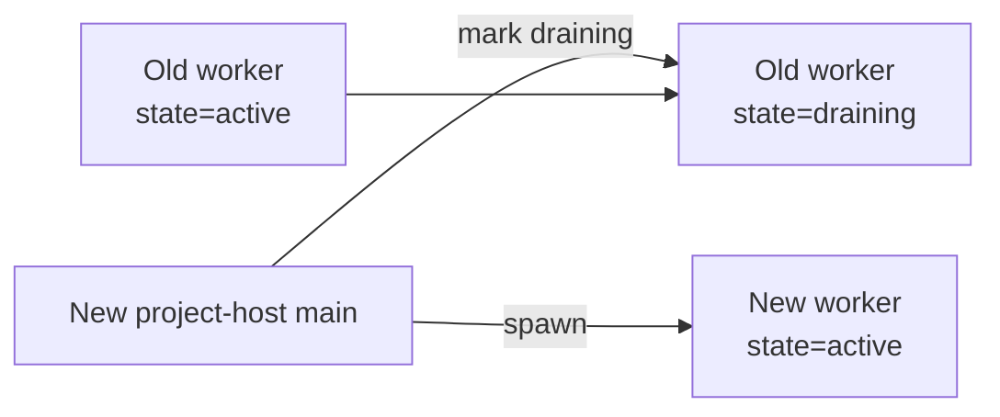
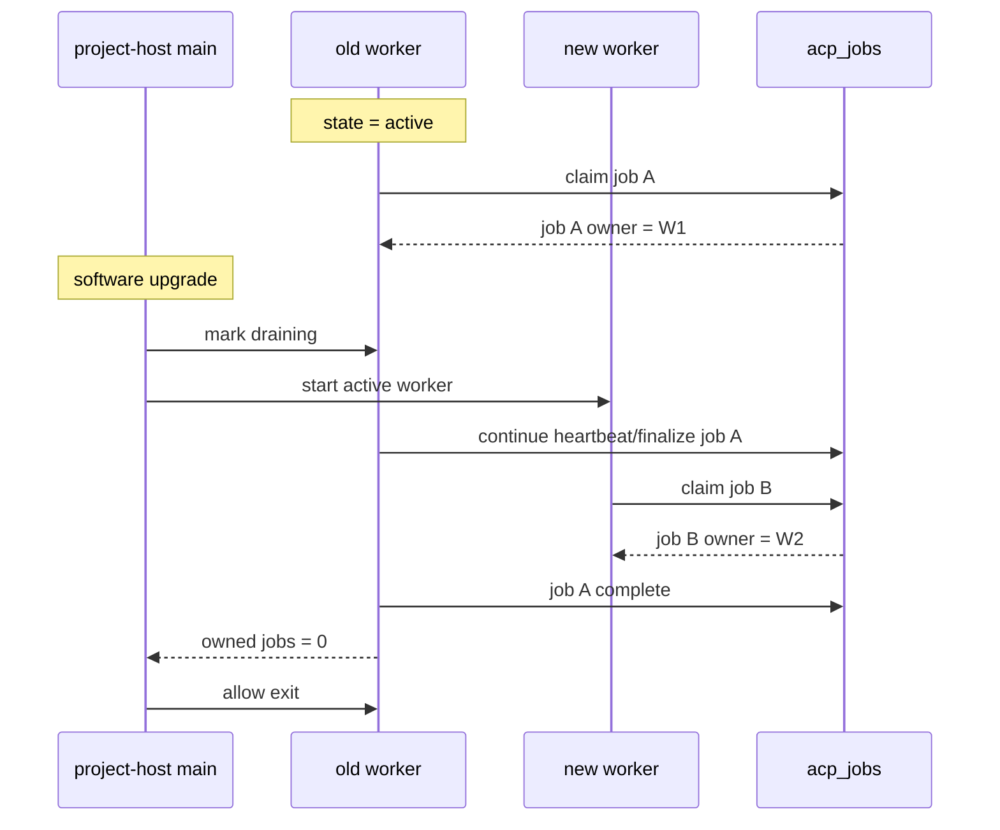

# Project-Host ACP Rolling Workers

Goal: preserve in-flight Codex turns during routine `project-host` software
upgrades by allowing an old ACP worker generation to drain while a new worker
generation accepts new work.

This is the missing operational piece for durable Codex turns on Launchpad.
The current detached-worker architecture decouples turns from the restartable
web/API process, but a host upgrade can still interrupt turns if the old worker
is replaced immediately.

## Acceptance Scenario

1. A project host has 100 active users.
2. Fifteen Codex turns are running, some for 15-20 minutes.
3. We deploy a routine `project-host` software upgrade.
4. The upgraded `project-host` starts successfully.
5. All already-running Codex turns continue to completion on the old worker.
6. All newly submitted Codex turns are scheduled onto the new worker.
7. Once the old worker has no running turns left, it exits automatically.
8. No manual intervention is required.

## Hard Requirements

- Routine `project-host` upgrades must not interrupt in-flight Codex turns.
- New turns submitted after an upgrade must use the new worker generation.
- At most one worker generation should accept new work at a time.
- Old workers must be allowed to finish only the turns they already own.
- If a worker dies unexpectedly, its owned running turns may fail, but that
  failure must be explicit and recoverable in chat/job state.
- The system must work without Kubernetes.

## Non-Goals

- Exact mid-turn resume after worker death.
- Sharing in-memory ACP agent/session state between workers.
- Running an unbounded number of worker generations.
- Applying the same rolling-worker complexity to Lite mode.

Lite can stay simpler. This plan is specifically for `project-host`, where
routine upgrades are part of normal operations.

## Core Idea

Introduce the notion of **worker generations**:

- `active` worker generation:
  - may claim new jobs
  - owns new turns after upgrade
- `draining` worker generation:
  - may not claim new jobs
  - may continue only jobs it already owns
  - exits when its owned running-job count reaches zero

This is the same operational model as a rolling Kubernetes deployment, but
implemented explicitly in CoCalc.

## Current Problem

Today a detached ACP worker is effectively singleton-per-host.

That is enough for:

- browser refresh/close durability
- API process restart durability

It is not enough for:

- routine `project-host` upgrade durability

because a bundle/version mismatch currently implies replacing the worker, which
would kill its in-flight turns.

## Proposed Data Model

Add a durable `acp_workers` table in the host sqlite database.

Suggested fields:

- `worker_id TEXT PRIMARY KEY`
- `host_id TEXT NOT NULL`
- `bundle_version TEXT NOT NULL`
- `bundle_path TEXT NOT NULL`
- `pid INTEGER`
- `state TEXT NOT NULL`
  - `active`
  - `draining`
  - `stopped`
- `started_at_ms INTEGER NOT NULL`
- `last_heartbeat_ms INTEGER NOT NULL`
- `last_seen_running_jobs INTEGER NOT NULL DEFAULT 0`
- `exit_requested_at_ms INTEGER`
- `stopped_at_ms INTEGER`
- `stop_reason TEXT`

Extend `acp_jobs` with worker ownership:

- `worker_id TEXT`
- `worker_bundle_version TEXT`

Semantics:

- queued jobs have `worker_id = NULL`
- once claimed, the job is sticky to one worker
- only that worker may continue heartbeats/finalization for that job

Optional but useful:

- `acp_runtime_state` key/value table to store:
  - current desired active bundle version
  - rollout timestamp
  - rollout mode

## Worker Registration Protocol

On startup, each ACP worker:

1. generates a `worker_id`
2. registers itself in `acp_workers`
3. announces:
   - host id
   - pid
   - bundle version
   - bundle path
   - initial state (`active` or `draining`, assigned by the main process)
4. heartbeats periodically

On shutdown, worker sets:

- `state = stopped`
- `stopped_at_ms`
- `stop_reason`

## Job Ownership Rules

### Claiming New Jobs

Only `active` workers may claim new queued jobs.

The claim transaction should:

1. select a queued job
2. verify worker is still `active`
3. set:
   - job state = `running`
   - `worker_id`
   - `worker_bundle_version`
4. create/update corresponding lease/session state

### Continuing Existing Jobs

A worker may continue a running job only if:

- `job.worker_id == this.worker_id`

This is the key invariant that makes draining safe.

### Draining Worker Behavior

A `draining` worker:

- does not claim any new jobs
- continues heartbeats, streaming, interrupts, and finalization for jobs it
  already owns
- exits automatically once it owns zero running jobs

## Upgrade / Rollout Algorithm

When a new `project-host` bundle starts:

1. Determine `current_bundle_version`.
2. Query `acp_workers` for live workers on this host.
3. Partition them:
   - same-version workers
   - old-version workers
4. If a same-version worker already exists:
   - keep using it
   - do not spawn another unless recovery requires it
5. If only old-version workers exist:
   - mark them `draining`
   - start one new `active` worker on the new bundle
6. New queued jobs are now claimed only by the new worker.
7. Old workers continue only their owned jobs.
8. Old workers exit when drained.

### Important Refinement

There may be more than one old worker if previous rollouts failed or an admin
experimented manually.

Policy:

- at most one `active` worker per host
- zero or more `draining` workers
- older extra workers may all drain simultaneously

## Why Two Workers Is Feasible Here

This works because the durable queue already exists.

The missing step is making ownership explicit:

- new jobs are not broadcast to all workers
- running jobs are sticky to one worker

Without sticky ownership, two workers would race and the design would be
unsafe. With sticky ownership, two workers are fine.

## Interrupt / Stop / Send-Immediately Semantics

This part is easy to miss.

During draining, a running job might still live on the old worker while the new
worker owns all new jobs.

Therefore control operations must target the owning worker by `worker_id`, not
just “the host”.

The durable interrupt queue should include or resolve:

- target `job_id`
- target `worker_id`

Delivery rule:

- any worker may observe interrupts
- only the worker that owns the job should apply them

This keeps `Stop` and `Send immediately` correct during rollouts.

## Recovery Semantics

### Main Process Restart

Safe:

- workers continue independently
- on restart, main process reconstructs desired rollout state from sqlite

### Worker Death

Allowed failure mode:

- if a worker dies unexpectedly, its owned running jobs are marked
  `interrupted` or `error`
- they do not silently disappear

This matches the existing product boundary already accepted for durable Codex
turns.

### Host Reboot

Not solved by this plan.

All workers die, so active turns fail. Queued turns remain durable.

## Main Process Responsibilities

The `project-host` main process should become the rollout coordinator.

Responsibilities:

- determine desired active bundle version
- start a new worker when needed
- mark old workers `draining`
- observe heartbeats / stale workers
- garbage-collect dead worker rows
- expose worker state for admin tooling

This is analogous to a tiny local deployment controller.

## Admin / Operator Visibility

Add a simple ACP worker status view.

Good output:

- current host bundle version
- active worker id / pid / bundle version / started at
- draining workers with:
  - pid
  - bundle version
  - owned running jobs
  - how long draining
- recent stop reasons

Useful commands:

- `acp-status`
- `acp-logs`
- `acp-restart --force`

The default operational story should still be automatic. These commands are for
debugging and emergencies.

## Deployment Policy

Recommended policy:

- normal host startup:
  - keep same-version active worker if present
  - do not churn it
- software upgrade:
  - spawn new active worker
  - old worker becomes draining
- admin forced restart:
  - may kill workers immediately
  - explicit warning that running turns will fail

This means:

- routine upgrades are non-disruptive
- emergency forced restart remains possible

## Schema / Code Touch Points

Likely files:

- `src/packages/lite/hub/sqlite/acp-jobs.ts`
  - job ownership fields
- `src/packages/project-host/hub/acp/worker-manager.ts`
  - rollout coordinator logic
- `src/packages/project-host/acp-worker.ts`
  - registration / heartbeat / drain exit
- `src/packages/lite/hub/acp/index.ts`
  - queue claim semantics
  - interrupt routing by owner
- host sqlite init/migrations
- admin scripts / README for host visibility

## Phased Implementation

### Phase A: Ownership Foundation

- add `acp_workers`
- add `worker_id` ownership to `acp_jobs`
- ensure running jobs are sticky to one worker

Acceptance:

- one worker still works exactly as before
- no behavior change yet for upgrades

### Phase B: Draining State

- worker can be `active` or `draining`
- draining worker stops claiming new jobs
- worker exits when owned running-job count hits zero

Acceptance:

- manually mark worker draining
- it finishes current jobs and exits

### Phase C: Upgrade Coordinator

- main process starts new worker on bundle mismatch
- old worker becomes draining
- new jobs flow only to new worker

Acceptance:

- start long Codex turn
- upgrade host
- long turn completes on old worker
- new turn runs on new worker

### Phase D: Admin Visibility

- add worker status/log tooling
- expose mismatch/draining state clearly

Acceptance:

- admin can see active vs draining workers at a glance

## Testing Plan

### Unit Tests

- classify workers by version/state
- claim logic refuses new jobs for draining workers
- owned running jobs continue on draining worker
- interrupt routing only applies on owner worker

### Integration Tests

- one active worker, no draining workers
- active + draining worker coexistence
- draining worker exits after last job

### End-to-End Smoke

1. Start long Codex turn on project-host.
2. Queue second turn.
3. Upgrade `project-host` bundle.
4. Verify:
   - first turn finishes
   - second turn runs on new worker
   - old worker exits afterward

### Failure Smoke

1. Start long turn.
2. Kill owning worker.
3. Verify job becomes `interrupted` / `error`.

## Mermaid Diagrams

### Worker Rollout

### Job Ownership

## Recommendation

Implement this only for `project-host`.

For Lite:

- same-process fallback and simple detached worker semantics are sufficient
- rolling upgrade semantics add complexity without the same operational payoff

For Launchpad:

- this is worth it
- routine upgrades are common enough that non-disruptive worker rollout is part
  of the product requirement, not optional hardening
