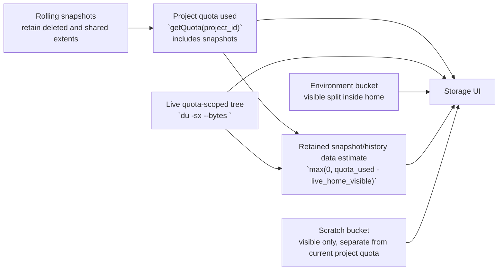

# Project Storage, Quota, and Snapshot Model

Last updated: April 28, 2026

Status: decision doc and implementation plan

## Executive Summary

We should keep the current authoritative quota definition:

- the enforced project quota is the btrfs simple-quota `getQuota(project_id)`
  value,
- that value includes snapshot-retained data,
- and the product should explain that truthfully instead of trying to hide it.

At the same time, we should replace the current `dust`-based live-usage model
with a `du`-based model because:

- `du` is materially faster and cheaper,
- `dust -s` does not inode-dedupe apparent size,
- the current `dust` metric is both slower and less correct for the top-line
  storage number.

The user-facing storage model should become:

1. `Quota used`
   - authoritative
   - comes from `getQuota(project_id)`
   - includes snapshot-retained data

2. `Live files`
   - fast visible apparent-size metric
   - comes from `du -sx --bytes <quota-scoped live tree>`

3. `Retained snapshot/history data (estimate)`
   - derived
   - `max(0, quota_used - live_visible_quota_scoped_bytes)`
   - not exact per-snapshot accounting

4. `Scratch`
   - visible storage bucket
   - shown separately
   - not subtracted from the project quota because it is not part of the
     current project qgroup metric

## Decision

We should do all of the following:

- switch quota-facing live usage from `dust` to `du`,
- keep the current quota definition, including snapshots,
- explain snapshot-retained usage honestly as an estimate derived from the
  difference between quota and visible live usage,
- fix snapshot deletion so it reliably works from user-facing UI flows,
- make snapshot cleanup easier and more visible,
- surface and tier snapshot and backup limits in the product instead of relying
  on hidden hardcoded caps.

## Why This Decision Is Correct

### 1. The current quota value is real and enforceable

Today the project quota is computed from the direct project subvolume qgroup in:

- [subvolume-quota.ts](/home/user/cocalc-ai/src/packages/file-server/btrfs/subvolume-quota.ts)

That value is the one the backend actually enforces. Keeping it as the product
truth avoids a class of confusing bugs where the UI says one thing and the
filesystem refuses writes based on another metric.

### 2. Snapshot-retained data is large and dynamic

On the dogfood project, the quota-used number dropped from roughly `26.7 GB`
down to around `21.5 GB` over time while the visible live tree stayed mostly
stable. That was not random. It matched rolling snapshot retention:

- older snapshots with high retained-exclusive bytes aged out,
- newer snapshots with low retained-exclusive bytes replaced them,
- the qgroup usage dropped accordingly.

This is exactly the behavior users need to understand:

- deleting live files may not reduce quota immediately,
- quota can drop later as snapshots age out,
- snapshot-retained usage is dynamic even if the snapshot itself is immutable.

### 3. Exact per-snapshot accounting is too expensive for the hot path

We measured:

- `btrfs filesystem du -s <snapshot>` gives meaningful snapshot retention data,
- but scanning all `19` snapshots on the dogfood project took about `152s`.

That is too expensive for:

- the default UI,
- periodic polling,
- request-path quota explanation.

### 4. Per-snapshot qgroup rows are misleading

We also measured that the per-snapshot `btrfs qgroup show` row can be tiny
while the snapshot clearly retains large amounts of data. So the old
`allSnapshotUsage` qgroup-based model is not suitable for customer-facing
storage explanation.

### 5. `du` is better than `dust` for the authoritative live metric

On `/home/user/cocalc-ai`, measured locally:

- `du -sx --bytes .`
  - `elapsed=1.232`
  - `cpu=107%`
- `dust -j -x -T 2 -d 1 -s -o b -P .`
  - `elapsed=1.899`
  - `cpu=178%`
- `dust -x -s -d 0 .`
  - `elapsed=2.805`
  - `cpu=874%`

This is the wrong trade:

- slower,
- more CPU,
- less correct for the top-line metric.

In addition, `dust -s` disables inode deduplication for apparent size, so it
can materially overcount hardlinked content. On the full dogfood project, the
measured distortion was multiple gigabytes, mainly in the environment tree.

## Model Diagram

## Important Semantics

### Quota

`Quota used` should remain:

- the current project-home qgroup usage,
- not a synthetic value,
- not a live-files-only approximation.

### Live files

`Live files` should be:

- a fast, deduped apparent-size metric of the quota-scoped live tree,
- computed with `du -sx --bytes`,
- not based on `dust`.

### Retained snapshot/history data

This should be shown as an estimate, not an exact per-snapshot number.

Definition:

- `retained_estimate_bytes = max(0, quota_used_bytes - live_home_visible_bytes)`

This is useful because it answers the practical customer question:

- “Why is my quota usage larger than the files I can see right now?”

But it should not be labeled as exact `Snapshot usage`, because the value is:

- derived,
- affected by sharing semantics,
- and not attributable cheaply to individual snapshots.

### Temporary Storage: Replace `/scratch` With `/tmp`

We should remove `/scratch` as a product concept.

Rationale:

- it has not been useful during serious dogfooding,
- it is easy to misunderstand as durable storage even though it is not,
- it disappears on host loss, migration, archive, and similar lifecycle
  events,
- it has no backups and no snapshots,
- `/tmp` already exists and is the standard place users expect temporary data,
- and it complicates the storage/quota model for no product benefit.

The right model is:

- keep durable project storage in the project home,
- keep temporary disposable storage in `/tmp`,
- and do not expose a second user-facing temporary filesystem.

Implementation direction:

- stop mounting a default tmpfs `/tmp`,
- mount what is currently the ephemeral scratch volume at `/tmp`,
- remove `/scratch` from user-facing UI, docs, and quota explanations,
- and remove `/scratch` compatibility paths aggressively since we are still
  pre-production and want less legacy surface.

Capacity policy:

- `/tmp` should have its own cap, not mirror full project disk quota,
- a good first rule is:
  - `tmp_cap_bytes = min(10 GB, project_disk_quota_bytes)`

This keeps temporary storage useful for builds and package work while bounding
abuse and avoiding the current “half the memory limit goes to tmpfs” default.

## Current Hidden Limits

We already have hidden hardcoded limits and caps in multiple places:

- frontend snapshot schedule editor max per bucket:
  - [edit-schedule.tsx](/home/user/cocalc-ai/src/packages/frontend/project/snapshots/edit-schedule.tsx)
  - `MAX = 50`
- hub snapshot creation hard cap:
  - [project-snapshots.ts](/home/user/cocalc-ai/src/packages/server/conat/api/project-snapshots.ts)
  - `MAX_SNAPSHOTS_PER_PROJECT = 250`
- project-host scheduled maintenance limit default:
  - [file-server.ts](/home/user/cocalc-ai/src/packages/project-host/file-server.ts)
  - `runScheduledSnapshotMaintenance(... limit = 250 )`

This is already a policy layer. It is just not surfaced, coherent, or tied to
membership.

## Product Positioning

The product should say, in plain language:

- project quota includes snapshot-retained data,
- snapshots help protect work but can also keep deleted data alive,
- older automatic snapshots age out automatically,
- deleting unneeded snapshots is one way to reduce quota usage,
- and there are plan-based limits on how many snapshots and backups a project
  can retain.

This is a better model than pretending snapshots do not count while relying on
hidden backend safety behavior.

## Current Regression To Fix

Snapshot deletion is currently broken or fragile in at least one user-facing
path.

Observed behavior:

- deleting snapshot paths from the UI can fail with:
  - `EIO: Read-only file system (os error 30)`
  - errors from `privileged-rm-helper`

The likely issue is that deleting a path under `~/.snapshots/...` is going
through the generic file-removal path against a readonly snapshot subvolume
instead of the dedicated snapshot delete path:

- [subvolume-snapshots.ts](/home/user/cocalc-ai/src/packages/file-server/btrfs/subvolume-snapshots.ts)

This matters to the product decision because if snapshots count against quota,
then deleting snapshots must be a reliable and obvious way to reduce retained
quota usage.

So “fix snapshot deletion” is part of the storage rollout, not optional polish.

## Detailed Implementation Plan

## Phase 1: Replace `dust` with `du` for quota-facing live storage

Goal:

- make the top-line metric fast, cheap, and correct enough,
- keep directory breakdown UX,
- stop using `dust` for authoritative storage numbers.

### Backend changes

1. Add a first-class sandboxed `du` wrapper.

Files:

- [fs.ts](/home/user/cocalc-ai/src/packages/conat/files/fs.ts)
- [index.ts](/home/user/cocalc-ai/src/packages/backend/sandbox/index.ts)
- new file:
  - `src/packages/backend/sandbox/du.ts`

Plan:

- add `DuOptions` to the fs API,
- add `fs.du(path, options)` alongside `fs.dust(...)`,
- whitelist only the specific flags we need:
  - `-x` / `--one-file-system`
  - `-s` / `--summarize`
  - `--bytes`
  - `-d` / `--max-depth`
- keep this small and boring.

2. Replace project storage overview scans with `du`.

File:

- [storage-info-service.ts](/home/user/cocalc-ai/src/packages/project-host/storage-info-service.ts)

Plan:

- replace `getStorageBreakdownImpl(...)` so it calls `du`, not `dust`,
- parse `du` output into the existing `ProjectStorageBreakdown` shape,
- use:
  - `du -x --bytes --max-depth=1 <path>` for bucket breakdowns,
  - `du -sx --bytes <path>` for top-line totals where appropriate.

3. Keep `dust` only if still needed elsewhere.

`dust` may remain for:

- terminal-facing pretty tree output,
- other exploratory features if they exist.

But the project storage UI should no longer depend on it.

USER: Let's just remove dust if at all possible, because it increases the "attack surface" of the sandbox.   It's one less thing to worry about.

### Data model changes

1. Add an explicit retained-data field.

File:

- [storage-info.ts](/home/user/cocalc-ai/src/packages/conat/project/storage-info.ts)

Plan:

- add either:
  - a new `counted` entry key such as `"retained"`, or
  - a dedicated top-level field such as `retained_estimate_bytes`

Recommendation:

- prefer a dedicated field over overloading `counted`.
- `counted.snapshots` was tied to the now-rejected per-snapshot qgroup model.

2. Update history points.

Files:

- [storage-info.ts](/home/user/cocalc-ai/src/packages/conat/project/storage-info.ts)
- [storage-info-service.ts](/home/user/cocalc-ai/src/packages/project-host/storage-info-service.ts)

Plan:

- replace `snapshot_counted_bytes` in history with `retained_estimate_bytes`,
- continue sampling every 5 minutes,
- preserve backwards compatibility by tolerating missing legacy fields during
  rollout.

### Frontend changes

Files:

- [use-disk-usage.ts](/home/user/cocalc-ai/src/packages/frontend/project/disk-usage/use-disk-usage.ts)
- [storage-overview.ts](/home/user/cocalc-ai/src/packages/frontend/project/disk-usage/storage-overview.ts)
- [disk-usage.tsx](/home/user/cocalc-ai/src/packages/frontend/project/disk-usage/disk-usage.tsx)

Plan:

- rename the current “Snapshots” concept in the overview/history UI,
- show:
  - `Project quota`
  - `Live files`
  - `Retained snapshot/history data (estimate)`
  - visible buckets for `Home` and `Environment`
- add clear explanatory copy:
  - snapshots can retain deleted data,
  - rolling snapshot cleanup can reduce quota later.

### Temporary storage runtime changes

Files likely involved:

- [load-balancer.ts](/home/user/cocalc-ai/src/packages/server/conat/project/load-balancer.ts)
- [types.ts](/home/user/cocalc-ai/src/packages/conat/project/runner/types.ts)
- [filesystem.ts](/home/user/cocalc-ai/src/packages/project-runner/run/filesystem.ts)
- [podman.ts](/home/user/cocalc-ai/src/packages/project-runner/run/podman.ts)
- [storage-info.ts](/home/user/cocalc-ai/src/packages/conat/project/storage-info.ts)
- [storage-info-service.ts](/home/user/cocalc-ai/src/packages/project-host/storage-info-service.ts)
- sandbox and ACP code that still resolves `/scratch`

Plan:

1. Stop setting a default tmpfs `/tmp` in the runner configuration.
2. Mount the current ephemeral scratch volume at `/tmp`.
3. Cap `/tmp` independently:
   - `min(10 GB, project disk quota)`
4. Remove `/scratch` from user-facing storage APIs and UI buckets.
5. Remove `/scratch` path handling from runtime and compatibility layers as
   quickly as practical, instead of carrying a long deprecation period.
6. Keep `/tmp` explicitly documented as disposable and not included in the
   durable project quota explanation.

### Snapshot deletion bug fix

Files likely involved:

- [project_actions.ts](/home/user/cocalc-ai/src/packages/frontend/project_actions.ts)
- snapshot UI under `src/packages/frontend/project/snapshots/`
- generic file delete path in frontend/backend
- [subvolume-snapshots.ts](/home/user/cocalc-ai/src/packages/file-server/btrfs/subvolume-snapshots.ts)

Plan:

1. Reproduce the failing UI deletion flow precisely.
2. Identify where deleting a path under `~/.snapshots/...` is routed into
   generic file deletion instead of snapshot deletion.
3. Route snapshot deletion through the snapshot API / btrfs subvolume delete
   path, not `privileged-rm-helper`.
4. Ensure both of these work:
   - deleting from the snapshots UI
   - deleting snapshot paths from file-manager style UI flows, if we continue
     to allow that
5. Add regression tests so readonly snapshots never again go through generic
   recursive rm behavior.

### CLI changes

File:

- [storage.ts](/home/user/cocalc-ai/src/packages/cli/src/bin/commands/project/storage.ts)

Plan:

- stop referring to `counted.snapshots` as an authoritative metric,
- adopt the same language as the UI,
- keep any slow exact snapshot diagnostics behind an explicit action, not the
  default summary.

### Tests

Files:

- [storage-info-service.test.ts](/home/user/cocalc-ai/src/packages/project-host/storage-info-service.test.ts)
- relevant frontend tests under
  `src/packages/frontend/project/disk-usage/`
- CLI tests under
  `src/packages/cli/build/test/cli/src/bin/commands/project/storage.js`
  and corresponding source tests if added

Plan:

- add parser tests for `du` output,
- update overview/history tests,
- add a regression test that retained estimate is derived from `quota - live`,
- add tests that `/tmp` is ephemeral, disk-backed, and independently capped,
- add tests that `/tmp` does not affect retained-estimate math.

## Phase 2: Fix messaging and UX around snapshots

Goal:

- make the storage screen honest and understandable,
- make snapshot cleanup an obvious action.

Plan:

1. Storage screen copy:

- explain that quota includes snapshot-retained data,
- explain that deleting live files may not reduce quota immediately,
- explain that automatic snapshot retention may reduce quota later.

2. Snapshot UI:

Files:

- [index.tsx](/home/user/cocalc-ai/src/packages/frontend/project/snapshots/index.tsx)
- [create.tsx](/home/user/cocalc-ai/src/packages/frontend/project/snapshots/create.tsx)
- [restore.tsx](/home/user/cocalc-ai/src/packages/frontend/project/snapshots/restore.tsx)
- [edit-schedule.tsx](/home/user/cocalc-ai/src/packages/frontend/project/snapshots/edit-schedule.tsx)

Plan:

- make “delete snapshots to free retained data” an explicit cleanup path,
- surface current snapshot count and effective limit,
- show automatic retention schedule more clearly.

3. Disk-usage history plot:

- stop implying exact per-snapshot accounting,
- show retained-estimate history instead.

## Phase 3: Surface and tier snapshot and backup limits

Goal:

- replace mystery hardcoded caps with plan-based visible limits.

### Policy shape

We should add explicit membership-tier entitlements such as:

- `max_snapshots_per_project`
- `max_backups_per_project`

Optionally later:

- `max_snapshot_schedule_frequent`
- `max_snapshot_schedule_daily`
- `max_snapshot_schedule_weekly`
- `max_snapshot_schedule_monthly`

But the first version can just cap total retained count.

### Enforcement path

1. Hub computes effective limits from the project owner’s membership.

Likely areas:

- membership entitlement resolution
- project details payload
- project snapshot/backup APIs

2. Hub passes effective limits into create/update operations.

Files:

- [project-snapshots.ts](/home/user/cocalc-ai/src/packages/server/conat/api/project-snapshots.ts)
- [file-server.ts](/home/user/cocalc-ai/src/packages/project-host/file-server.ts)
- [subvolume-snapshots.ts](/home/user/cocalc-ai/src/packages/file-server/btrfs/subvolume-snapshots.ts)
- [subvolume-rustic.ts](/home/user/cocalc-ai/src/packages/file-server/btrfs/subvolume-rustic.ts)

Plan:

- replace `MAX_SNAPSHOTS_PER_PROJECT = 250` with an effective policy value,
- replace scheduled-maintenance `limit = 250` with the same effective value,
- do the same for backup retention limits.
- ensure the same effective policy layer is used by snapshot deletion and
  snapshot-management UX, not just creation/retention.

3. UI surfaces the effective limits.

Files:

- [edit-schedule.tsx](/home/user/cocalc-ai/src/packages/frontend/project/snapshots/edit-schedule.tsx)
- project details surfaces that already expose `snapshots` / `backups`

Plan:

- show the current total snapshot count,
- show the effective limit,
- clamp schedule editor values to the effective policy,
- explain which plan controls the limit.

### Why this matters even if quota already bounds bytes

Count limits still matter because they bound:

- restore/listing complexity,
- accidental retention churn,
- operational cost,
- user expectations,
- support burden from hidden mystery limits.

## Phase 4: Optional exact diagnostics, kept off the hot path

Goal:

- preserve a path to deeper support tooling without corrupting the main model.

Plan:

- keep exact snapshot inspection as an explicit support/advanced action,
- run `btrfs filesystem du` only on demand,
- cache results,
- label them as expensive diagnostics.

This is useful for:

- support,
- debugging,
- unusual user cases,
- internal storage forensics.

It should not be part of the default storage screen.

## Estimated Effort

### Phase 1 and 2 together

Expected effort:

- roughly `1` solid engineering day for a pragmatic first pass,
- up to `2` days if we also fully update CLI/history/tests in the same
  changeset.

### Phase 3

Expected effort:

- roughly `2-5` days depending on how much membership/admin/policy surface we
  want in the first version.

This is not research. It is policy plumbing across several existing surfaces.

## Risks

1. Directory bucket attribution is still not mathematically perfect when
   hardlinks cross directories.
   - acceptable for cleanup UX
   - not acceptable as the top-line quota metric

2. Users may still read `retained snapshot/history data` as exact snapshot
   usage if copy is sloppy.
   - solve with precise labeling

3. Temporary `/tmp` semantics are separate from the durable project quota
   explanation.
   - we must not silently mix ephemeral temp bytes into the retained-estimate
     story

4. Snapshot/backup limits need one canonical owner-based source of truth.
   - otherwise the hub, UI, and project-host will drift

## Recommended Order

1. Remove `/scratch` from the product model and move ephemeral temp storage to
   disk-backed `/tmp` with an explicit cap.
2. Land the `du`-based storage metric and retained-estimate UI.
3. Update CLI/history/messaging in the same conceptual model.
4. Surface effective snapshot and backup limits in the product.
5. Replace the current hidden hardcoded caps with membership-tier-derived caps.
6. Keep exact snapshot forensics as an explicit advanced diagnostic only.

## Bottom Line

The correct product posture is:

- quota is real and includes snapshots,
- live usage should be computed with `du`, not `dust`,
- retained snapshot/history data should be shown as a fast derived estimate,
- temporary disposable storage should live in `/tmp`, not a separate
  user-facing `/scratch`,
- and snapshot/backup count limits should be explicit plan features rather than
  hidden hardcoded guardrails.
