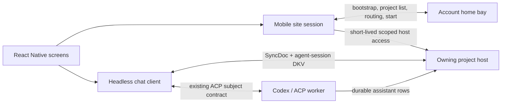

# CoCalc React Native First Vertical Slice Plan

Status: first vertical slice implemented locally as of 2026-08-14. The Expo
development build has compiled, installed, and loaded its JavaScript bundle in
an iPhone simulator. Focused package tests and the production iOS bundle export
pass. Interactive validation against `lite4b.cocalc.ai` now covers browser
authentication with 2FA, home-bay bootstrap, project and indexed-session
listing, existing-thread loading and sending, Patchflow collaboration with the
web client, and interrupt convergence initiated from both mobile and web.
Switching away from or backgrounding a running chat exposed that the first
headless client projected the final chat row but did not recover its separately
persisted ACP activity log. The client now reloads recent activity from the
project-host AKV and follows the live activity stream; simulator lifecycle
retesting, local/cross-bay validation, physical-device validation, and release
signing remain follow-up work.

## Executive Decision

Build the first CoCalc mobile application as a React Native app using Expo and
an Expo development build. Target iPhone and iPad first, while keeping shared
code Android-compatible. Do not build a parallel Swift application and do not
embed the complete CoCalc web application as the primary UI.

The first vertical slice must prove the difficult path end to end:

1. configure an arbitrary CoCalc-ai site URL;
2. authenticate through the site's existing browser-approved login flow;
3. connect to the account home bay;
4. list the account's projects;
5. connect directly to the selected project's host;
6. list the project's indexed agent sessions;
7. open an existing Codex thread, send a prompt, and display live collaborative
   updates through completion; and
8. recover the same thread after the app backgrounds, loses its connection, or
   restarts.

This slice is intentionally chat-first. It establishes the reusable native
session, routing, and headless chat foundations on which files, Markdown,
terminals, Jupyter, notifications, and other mobile features can be built.

Recommended reasoning effort for the plan plus first implementation is
`xhigh`. Routine follow-up UI work can normally use `high`.

## Product Outcome

At the end of this slice, a developer can install a development build on an
iOS simulator or physical device and perform this demo:

1. Launch the app and enter `https://cocalc.ai`, a staging/dev URL, or a
   compatible self-hosted Launchpad URL.
2. Approve sign-in in the browser and return to the app.
3. See a searchable, paginated project list with title, description, runtime
   state, and recent activity.
4. Select a project and see its recent indexed agent sessions.
5. Open one session and see the selected thread's human and agent messages.
6. Submit a plain-text prompt to that existing Codex thread.
7. See queued/running state, new collaborative messages, and the final agent
   response without refreshing.
8. Interrupt the active turn.
9. Background the app during a turn, foreground it, and converge to the server's
   current state without duplicate submission or lost messages.
10. Open the equivalent site/project in the system browser as an escape hatch.

The first slice may require a project that already has at least one indexed
agent session. If a project has none, the app explains this and offers the web
escape hatch. Creating the first chat file, creating arbitrary new threads,
and choosing a workspace are the immediate next chat milestone, not part of
this slice. This keeps the initial proof focused on authentication, transport,
SyncDoc compatibility, durable turns, and mobile lifecycle recovery.

## Scope

### Included

- React Native/Expo application shell for iPhone and iPad.
- Site profiles keyed by site application URL and account id.
- Browser-approved interactive login; no API-key login.
- Keychain-backed session credential storage.
- Home-bay discovery and control-plane Conat connection.
- Paginated project list using `projects.listAccountProjectWindow`.
- Correct owning-bay/project-host routing.
- Project-scoped agent session discovery using
  `cocalc-agent-sessions-v1` DKV.
- A headless `@cocalc/chat-client` package with no React, DOM, Redux, Ant
  Design, or `@cocalc/frontend` dependencies.
- Existing-thread message loading, subscription, send, ACP acknowledgement,
  interrupt, and reconnect/catch-up.
- Native message list and composer with basic Markdown, links, code blocks,
  copy, selection, and accessible status text.
- External-browser escape hatch.
- Unit, contract, integration, accessibility, and iOS simulator smoke tests.
- Validation against at least a local hub/Launchpad deployment and one remote
  HTTPS deployment.

### Explicitly deferred

- App Store/TestFlight release automation and production signing polish.
- Android device validation, though shared code must not intentionally depend
  on iOS-only APIs.
- Creating the first project chat file or workspace from mobile.
- Full new-thread configuration, model selection, reasoning selection,
  payment-source setup, and agent automations.
- Attachments, images, mentions, reactions, message editing, thread management,
  voice input, and full ACP activity visualization.
- APNs, badges, background notifications, and an account-wide running-turn
  projection.
- Native file browser, Markdown editor, terminal, Jupyter, and LaTeX UI.
- Embedded web fallback with shared `WKWebView` cookies. The first slice opens
  the system browser instead.
- Offline message creation. Read-only cached display may be added, but sends
  require a live authenticated connection.
- Apple Watch support.
- CoCalc Plus/Lite as a supported site target. Launchpad is in scope as the
  one-bay form of the CoCalc-ai architecture.

## Architectural Invariants

The implementation must preserve the rules in
`src/.agents/scalable-architecture.md`:

- The configured site is only the login/bootstrap entry point.
- Account control traffic goes to the authenticated account's `home_bay_url`.
- Project ownership is resolved explicitly; the local bay is never assumed to
  be authoritative.
- Project SyncDoc, DKV, files, and other steady-state data-plane traffic goes
  directly to the project host whenever the current server supports it.
- Cross-bay routing uses the existing control-plane and project-host token
  mechanisms. The mobile app must not invent direct database or local-host
  shortcuts.
- Launchpad uses the same code paths as the multibay deployment, with one bay.
- A mobile-specific hub proxy for chat is not introduced merely to simplify
  the client.

Additional mobile invariants:

- Never hardcode `cocalc.ai`, a bay hostname, `/home/user`, or an empty base
  path into shared client code.
- Never place a `remember_me` value, project-host bearer, poll token, or redeem
  token in AsyncStorage, logs, analytics, Redux-like application state, URLs,
  crash reports, or UI error messages.
- Do not use account API keys for interactive mobile sign-in.
- Do not import `@cocalc/frontend` into the mobile app or
  `@cocalc/chat-client`.
- Values exposed by the headless client are plain TypeScript data. Immutable.js
  objects must not leak into the native UI.
- The server remains authoritative. Local optimistic state is disposable and
  must reconcile after reconnect.
- One user action creates at most one ACP turn, including across timeout,
  backgrounding, and retry.

## Target Package Layout

Create these packages inside the existing pnpm workspace:

```text
src/packages/chat-client/
  package.json                 # @cocalc/chat-client
  src/
    client.ts                  # one open chat document/thread
    agent-sessions.ts          # project-scoped DKV reader/watcher
    messages.ts                # plain message/thread projections
    send.ts                    # durable user row + ACP submission pipeline
    lifecycle.ts               # suspend/resume/reconnect contracts
    types.ts
    __tests__/

src/packages/mobile/
  package.json                 # @cocalc/mobile
  app.config.ts
  eas.json                     # development profile initially
  src/
    app/
    auth/
    cocalc/                    # site session and Conat transport adapter
    projects/
    agents/
    chat/
    storage/
    test/
```

Use Expo's generated-native-project workflow initially. Do not commit generated
`ios/` or `android/` trees unless a required native customization cannot be
expressed through app configuration/config plugins and the repository makes a
deliberate decision to own those projects.

`@cocalc/chat` remains the shared schema/types/helpers package.
`@cocalc/chat-client` owns stateful, UI-independent client behavior.
`@cocalc/mobile` owns React Native components, navigation, secure storage,
lifecycle integration, and site profiles.

Use Expo Router for the small navigation tree, `expo-secure-store` as the
Keychain abstraction, and `expo-web-browser` for the preferred callback-capable
authentication session. Subscribe React components to the headless client via
`useSyncExternalStore`; do not introduce a second Redux application merely to
mirror the web frontend.

Do not first attempt to make all of `@cocalc/frontend/chat` reusable. Extract
only the domain behavior needed by the slice, with tests that prove parity with
the browser behavior.

## Dependency Firewall

`@cocalc/chat-client` may depend on browser-neutral portions of:

- `@cocalc/chat`
- `@cocalc/conat`
- `@cocalc/sync`
- `@cocalc/util`

It must not depend on:

- `@cocalc/frontend`
- React or React Native
- Redux or browser local storage
- Ant Design
- `window`, `document`, `location`, or browser cookies
- backend-only packages or Node filesystem/process APIs

Add an automated dependency-boundary test so this remains enforced.

The React Native bundle must audit all transitive imports from `@cocalc/conat`
and `@cocalc/sync`. Centralize required runtime shims such as `Buffer`,
`TextEncoder`, cryptographic random ids, and `setImmediate`; do not scatter
global patches across screens. Node-only optional performance modules such as
native websocket buffer helpers must not be pulled into Metro's bundle.

## Runtime Architecture



The app maintains one active control-plane session per selected site/account
profile and opens project-host clients on demand. Keep a bounded cache of
project-host clients and close inactive clients under memory pressure or when
the app backgrounds for a sustained period.

The first slice must determine, with a live transport test, whether the current
ACP request subject can be used over the routed project-host client. Prefer the
direct project-host client when supported. If the authoritative current web
path still requires the home-bay Conat client for ACP queue/control messages,
use that exact path temporarily, document the exception in this file, and keep
SyncDoc/DKV data on the direct project-host connection. Do not invent a second
mobile-only ACP protocol.

## Site Profile And Compatibility Contract

Treat the entered value as a CoCalc application URL, not merely a hostname. It
may include a non-root application base path. Normalize it without discarding
that path.

Persist non-secret profile metadata in AsyncStorage:

```ts
interface MobileSiteProfile {
  profile_id: string;
  entered_app_url: string;
  canonical_app_url: string;
  app_base_path: string;
  account_id: string;
  email_address?: string;
  display_name?: string;
  home_bay_id?: string;
  home_bay_url: string;
  protocol?: MobileProtocolCapabilities;
  last_used_at: string;
}
```

Store only the opaque session credential and its expiry in Keychain, namespaced
by `profile_id`.

Extend `POST /api/v2/auth/bootstrap` with an optional, backward-compatible
capability block rather than adding a mobile-only backend:

```ts
interface MobileProtocolCapabilities {
  protocol_version: 1;
  app_base_path: string;
  browser_challenge_login: 1;
  project_window: 1;
  project_host_routing: 1;
  chat_sync: 2;
  agent_session_index: 1;
  acp: 1;
  auth_callback?: 1;
}
```

The exact property name should be general, such as `client_capabilities`, so a
future desktop client can consume it too. Do not call it `ios_capabilities`.

For servers that predate the capability block, attempt the known version-1
protocol through the existing endpoints and show a compatibility warning.
Missing required endpoints or incompatible chat schema must produce a clear
"server upgrade required" state, not a generic network error.

The minimum compatible server contract for this slice is:

- `POST /api/v2/auth/bootstrap`
- `POST /api/v2/auth/cli/login/start`
- `POST /api/v2/auth/cli/login/status`
- `POST /api/v2/auth/cli/login/redeem`
- browser approval page returned by `approval_url`
- account-authenticated Hub Conat
- `projects.listAccountProjectWindow`
- `projects.getProjectState`, `projects.start`, and project-host routing APIs
- project-host SyncDoc and DKV
- chat schema v2
- the current ACP stream/control subjects

## Authentication Flow

Reuse the existing browser-approved CLI challenge as the initial device-login
protocol. Its security shape is appropriate: the app retains the poll secret,
the browser approves a separate session, redemption is one-time, and the
response includes the account's home-bay identity.

```text
mobile -> entered site: auth/cli/login/start
mobile <- site: challenge id, poll token, approval URL
mobile -> browser: open approval URL
browser -> site: normal sign-in + fresh-auth approval
mobile -> site: poll challenge status
mobile <- site: one-time redeem token
mobile -> site: redeem
mobile <- site: remember_me, account id, expiry, home bay URL
mobile -> home bay: auth/bootstrap with session credential
mobile -> home bay Conat: connect as account
```

Implementation requirements:

1. Use the preferred system authentication/browser session when the server
   advertises an app callback. Add an optional, strictly validated callback URL
   to the challenge flow so approval can return to the app. The callback carries
   no poll or redeem secret.
2. Preserve compatibility with an unchanged server by opening the approval URL
   in the system browser and polling immediately when the app returns to the
   foreground.
3. Keep the poll token only in memory during login. If the app is killed, start
   a new challenge.
4. Store the redeemed `remember_me` only in Keychain.
5. Send the session explicitly on native HTTP and Socket.IO requests; do not
   assume browser cookie-jar behavior.
6. Confirm the session against `auth/bootstrap` on `home_bay_url` before
   showing account data.
7. On expiration/revocation, disconnect all clients, remove the Keychain item,
   retain only the non-secret site entry, and return to sign-in.
8. Sign-out calls the existing server sign-out endpoint when reachable and
   always clears local credentials and project-host tokens.
9. Never silently fall back to API keys, bearer keys, hub passwords, or project
   ambient credentials.

For development, permit cleartext HTTP only in an explicit debug configuration
and only for enumerated local targets. Production profiles require valid HTTPS
and WSS. A physical phone cannot use the Mac's loopback address; use a trusted
LAN hostname or a tunnel and document the exact local setup.

## Control-Plane And Project-Host Transport

The existing browser routing implementation in
`src/packages/frontend/conat/client.ts` contains both reusable routing logic
and browser/Redux concerns. Do not copy that entire class into the mobile app.

Extract the smallest reusable project-host connection manager into a
browser-neutral `@cocalc/conat` module. It should own:

- resolving current host connection information;
- calling the existing `hosts.resolveHostConnection` and
  `hosts.issueProjectHostAuthToken` contracts through the home bay;
- honoring `host_session_id` changes;
- obtaining and refreshing short-lived project-host auth tokens;
- token expiry and bounded retry/backoff;
- direct Socket.IO/Conat client creation with injected credentials;
- invalidation after auth errors;
- connection close/resume hooks; and
- a bounded mapping from project ids to routed host clients.

Inject platform-specific inputs:

- control-plane app URL/base path;
- the authenticated hub RPC caller;
- native credential/header creation;
- network/foreground state;
- clock, timers, and logging; and
- a Conat connection factory.

Migrate the corresponding token/cache/address decisions in the web frontend to
the extracted helper for the paths used by mobile. Browser-only cookie
bootstrap, Redux project maps, public-share UI, and browser visibility
instrumentation can remain in `@cocalc/frontend` as adapters. The objective is
one implementation of security-sensitive token lifetime and host-session
invalidation, not two implementations that merely look similar.

Phase 0 is not complete until an iOS simulator can:

1. connect to Hub Conat with a redeemed session;
2. call `system.ping`;
3. call `projects.listAccountProjectWindow`;
4. resolve a selected project's host;
5. obtain scoped host access;
6. connect directly to that host; and
7. read one harmless project-host value such as the agent-session DKV.

This transport proof happens before building polished screens.

## Headless Chat Client Contract

The first public interface should be narrow and observable rather than exposing
the browser `ChatActions`/Redux API:

```ts
interface HeadlessChatClient {
  open(): Promise<void>;
  getSnapshot(): ChatSnapshot;
  subscribe(listener: (snapshot: ChatSnapshot) => void): () => void;
  sendToExistingCodexThread(opts: {
    thread_id: string;
    text: string;
  }): Promise<{ message_id: string; thread_id: string }>;
  interrupt(thread_id: string): Promise<void>;
  reconnect(reason: string): Promise<void>;
  close(): Promise<void>;
}
```

Construction receives explicit account, project, path, control-plane client,
project-host client, lifecycle hooks, id generator, and clock. There are no
global singletons.

`ChatSnapshot` contains plain serializable values:

- connection state and last error;
- document readiness;
- threads and selected thread id;
- ordered current message revisions;
- queued/running/interrupted/complete state;
- compact ACP status/activity suitable for native rendering; and
- a monotonic local revision so React can avoid unnecessary full-list work.

Extract and reuse the browser's existing semantics instead of simplifying the
wire format:

- schema-v2 message/thread/config/state rows from `@cocalc/chat`;
- primary keys used by `frontend/chat/register.ts`;
- thread/message id reservation;
- current message history/revision selection;
- ACP config normalization for an existing thread;
- write and commit of the user's durable chat row before ACP submission;
- ACP acknowledgement timeout/retry behavior from
  `frontend/chat/acp-api.ts`;
- interrupt-before-retry protection against ambiguous ACP acknowledgement;
- backend ownership of assistant reply rows;
- generating/queued/running/final state reconciliation; and
- session-index record status updates.

The mobile app must not dispatch an ACP turn by merely writing a chat row and
guessing at backend behavior. The headless send operation owns the complete
transactional sequence and reports an unambiguous result.

Agent-session access must be instance-based. The existing frontend module has
module-level DKV state keyed to one project; the headless implementation must
support clean switching among projects, close subscriptions, deduplicate by
`chat_path + thread_key`, and never return another project's cached records.

## Native UI

Use a small native navigation hierarchy:

```text
Site / account chooser
  -> Sign in
  -> Projects
       -> Project agents
            -> Chat thread
```

### Site and sign-in

- Default URL is `https://cocalc.ai`, but it is editable.
- Show normalized URL, connection result, site identity, and actionable TLS or
  compatibility errors before login.
- Support multiple saved site/account profiles, though simultaneous active
  sessions are not required in this slice.

### Projects

- Fetch `listAccountProjectWindow` in pages; never load an unlimited account
  project list.
- Search through the server API with debounce.
- Render title, description excerpt, current state, and last activity.
- Pull-to-refresh re-fetches the current window.
- Selecting a project does not assume the project is already running.

### Project agents

- Open/watch `cocalc-agent-sessions-v1` on the project host.
- Group running/active sessions before recent idle/failed/archived sessions.
- Render title, status, model if present, and updated time.
- If the DKV has no valid sessions, explain the first-slice limitation and
  offer `Open project in browser`.

### Chat

- Use a virtualized native list with stable message ids.
- Render the latest message revision, basic Markdown, fenced code blocks, and
  safe HTTP(S) links.
- Distinguish human, agent, system/error, queued, running, and interrupted
  states with text/icons in addition to color.
- Expose `Send`, `Interrupt`, `Copy`, `Retry connection`, and `Open in browser`
  with accessible names.
- Disable send until the SyncDoc is ready, the selected thread is an existing
  Codex thread, and the project runtime is ready.
- Before sending, call the existing project state/start APIs. If stopped,
  request `projects.start({ autostart: true, wait: false })`, show progress,
  and poll/watch until running or until the server returns a policy/error state.
- Keep the draft locally by site/account/project/chat/thread key. Drafts may be
  stored in AsyncStorage because they are user content, but offer a clear-draft
  action and do not include them in analytics or logs.

Use `COLORS` from `@cocalc/util/theme` rather than introducing untracked CoCalc
brand literals. Native platform system colors may be used for ordinary semantic
controls when a CoCalc theme token is not appropriate.

## Mobile Lifecycle And Recovery

Codex continues running in the project when the app is suspended. The first
slice does not attempt to keep JavaScript or sockets alive indefinitely in the
background.

On transition to background:

- finish or persist any already-acknowledged local state;
- stop aggressive reconnect loops and polling;
- retain no unredeemed auth secret;
- allow sockets to be suspended/closed by iOS; and
- record only non-secret diagnostic timestamps.

On foreground:

1. verify network availability;
2. verify/reconnect the home-bay session;
3. invalidate routed clients whose host session or token is stale;
4. reconnect the selected project host;
5. reopen/recover SyncDoc and DKV subscriptions;
6. rebuild the snapshot from authoritative rows; and
7. resolve any locally pending send by its stable message/thread ids before
   considering a retry.

On process restart, restore the selected profile and navigation metadata, but
do not automatically resubmit an unacknowledged prompt. Reopen the chat and
inspect authoritative state. If the user row exists without an ACP turn, show
an explicit retry affordance using the same browser semantics.

## Implementation Phases

### Phase 0: React Native and transport feasibility gate

Tasks:

- Scaffold `@cocalc/mobile` with Expo, TypeScript, an Expo development build,
  and package-local run/typecheck/test scripts.
- Pin versions compatible with the repository's React version and document the
  choice in the package README.
- Establish the centralized React Native runtime shim layer.
- Make `@cocalc/conat` and the required `@cocalc/sync` surface bundle under
  Metro without Node-only modules.
- Implement an in-memory development credential provider.
- Complete the seven-step Hub/project-host transport proof above.
- Record bundle warnings, required polyfills, and any server incompatibility in
  this plan before proceeding.

Done when:

- a package-local command boots the iOS simulator development build;
- the app connects to both Hub and project host and reads project data; and
- there is no import from `@cocalc/frontend` in the Metro dependency graph.

Stop and revise the architecture if this gate requires embedding the full web
frontend, proxying project data through a new mobile API, or maintaining a
large fork of Conat.

### Phase 1: Site bootstrap and secure authentication

Tasks:

- Implement application-URL normalization including optional base path.
- Add the backward-compatible `client_capabilities` bootstrap response.
- Implement challenge start/poll/redeem as a browser-neutral client module.
- Add optional app callback support while preserving unchanged-server fallback.
- Store the resulting session in Keychain and non-secret profile data in
  AsyncStorage.
- Confirm and route to `home_bay_url`.
- Implement sign-out, expiry, revocation, and profile switching.
- Redact auth values at the logging boundary and add tests that scan emitted
  diagnostics.

Done when:

- a fresh installation can sign in to two different configured sites one at a
  time;
- killing/restarting the app restores a valid profile without placing the
  credential in AsyncStorage or another unprotected persistence layer; and
- revoking/signing out the session returns the app to sign-in.

### Phase 2: Project list and routed project connection

Tasks:

- Initialize typed Hub APIs on the home-bay Conat client.
- Implement paginated/searchable `listAccountProjectWindow` loading.
- Build the Projects screen and empty/error/loading states.
- Extract the browser-neutral project-host connection manager.
- Wire project selection to host resolution/token/direct connection.
- Add runtime state/start handling required before a Codex send.

Done when:

- a heavy account is paginated rather than loaded wholesale;
- a project owned by another bay resolves through its owning bay and connects
  to its host;
- Launchpad takes the same path without cross-bay special casing; and
- moving/restarting a project host invalidates stale mobile routing state.

### Phase 3: Headless agent-session and chat read path

Tasks:

- Create `@cocalc/chat-client` and its dependency-boundary test.
- Extract project-scoped agent-session DKV types/read/watch behavior.
- Open the chat SyncDoc with the current schema-v2 primary keys.
- Extract plain message/thread projection and message revision logic.
- Expose snapshots/subscriptions and deterministic close/reconnect.
- Build Project Agents and read-only Chat screens.
- Render basic Markdown/code/links safely.

Done when:

- two foreground clients viewing the same chat see each other's durable changes;
- switching rapidly between projects never leaks sessions or messages;
- closing a screen releases SyncDoc/DKV listeners; and
- a long chat remains scrollable without rendering every row at once.

### Phase 4: Existing-thread Codex send and interrupt

Tasks:

- Extract the stable message/thread identity and send transaction.
- Persist the user message to SyncDoc before ACP submission.
- Reuse current ACP request/config construction for the existing thread.
- Preserve acknowledgement, retry, and ambiguous-send protection.
- Surface queued/running/failure/final states.
- Add interrupt support.
- Update the project agent-session record as state changes.
- Add the native composer and draft storage.

Done when:

- one tap produces one user message and at most one agent turn;
- a second web client sees the mobile user's message and live response;
- the mobile client sees a web collaborator's concurrent messages;
- interruption converges on both mobile and web; and
- server-side denial, payment configuration, project-start policy, and model
  incompatibility errors are shown without fabricating a reply.

### Phase 5: Lifecycle hardening and vertical-slice validation

Tasks:

- Integrate React Native `AppState` and network changes with the connection
  manager.
- Add foreground recovery and process-restart reconciliation.
- Bound caches, listeners, retry loops, and memory use.
- Add the external-browser project/chat escape hatch.
- Add accessibility semantics, Dynamic Type support, VoiceOver verification,
  hardware-keyboard navigation, reduced-motion behavior, and iPad layout.
- Run the validation matrix and document observed limitations.

Done when every acceptance criterion below passes on an iOS simulator and the
remote-device cases pass on a physical iPhone or iPad.

## Testing Strategy

### Unit tests

- URL/base-path normalization and origin rejection.
- Capability parsing and legacy-server fallback.
- Keychain profile namespacing without testing secret values in snapshots.
- Project pagination/search reducer.
- Host token expiry, backoff, host-session replacement, and invalidation.
- Agent-session project isolation and deduplication.
- Schema-v2 thread/message projection.
- Latest message revision selection.
- Send identity stability and one-turn idempotency.
- Background/foreground state transitions.
- Auth/log redaction.

### Contract tests

Run the same fixtures against the web adapter and headless client for:

- chat primary keys and schema-v2 rows;
- thread metadata and ACP config resolution;
- message ordering/revisions;
- queued/running/interrupted/complete state;
- ACP request envelope; and
- agent-session status projection.

When browser code is moved into a shared helper, keep the existing frontend
tests and add headless package tests before deleting the old implementation.

### Integration tests

- Auth challenge start/status/redeem with a real local hub.
- Home-bay redirect/bootstrap.
- Project list pagination on an account with more than one page.
- Cross-bay project selection where available.
- Direct project-host DKV and SyncDoc access.
- Existing Codex thread send through final durable assistant row.
- Interrupt and reconnect.
- Session expiry/revocation.

### Native end-to-end smoke

Use a scripted iOS simulator flow, initially with Maestro unless a concrete
development-build limitation requires Detox. Cover:

1. configure site;
2. complete browser-approved login;
3. list/search/select project;
4. select agent session;
5. submit prompt;
6. observe running and final state;
7. background/foreground during a second turn;
8. interrupt a third turn; and
9. sign out.

Tests should select controls by accessible role and name, not styling or test
implementation details.

## Deployment Validation Matrix

| Target                         | Required in slice | Notes                                                             |
| ------------------------------ | ----------------- | ----------------------------------------------------------------- |
| iOS simulator + local hub      | Yes               | Fast implementation loop; loopback is the Mac                     |
| Physical iPhone/iPad + dev hub | Yes               | Use trusted HTTPS LAN/tunnel URL, never assume loopback           |
| `cocalc.ai` or staging HTTPS   | Yes               | Confirms public TLS, multibay bootstrap, and remote host routing  |
| Self-hosted Launchpad HTTPS    | Yes               | Confirms the one-bay deployment uses the same client architecture |
| Android                        | No                | Type/bundle compatibility desirable; device validation follows    |
| CoCalc Plus/Lite               | No                | Requires a separate compatibility decision after this slice       |

For every supported target record:

- entered and canonical application URL/base path;
- bootstrap/capability response;
- home bay selected;
- control-plane versus project-host connection addresses with credentials
  removed;
- project owning bay and host id;
- auth, project-list, SyncDoc, DKV, ACP, and reconnect result; and
- server/app build identifiers.

## Accessibility And iPad Requirements

Apply the intent of `src/.agents/accessibility.md` to native controls:

- Every control has an accessible role, label, state, and value where relevant.
- Status changes such as queued, running, interrupted, completed, and connection
  loss are announced without repeatedly stealing VoiceOver focus.
- Color is never the only indication of author or state.
- Dynamic Type does not hide the composer or primary navigation.
- The app remains usable with VoiceOver, Switch Control semantics, and an iPad
  hardware keyboard.
- Focus returns predictably after browser authentication and modal errors.
- Motion honors Reduce Motion.
- iPad uses the same codebase, with a project/session column and chat detail
  when width allows; it must not merely scale up the phone layout.

## Security Review Checklist

- Browser approval requires the site's normal authentication and fresh-auth
  policy.
- Challenge poll and redeem tokens are high-entropy, one-time, short-lived, and
  never placed in callback URLs.
- `remember_me` is Keychain-only and individually revocable.
- Project-host access remains short-lived and project/account scoped.
- Host-session changes invalidate prior routed credentials.
- No mobile endpoint accepts an account id supplied by the client as authority.
- Arbitrary site URLs cannot trigger cleartext transport in production.
- Redirects cannot silently change to an unrelated origin; home-bay changes are
  accepted only from authenticated CoCalc bootstrap/login responses.
- Markdown disallows executable HTML/scripts and validates external URL schemes.
- Logs and crash diagnostics contain ids/state but no credentials, prompts, file
  contents, or complete chat messages by default.
- Clipboard copying is explicit; sensitive data is never copied automatically.
- Sign-out closes all Hub/project connections and clears drafts when the user
  selects the corresponding option.

## Main Risks And Required Early Answers

### React Native compatibility of Conat/SyncDoc

This is the largest technical risk. Resolve it in Phase 0, before UI polish.
Likely issues include Metro resolving Node-only websocket helpers, binary data
types, random id generation, timer/background behavior, and explicit cookie
headers.

### Security-sensitive routing embedded in frontend code

Token caching and host-session invalidation currently live among browser/Redux
logic. Extract narrowly and validate against existing frontend tests rather
than implementing a mobile approximation.

### Chat behavior spread across frontend modules

Message creation, thread state, ACP dispatch, pending sends, and presentation
are intertwined. The extraction boundary is domain operations and snapshots,
not React components. Avoid porting `ChatActions` wholesale.

### Mobile suspension during ambiguous send acknowledgement

Stable ids plus authoritative SyncDoc/ACP state must decide recovery. Never
automatically resubmit merely because the app missed an acknowledgement.

### Self-hosted URL and TLS variability

Support application base paths and trusted certificates. Provide actionable
diagnostics for DNS, TLS, HTTP-to-HTTPS, missing websocket upgrades, and old
protocol versions. Do not weaken production transport security to accommodate
misconfigured sites.

### Very large chats

Do not convert the full chat into a new array on every token/update. Maintain a
plain incremental projection keyed by stable ids and feed a virtualized native
list. Add a large seeded-chat performance case before declaring the slice done.

## Acceptance Criteria

The slice is complete only when all of the following are true:

- [ ] `@cocalc/mobile` launches as an Expo development build on an iOS
      simulator and a physical iOS/iPadOS device.
- [ ] No mobile runtime module imports `@cocalc/frontend`, Ant Design, DOM APIs,
      or backend-only packages.
- [ ] A user can configure, sign in to, sign out of, and switch between at
      least two site/account profiles.
- [ ] The credential is present only in Keychain and redaction tests pass.
- [ ] Home-bay discovery is honored after login.
- [ ] Projects load through paginated `listAccountProjectWindow`.
- [ ] A cross-bay project, when available, connects to its owning project host.
- [ ] Launchpad passes without a separate one-bay client implementation.
- [ ] Indexed project agent sessions load and update live.
- [ ] An existing Codex thread loads with correct message ordering and current
      revisions.
- [ ] A prompt persists, dispatches exactly once, and completes with the same
      durable result visible in the web app.
- [ ] A web collaborator's concurrent message appears on mobile.
- [ ] Interrupt works and converges across clients.
- [ ] Background/foreground, temporary network loss, and app restart recover
      without duplicate turns or lost durable messages.
- [ ] Missing capabilities, expired auth, project-start denial, ACP failure,
      and unavailable project host each have distinct actionable UI states.
- [ ] The browser escape hatch opens the configured site, not a hardcoded
      production URL.
- [ ] VoiceOver labels/status announcements, Dynamic Type, reduced motion, and
      iPad layout have been manually checked.
- [ ] Package-local typechecks/tests, relevant `@cocalc/chat` and
      `@cocalc/conat` tests, and `pnpm -C src lint:frontend` pass for any shared
      frontend changes.
- [ ] This plan is updated with the actual implementation status, deviations,
      commands, and validation evidence.

## Likely Source Touchpoints

Read these before implementing the corresponding phase:

- `src/packages/cli/src/bin/commands/auth.ts` — challenge login client flow.
- `src/packages/server/auth/cli-auth.ts` — challenge/session security contract.
- `src/packages/http-api/pages/api/v2/auth/bootstrap.ts` — home-bay bootstrap.
- `src/packages/frontend/auth/api.ts` — existing home-bay auth handling.
- `src/packages/conat/core/client.ts` — base Conat/Socket.IO client.
- `src/packages/frontend/conat/client.ts` — current browser routing/token logic
  to extract, not import.
- `src/packages/conat/hub/api/projects.ts` — project list/state/start contract.
- `src/packages/conat/hub/api/hosts.ts` — host connection/token contract.
- `src/packages/frontend/chat/register.ts` — chat SyncDoc construction.
- `src/packages/frontend/chat/actions.ts` — message/thread domain behavior.
- `src/packages/frontend/chat/acp-api.ts` — ACP dispatch and retry semantics.
- `src/packages/frontend/chat/agent-session-index.ts` — existing DKV schema.
- `src/packages/chat/src/index.ts` — shared chat schema v2.
- `src/packages/chat/src/acp.ts` — shared ACP event helpers.
- `src/packages/conat/ai/acp/client.ts` — explicit-client ACP operations.
- `src/.agents/syncdoc-reconnect-lifecycle-plan-2026-05-21.md` — current
  recovery model.
- `src/.agents/project-read-state.md` — eventual shared unread/read state.
- `src/.agents/accessibility.md` — first-party interaction requirements.

## Immediate Follow-On Slice

After this plan is complete, the next chat slice should remove the seeded-chat
limitation:

1. discover the exact project runtime home directory;
2. create or select the canonical per-account Navigator/workspace chat path;
3. create a new schema-v2 Codex thread;
4. choose working directory, model, reasoning, and session mode;
5. index the new session in project DKV; and
6. support the remaining high-value chat operations and rich ACP activity.

Only after that should the project expand into native files/Markdown and the
terminal/Jupyter WebView escape hatches. Push notifications and an account-home-
bay projection of running/recent turns should be designed as a separate server
and mobile slice.
