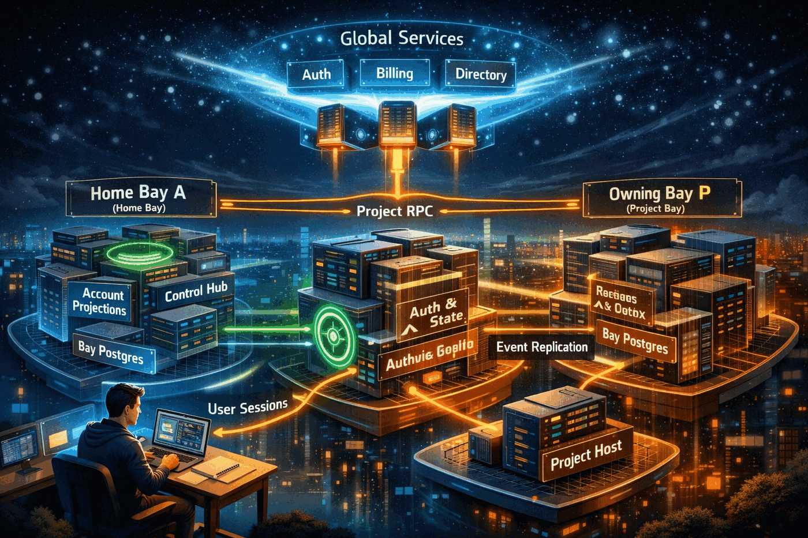

# Scalable Control Plane Implementation Plan

Status: proposed phased implementation plan for moving CoCalc Launchpad and
Rocket to the bay architecture described in
[scalable-architecture.md](/home/wstein/build/cocalc-lite4/src/.agents/scalable-architecture.md).

This document is intentionally implementation-oriented. It is not another
architecture overview. The goal is to define a migration sequence that retires
the biggest scalability risks first and keeps the system shippable throughout.

## Success Criteria

The implementation is successful when:

- Launchpad runs as a one-bay Rocket deployment
- browser-facing project/collaborator/account reactivity no longer depends on
  raw base-table Postgres changefeeds
- all major bay/project/backup operations are available through `cocalc-cli`
- account rehome between bays is a routine supported workflow
- project hosts are attached to bays, not to one global hub
- inter-bay replication is durable and replayable
- load tests establish practical bay size targets and operating envelopes
- scaling to more users is mainly a matter of adding bays and project hosts

## Core Implementation Principles

### Retire Risk In This Order

1. remove architectural bottlenecks
2. make routing explicit
3. make Launchpad the one-bay special case
4. then introduce true multi-bay operation

### One Architecture

Launchpad and Rocket should converge toward one architecture, not diverge.

### CLI-First Operations

If an operator or Codex cannot inspect or trigger it through `cocalc-cli`, it
is not finished.

### Load Testing Is A Phase Gate

Load testing is not the last phase. Every major phase must have a concrete load
test gate.

### Roll Forward, But Always With A Fence

New routing and replication features must support:

- canary rollout
- fencing
- rollback
- replay

## Cross-Cutting Workstreams

These workstreams span multiple phases.

### 1. Control Data Model

- global directory data
- bay-local authoritative tables
- bay-local projection tables
- outbox/event schemas

### 2. Browser / Frontend Routing

- home-bay bootstrap
- project open via owning bay
- explicit Conat client selection
- removal of hidden global-client fallbacks

### 3. CLI / Operator Surface

- bay-aware commands
- machine-readable output
- scoped credentials
- parity between Launchpad and Rocket

### 4. Host / Placement Control

- host belongs to one bay
- project start/stop through owning bay
- account move / rehome between bays
- project move between bays

### 5. Backup / Restore

- per-bay Postgres backup to R2
- PITR
- fenced restore
- restore-aware directory behavior

### 6. Load Testing And Sizing

- baseline measurements
- repeatable synthetic workloads
- capacity envelopes
- bay sizing guidance

## Required Load Testing Program

This is not optional. It must exist early and be maintained throughout the
migration.

### Goals

- determine practical bay size limits
- validate the architecture before large-scale rollout
- catch regressions during migration

### What Must Be Measured

At minimum:

- login/bootstrap latency
- initial project list latency
- initial collaborator list latency
- project rename latency
- collaborator add/remove latency
- project start latency
- project open latency
- home-bay projection lag
- inter-bay event lag
- browser control connection counts
- Conat message throughput and queue depth
- Postgres CPU, IOPS, memory, and lock contention
- worker backlog
- backup freshness and WAL lag

### Canonical Test Personas

At minimum the harness must model:

- light user: 5 to 20 projects
- normal user: 50 to 200 projects
- heavy user: 1,000+ projects
- extreme user: 10,000+ projects
- heavily collaborative org user
- user with many active browser tabs

### Canonical Test Flows

At minimum:

- authenticate and bootstrap
- load project list
- load collaborator list
- rename project
- add/remove collaborator
- start project
- open project and get host route
- receive burst of project state updates
- receive replicated project summary updates from another bay

### Load Harness Shape

The harness should support:

- direct Conat-based clients for control-plane load generation
- browserless API/control simulations for scale
- optional browser/UI smoke flows for correctness
- scripted replay of realistic multi-step sessions

The harness should be invokable from `cocalc-cli`.

Suggested future commands:

- `cocalc load bootstrap ...`
- `cocalc load projects ...`
- `cocalc load bay ...`
- `cocalc load replication ...`

### Phase Gates

No phase that changes routing, reactivity, or replication is complete without:

- defined workload
- measured p50/p95/p99 latency
- measured resource usage
- written summary of safe operating envelope

## Phase 0: Foundations And Measurement

This is the first mandatory phase.

### Purpose

- freeze core terminology and invariants
- make routing/client usage explicit enough that future phases are safe
- build the load-testing and observability foundation

### Deliverables

- terminology freeze: `bay`, `home_bay`, `owning_bay`
- explicit written invariants for:
  - account home bay
  - project owning bay
  - host belongs to one bay
  - project runs on a host in its owning bay
- audit of implicit/global Conat client usage across browser and backend paths
- coding rule: non-default Conat clients must be passed explicitly
- observability baseline for:
  - changefeeds
  - browser control connections
  - Postgres query pressure
  - host routing calls
- initial load harness design and first baseline tests
- initial `cocalc-cli` operator surface requirements document

### Code Targets

Likely areas:

- frontend Conat client wrappers
- hub API client wrappers
- project-host routing code
- CLI auth/routing helpers

### Exit Criteria

- known global-client fallback sites are cataloged
- current baseline latency and throughput numbers are captured
- one repeatable synthetic load harness exists
- dashboards/metrics needed for later phases are available

### Rollback Story

This phase should mostly add instrumentation and rules, so rollback risk is low.

## Phase 1: Directory Abstraction In One-Bay Mode

### Purpose

Introduce the directory abstraction without changing deployment shape.

### Deliverables

- global directory abstraction exists even if it always resolves to `bay-0`
- `home_bay_id` and `owning_bay_id` concepts exist in code and schema
- project hosts are modeled as belonging to one bay
- CLI can resolve:
  - account -> home bay
  - project -> owning bay
  - host -> bay

### Implementation Notes

- Start with static/deterministic one-bay values in Launchpad.
- Prefer abstraction boundaries first, not distribution first.

### Exit Criteria

- Launchpad still works
- browser/bootstrap code can ask for home bay
- project/control code can ask for owning bay
- CLI can display bay ownership information

### Load Test Gate

- no regression in bootstrap/project-open latency versus baseline

## Phase 2: Bay-Local Authoritative And Projection Schemas

### Purpose

Add the schemas needed for the future architecture while still running as one
bay.

### Deliverables

- bay-local authoritative table changes
- projection tables:
  - `account_project_index`
  - `account_collaborator_index`
  - `account_notification_index`
  - optional account settings projection
- outbox table for authoritative changes
- projector workers that can build/update projections

### Implementation Notes

- Build in dual-write mode first where necessary.
- Projection rebuild tooling must exist from the beginning.

### Exit Criteria

- projections can be fully rebuilt from authoritative state
- outbox events are generated transactionally
- projection correctness is verified on representative data

### Load Test Gate

- projection build time and steady-state update cost are measured
- large-user bootstrap from projection tables is benchmarked

## Phase 3: Browser Read Path Migration

### Purpose

Switch browser-facing reads from base tables/changefeeds to projection-backed
reads and live updates.

This is the most important scalability phase.

### Deliverables

- project list uses `account_project_index`
- collaborator list uses `account_collaborator_index`
- relevant notifications/settings use projections
- browser receives live updates from projection update streams, not direct base
  changefeeds

### Required Cleanup

- remove dependence on the `projects` and `collaborators` base-table
  changefeeds for browser-facing list views
- isolate or retire the heavy tracker path in
  `project-and-user-tracker`

### Exit Criteria

- browser behavior is functionally equivalent for users
- large-account project list loads no longer require loading all project
  memberships into a tracker
- raw base-table changefeeds are no longer on the browser-critical path for
  project and collaborator lists

### Load Test Gate

- benchmark light, normal, heavy, and extreme users
- record p99 bootstrap and list-load latency
- record Postgres load reduction versus baseline

## Phase 4: Launchpad As One-Bay Rocket

### Purpose

Make Launchpad run the future architecture in one-bay mode.

### Deliverables

- one-bay directory service in Launchpad
- one-bay browser control routing through bay APIs
- one-bay host-controller relationship
- one-bay backup pipeline to R2
- bay-aware CLI commands working in Launchpad

### Exit Criteria

- Launchpad users see no regression
- one-bay operational workflows work via `cocalc-cli`
- backup and restore commands function in one-bay mode

### Load Test Gate

- one-bay Launchpad load test establishes practical upper bound for a single
  bay on target hardware classes

## Phase 5: Inter-Bay Plumbing

### Purpose

Add the minimum cross-bay control-plane machinery.

### Deliverables

- `api.bay.<bay_id>` RPC surface
- durable inter-bay event streams
- replicated projection consumers
- fencing and replay support
- cross-bay observability:
  - lag
  - event backlog
  - replay status

### Important Design Choice

- use one durable stream per destination bay
- do not create per-project streams or subjects

### Exit Criteria

- one bay can forward project-scoped control RPC to another
- one bay can replicate project summary changes to another
- replay after outage works

### Load Test Gate

- inter-bay RPC latency measured under load
- replication lag measured under bursty update workloads
- Conat subject/stream topology verified to remain bounded

## Phase 6: Project Hosts Attached To Bays

### Purpose

Move host control fully under owning-bay authority.

### Deliverables

- each host belongs to one bay
- host heartbeats/metrics go to its bay
- project start/stop/restart flows route through owning bay
- bay-local host pools and placement policy

### Exit Criteria

- there is no hidden dependence on one global control hub for steady-state host
  operations
- a project's controlling authority is its owning bay

### Load Test Gate

- host heartbeat and lifecycle workloads measured at target bay sizes

## Phase 7: Account Rehome Between Bays

### Purpose

Implement account home-bay move / rehome as a first-class workflow.

### Deliverables

- account-write fencing workflow
- small home-state copy workflow
- projection copy/rebuild workflow
- global directory update workflow
- forced browser reconnection workflow
- replay and rollback plan
- CLI commands for account rehome orchestration

### Exit Criteria

- account can move from bay A to bay B safely
- browser control sessions reconnect to the new home bay
- account-facing state is correct after rehome
- rehome does not imply moving project data or project hosts

### Load Test Gate

- repeated account rehomes under background load
- reconnect storms and projection rebuild costs measured
- operator workflow latency measured for heavy accounts

## Phase 8: Project Move Between Bays

### Purpose

Implement project move as a first-class workflow.

### Deliverables

- fence/quiesce workflow
- data copy workflow
- metadata transfer workflow
- global directory update workflow
- projection convergence workflow
- rollback/retry plan
- CLI commands for move orchestration

### Exit Criteria

- project can move from bay A to bay B safely
- browser opens resolve correctly after move
- backup/restore and ownership history remain coherent

### Load Test Gate

- repeated move operations under background load
- move impact on replication lag and operator workflows measured

## Phase 9: Multi-Bay Rocket Rollout

### Purpose

Begin real multi-bay production deployment.

### Deliverables

- 2+ bays in production/staging
- new-tenant placement across bays
- controlled collaborator scenarios across bays
- production-ready bay dashboards and alerts

### Exit Criteria

- cross-bay collaboration scenarios work
- operators can inspect and control bays through CLI
- backup/restore status is visible per bay

### Load Test Gate

- end-to-end multi-bay load test with realistic account/project distributions
- documented bay sizing guidance, including:
  - max active browsers per bay
  - max heavy accounts per bay
  - max host count per bay
  - expected p99 latencies

## Phase 10: Regionalization And HA Hardening

### Purpose

Add geographic placement and stronger fault isolation.

### Deliverables

- region-aware home-bay and owning-bay placement
- org-level placement policy if needed
- multi-zone bay deployment standards
- fenced restore and failover playbooks
- bay backup SLOs

### Exit Criteria

- region-aware placement policies are working
- restore playbooks have been rehearsed
- operators can recover a failed bay with bounded RTO/RPO

### Load Test Gate

- inter-region replication lag measured
- degraded-mode/failure-mode exercises completed

## Required CLI Surface By Phase

The CLI should evolve in lockstep with the platform.

### By End Of Phase 1

- `cocalc account where`
- `cocalc project where`
- `cocalc host show`

### By End Of Phase 4

- `cocalc bay list`
- `cocalc bay show`
- `cocalc bay load`
- `cocalc bay backups`

### By End Of Phase 7

- `cocalc account move --bay ...`

### By End Of Phase 8

- `cocalc project move --bay ...`
- `cocalc bay cordon`
- `cocalc bay drain`
- `cocalc bay restore`

### By End Of Phase 9

- `cocalc replication lag`
- `cocalc bay health`
- `cocalc bay restore status`

## Explicit Anti-Goals

Do not do these:

- do not introduce true multi-bay routing before projections replace the
  browser-critical changefeed paths
- do not rely on direct SQL for routine bay operations
- do not couple account rehome to project move
- do not make project moves an operator-only manual database procedure
- do not postpone load testing until after multi-bay rollout

## Immediate Recommended Next Actions

1. Create a smaller follow-up document that enumerates the exact current code
   paths using browser-critical `projects` and `collaborators` changefeeds.
2. Create a Conat client explicitness audit doc, especially for frontend paths
   that can accidentally fall back to the global client.
3. Start the load harness design and baseline measurement work immediately.
4. Add a CLI-oriented operator API backlog derived from this plan.

Those actions de-risk the later phases the most.

