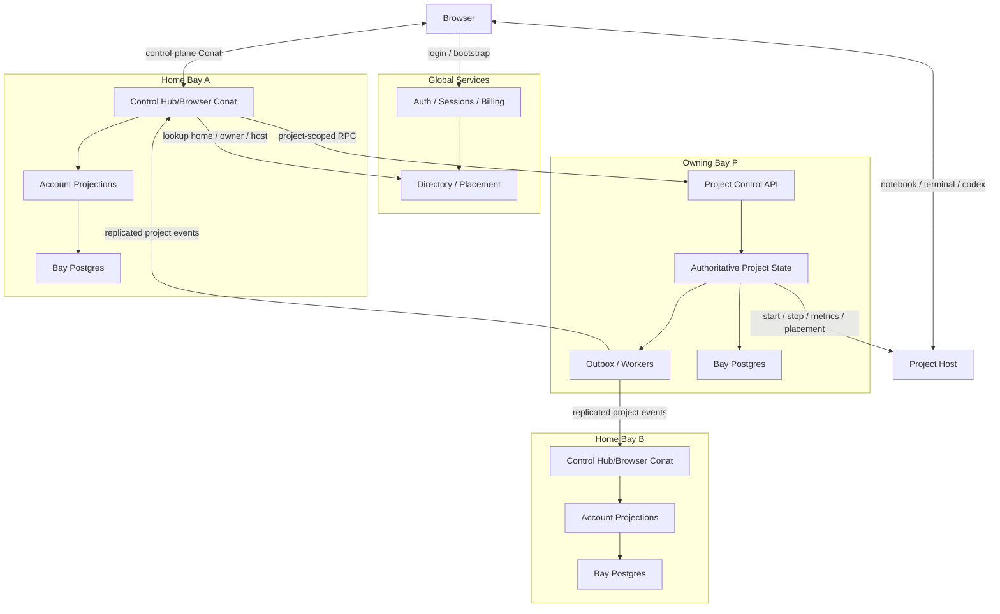

# Scalable Control Plane Architecture

Status: proposed target architecture for `cocalc-rocket`, with `cocalc-launchpad`
implemented as the one-bay special case.

This document turns the high-level scaling discussion into a concrete design.
The goal is to make the control plane scale by adding bays and compute hosts,
not by redesigning the architecture later.

## Goal

The architecture must support:

- `cocalc-plus`: single-user, local, not important for this design
- `cocalc-launchpad`: one control plane, a few hosts, dozens of users
- `cocalc-rocket`: many control-plane bays, many project hosts, large scale

The hard requirement is:

- scaling to large numbers of simultaneous active users must become primarily a
  spending/operations problem
- it must not require replacing the control-plane design again

## Summary

The correct architecture is:

- a tiny global layer for auth, billing, and directory/placement
- many identical **bays**
- one account has a `home_bay`
- one project has an `owning_bay`
- each project host belongs to exactly one bay
- the browser keeps one control-plane connection to the `home_bay`
- project compute/data-plane traffic goes directly to the project host
- inter-bay RPC and event replication use internal Conat
- Postgres remains the durable relational source of truth
- browser reactivity comes from per-account projection tables, not raw table
  changefeeds

Launchpad should become exactly one bay with no cross-bay routing.

Terminology note:

- this document uses `bay` instead of `cell`
- the reason is to avoid confusion with notebook code cells and markdown cells
- `home bay` and `owning bay` are the two key routing concepts

## High-Level Diagram

## Why The Current Model Will Not Scale

The current control plane relies heavily on:

- Postgres `LISTEN/NOTIFY`
- per-user changefeeds
- websockets from browsers into a central hub tier
- server-side tracking of large per-account project/collaborator state just to
  know which notifications to forward

In particular:

- [projects.ts](/home/wstein/build/cocalc-lite4/src/packages/util/db-schema/projects.ts)
  uses `pg_changefeed: "projects"`
- [collaborators.ts](/home/wstein/build/cocalc-lite4/src/packages/util/db-schema/collaborators.ts)
  uses `pg_changefeed: "collaborators"`
- [server.ts](/home/wstein/build/cocalc-lite4/src/packages/conat/hub/changefeeds/server.ts)
  creates a live changefeed connection per client query
- [project-and-user-tracker.ts](/home/wstein/build/cocalc-lite4/src/packages/database/postgres/project/project-and-user-tracker.ts)
  loads all projects for an account so it can route updates later

That design is too expensive at large scale because it couples:

- active browsers
- size of each user account
- live database fanout

The new design must break that coupling.

## Core Concepts

### Bay

A bay is the main deployment unit.

Every bay runs the same software stack:

- control hub / API
- browser-facing control Conat endpoint
- host-controller service
- worker/scheduler processes
- Conat nodes
- one Postgres database
- projection updaters

Bays are identical operationally. There are not separate binaries for
"account bays" and "project bays".

### Home Bay

Each account has one `home_bay_id`.

The home bay is where account-facing UI state lives:

- project list
- collaborator list
- notifications
- account settings
- lightweight project summaries for all accessible projects

The browser talks to the home bay for control-plane work.

### Owning Bay

Each project has one `owning_bay_id`.

The owning bay is authoritative for:

- the project row
- membership/collaborators on that project
- lifecycle state
- host placement
- backups/snapshots metadata
- project-scoped chat/automation/control metadata

The owning bay decides where the project runs.

### Project Host

Each project host belongs to one bay.

Steady-state rule:

- a project runs only on a host in its owning bay's compute pool

This simplifies routing and authority. Moving a project between bays also
moves project ownership.

## Deployment Modes

### Plus

Not relevant to large-scale architecture. It can remain special.

### Launchpad

Launchpad should be the one-bay version of Rocket.

That means:

- one bay
- one Postgres
- one directory mapping everything to that bay
- one browser control Conat endpoint
- local in-process or same-node dispatch instead of cross-bay routing

Important property:

- the Rocket code paths get exercised in Launchpad
- there is one architecture to maintain

### Rocket

Rocket is many bays plus a small global layer.

## Global Services

The global layer must be kept intentionally tiny.

It should contain:

- auth / session issuance
- billing / subscriptions
- directory / placement service
- optional global email/notification dispatch

It should *not* contain:

- live user project lists
- collaborator lists
- per-user browser changefeed fanout
- project lifecycle state beyond placement pointers

## `cocalc-cli` As A First-Class Control Plane Client

The scalable architecture must treat `cocalc-cli` as a first-class operator and
automation surface, not as an afterthought.

This is important for:

- human operations
- scripting and automation
- incident response
- smoke tests
- Codex-assisted operations

The existing CLI in
[src/packages/cli](/home/wstein/build/cocalc-lite4/src/packages/cli) already
has broad support for project, host, snapshot, codex, and admin workflows. The
bay architecture should extend that model rather than creating a separate
operations surface that only exists in the web UI.

### Design Rule

Every important control-plane operation must be available through
`cocalc-cli` with machine-readable output.

That includes:

- inspecting bays
- placing and draining bays
- viewing bay load/capacity
- viewing home-bay and owning-bay mappings
- moving projects between bays
- checking backup and restore health
- triggering or fencing restores
- inspecting inter-bay replication lag
- viewing host pools and host assignment by bay

### Architectural Implication

The control plane should expose stable API methods specifically designed to be
consumed by:

- the web frontend
- `cocalc-cli`
- Codex/agent workflows

This means:

- do not build bay administration only into ad-hoc web pages
- do not require direct SQL access for routine operational tasks
- do not require Kubernetes access for ordinary control-plane workflows

Those may still exist for emergencies, but they must not be the primary
operational interface.

### Bay-Aware CLI Routing

The CLI should follow the same routing model as the browser:

- authenticate once
- resolve account home bay and project owning bay through the directory
- route commands to the correct bay automatically

Examples:

- `cocalc project open ...` should resolve the owning bay
- `cocalc project move --bay <dest>` should route to the source owning bay and
  destination owning bay as needed
- `cocalc bay list` should talk to the global directory/control surface
- `cocalc bay backup status <bay>` should route to the relevant bay

This keeps CLI behavior aligned with the architecture and avoids hidden
"special admin backdoors" that only work in one deployment mode.

### Suggested Command Families

The exact command names can evolve, but the architecture should assume command
families like:

- `cocalc bay list`
- `cocalc bay show <bay-id>`
- `cocalc bay create`
- `cocalc bay cordon <bay-id>`
- `cocalc bay drain <bay-id>`
- `cocalc bay uncordon <bay-id>`
- `cocalc bay load <bay-id>`
- `cocalc bay backups <bay-id>`
- `cocalc bay restore <bay-id>`
- `cocalc project where <project-id>`
- `cocalc project move --bay <dest-bay-id>`
- `cocalc account where <account-id>`
- `cocalc host list --bay <bay-id>`
- `cocalc host show <host-id>`
- `cocalc replication lag [--bay <bay-id>]`

These commands should support:

- human-readable output by default
- `--json` or `--jsonl` for automation
- stable exit codes

### Credentials And Scopes

The architecture should support CLI credentials with explicit scopes for:

- account-level operations
- org-level operations
- admin/operator bay operations
- backup/restore operations

This is especially useful for Codex-assisted workflows, because it makes it
possible to grant exact operational capabilities without handing out raw cloud
credentials or database access.

### Launchpad And Rocket Compatibility

Launchpad should use the same CLI commands as Rocket.

In one-bay mode:

- `cocalc bay list` returns one bay
- bay commands still work
- backup and restore commands still work
- routing logic collapses to local dispatch

This is another reason that Launchpad should be treated as one-bay Rocket,
since it ensures the operational surface is exercised continuously.

### Backup And Restore Visibility

Backup design is only operationally useful if it is visible through the CLI.

At minimum, operators should be able to do things like:

- view latest successful backup set for a bay
- view WAL/archive freshness
- list restore points
- launch a fenced restore
- inspect current restore state
- verify whether a bay is safe to un-fence

This must not require browsing R2 manually.

### Why This Matters For Codex

Codex and agent workflows are dramatically more useful when the primary
operational surface is scriptable and typed.

If the bay architecture is CLI-native, then Codex can:

- inspect bay placement
- reason about ownership and routing
- view backup health
- initiate or monitor safe operational workflows

without requiring fragile browser-only automation.

## Global Tables

These can live in a small global database.

### `bays`

Tracks all bays.

Suggested columns:

- `bay_id`
- `region`
- `zone_group`
- `state`
- `public_api_base_url`
- `internal_conat_cluster`
- `capacity_class`
- `created_at`
- `updated_at`

### `accounts_directory`

Maps accounts to home bays.

Suggested columns:

- `account_id`
- `home_bay_id`
- `preferred_region`
- `org_id`
- `created_at`
- `updated_at`

### `projects_directory`

Maps projects to owning bays and current hosts.

Suggested columns:

- `project_id`
- `owning_bay_id`
- `host_id`
- `host_session_id`
- `region`
- `state_summary`
- `created_at`
- `updated_at`

This is the minimum global directory entry. The authoritative project row is in
the owning bay.

### `hosts_directory`

Global host registry.

Suggested columns:

- `host_id`
- `bay_id`
- `region`
- `machine_class`
- `gpu_class`
- `state`
- `last_heartbeat_at`
- `public_url`
- `internal_url`

### `org_directory`

Optional but probably useful.

Suggested columns:

- `org_id`
- `preferred_bay_id`
- `preferred_region`
- `policy_json`

This lets org-owned projects bias toward one bay/region.

## Cell-Local Authoritative Tables

These live in each bay's Postgres and are authoritative only for rows owned by
that bay.

### `projects`

Only projects whose `owning_bay_id == this_bay_id`.

Suggested additions relative to current model:

- `project_id`
- `owning_bay_id`
- `host_id`
- `state`
- `users`
- `title`
- `description`
- `launcher`
- `settings`
- `last_activity_at`
- `created_at`
- `updated_at`

The current `projects` table shape from
[projects.ts](/home/wstein/build/cocalc-lite4/src/packages/util/db-schema/projects.ts)
can largely remain, but it is now bay-partitioned.

### `project_events_outbox`

Transactional outbox for authoritative project changes.

Suggested columns:

- `event_id`
- `project_id`
- `event_type`
- `payload_json`
- `created_at`
- `published_at`

This is the durable source for cross-bay propagation.

### `project_host_assignments`

Optional normalized table if needed instead of overloading `projects.host_id`.

### `project_chats`, `project_automations`, `project_notifications`

Any project-scoped control metadata should live with the owning project.

## Bay-Local Projection Tables

These live in each bay's Postgres for accounts homed in that bay.

These are what the browser queries and subscribes to.

### `account_project_index`

One row per `(account_id, project_id)` visible to that account.

Suggested columns:

- `account_id`
- `project_id`
- `owning_bay_id`
- `host_id`
- `title`
- `description`
- `users_summary`
- `state_summary`
- `last_activity_at`
- `last_opened_at`
- `is_hidden`
- `sort_key`
- `updated_at`

This replaces the need to query the global/base `projects` table for the
browser's project list.

### `account_collaborator_index`

One row per `(account_id, collaborator_account_id)`.

Suggested columns:

- `account_id`
- `collaborator_account_id`
- `common_project_count`
- `display_name`
- `avatar_ref`
- `updated_at`

This replaces the need for the current collaborator changefeed model.

### `account_notification_index`

Suggested columns:

- `account_id`
- `notification_id`
- `kind`
- `project_id`
- `summary`
- `read_state`
- `created_at`

### `account_settings_projection`

If account settings become split across systems, keep a browser-friendly
projection here.

## Browser Connections

The browser should keep exactly one control-plane Conat connection:

- to the `home_bay`

That connection handles:

- project list reads/subscriptions
- collaborator reads/subscriptions
- notifications
- account settings
- project-scoped control RPC that the home bay forwards when needed

The browser may also keep direct project-host connections for:

- notebooks
- terminals
- sync docs
- codex/project runtime traffic

Important implementation rule:

- avoid use of a global implicit Conat client in browser code
- all non-default bay/project-host clients must be passed explicitly

This is critical because mixing clients implicitly has already caused bugs in
the current hub vs project-host split.

## Internal Conat Layout

Conat should be the internal fabric for:

- inter-bay RPC
- inter-bay event distribution
- host-to-bay control traffic
- bay-local browser live fanout

Do not create subjects per project.

That would lead to enormous subject interest state, e.g. millions of project
subjects.

### Inter-Bay RPC

Use one subject per bay API surface, e.g.:

- `api.bay.<bay_id>`

The RPC payload includes:

- caller bay
- authenticated account
- method name
- request body
- trace/request id

This matches normal NATS/Conat-style RPC and avoids subject explosion.

### Host Control RPC

Use one subject per host control endpoint or per bay host-controller endpoint,
e.g.:

- `host.bay.<bay_id>`
- `host.<host_id>` only if the number of live hosts is reasonable

Since host counts are much smaller than project counts, host-specific subjects
are acceptable if useful.

### Durable Inter-Bay Streams

For durable cross-bay replication, use one durable Conat stream per
destination bay, not per project and not per account.

Suggested logical naming:

- `bays/<dest_bay_id>/events`

Stored under hub/global scope in Conat persist.

Each event includes:

- `event_id`
- `source_bay_id`
- `destination_bay_id`
- `entity_type`
- `entity_id`
- `event_type`
- `payload`
- `created_at`

Events stay on disk until the destination bay has definitely consumed them.

This is the correct way to guarantee that bay `B` eventually receives project
summary updates from bay `P`.

### Optional Fanout Streams Inside A Bay

Inside a bay, browser session fanout can be driven by:

- one bay-local stream per account session
- or one in-memory/pubsub fanout fed from projection updates

The exact local mechanism is less important than the architectural rule:

- browser updates come from account projections, not direct base-table
  changefeeds

## Why Postgres LISTEN/NOTIFY Is Not Core Anymore

Postgres remains the durable relational store.

However:

- browser reactivity should not depend on base-table `LISTEN/NOTIFY`
- cross-bay correctness should not depend on `LISTEN/NOTIFY`

Acceptable use of `LISTEN/NOTIFY`:

- optional wakeup hint for local outbox workers

Not acceptable:

- one live DB changefeed per browser query
- reconstructing user-visible state by listening directly to base tables

## Event Model

The event model is central.

### Authoritative Events

Produced by the owning bay inside the same transaction as the write via the
outbox table.

Examples:

- `project.created`
- `project.summary_changed`
- `project.membership_changed`
- `project.state_changed`
- `project.host_changed`
- `project.deleted`
- `project.moved_out`
- `project.moved_in`

### Projection Update Consumers

Home bays consume these events and update:

- `account_project_index`
- `account_collaborator_index`
- notifications

### Delivery Guarantee

The design target is:

- at-least-once delivery between bays
- idempotent projection updaters

This is fine because projection tables can safely upsert by `(account_id,
project_id)` and use event ids/version numbers for deduplication.

## Control Flows

### Login / Bootstrap

1. User authenticates against the global auth service.
2. Global directory resolves `account_id -> home_bay_id`.
3. Browser receives:
   - auth token
   - home bay address
   - any bootstrap config needed
4. Browser opens control Conat connection to `home_bay`.
5. Browser requests initial account projections from `home_bay`.

### Open Project

1. Browser selects a project from its home-bay project index.
2. Browser asks `home_bay` to open the project.
3. `home_bay` consults:
   - local projection row for `owning_bay_id`
   - or global directory if cache is stale
4. If needed, `home_bay` forwards RPC to `owning_bay`.
5. `owning_bay` returns:
   - current host route
   - access token / session material
   - project status
6. Browser connects directly to project host for the data plane.

### Rename Project

1. Browser sends rename RPC to `home_bay`.
2. `home_bay` forwards to `owning_bay`.
3. `owning_bay` transactionally:
   - updates `projects`
   - appends `project.summary_changed` to outbox
4. `owning_bay` returns success.
5. Outbox worker publishes event.
6. Each relevant home bay updates `account_project_index`.
7. Home bay pushes updated summary to connected browser sessions.

### Add Collaborator

1. Browser sends collaborator add RPC to `home_bay`.
2. `home_bay` forwards to `owning_bay`.
3. `owning_bay` updates project membership transactionally and writes
   `project.membership_changed`.
4. Outbox worker publishes event.
5. All affected home bays update:
   - `account_project_index`
   - `account_collaborator_index`
6. Connected browsers receive updates from their home bays.

### Start Project

1. Browser asks `home_bay` to start the project.
2. `home_bay` forwards to `owning_bay`.
3. `owning_bay` selects/validates a host within its own compute pool.
4. `owning_bay` instructs host-controller / host via Conat.
5. Host starts the project runtime.
6. Host reports state back to owning bay.
7. Owning bay updates authoritative `projects.state` and emits
   `project.state_changed`.
8. Home bays update their projections.

### Move Project Between Bays

Project moves are required for:

- rebalancing
- GPU vs non-GPU placement
- storage or compliance reasons
- region moves

This is not trivial, but it is necessary and should be designed in from the
start.

Suggested move flow:

1. A global or source-bay operator initiates move.
2. Source owning bay is `S`, destination bay is `D`.
3. Project is quiesced or placed in move-safe mode.
4. Project data is copied to a host in `D`.
5. Authoritative project metadata is copied from `S` to `D`.
6. `D` creates the project row transactionally with `owning_bay_id = D`.
7. Global directory updates `project_id -> owning_bay_id = D`.
8. `S` writes `project.moved_out`; `D` writes `project.moved_in`.
9. Home-bay projections update route/owner information.
10. Browser/project open requests now resolve to `D`.
11. Source bay retains tombstone/redirect metadata for a bounded period.

The move must be treated as a first-class workflow, not an afterthought.

## Directory Semantics

The directory should be tiny and authoritative for routing only.

It should answer:

- where is this account homed?
- where is this project owned?
- which bay owns this host?

It should not attempt to be a global project-list or collaboration database.

## Messages Table

The current global `messages` functionality in
[messages.ts](/home/wstein/build/cocalc-lite4/src/packages/util/db-schema/messages.ts)
does not fit naturally into this architecture if kept exactly as-is.

That is acceptable.

Recommendation:

- do not treat the current global user-to-user messaging system as a hard
  requirement for Rocket scaling
- replace it with email or another simpler notification channel
- or redesign it later as a separate service

This should not block the bay architecture.

## Geographic Distribution

Geographic distribution should be supported, but not by making one globally
synchronous control plane.

Recommended approach:

- bays are region-local
- a bay's Postgres is strongly consistent only within that region
- cross-region propagation is asynchronous via Conat/event replication
- accounts default to a home bay near the user/org
- projects default to an owning bay near desired compute or collaborators

Do not require globally synchronous multi-region Postgres replication.

## Multi-Zone High Availability

Within a region:

- run bay services across multiple zones
- run Postgres with zonal HA/failover
- run Conat nodes across zones
- keep project host pools spread across zones where practical

This is orthogonal to multi-region distribution.

## Backups And R2

Backup and restore must be part of the bay contract from the beginning.

With this architecture, there is no longer "the Postgres database". There may
be dozens of per-bay Postgres databases plus a small global directory/auth
database.

That changes the operational model in a good way:

- each bay has a much smaller blast radius
- each bay can back up independently
- restore can be scoped to one bay instead of the whole control plane
- backup throughput scales horizontally as bays are added

### Design Rule

Every bay must continuously back itself up to R2 automatically.

This includes:

- the bay Postgres database
- backup manifests and restore metadata
- enough metadata to reattach the restored bay cleanly to the global
  directory

The global directory/auth databases must also back themselves up to R2, but
those are separate and much smaller.

### Recommended Backup Shape

For each bay Postgres:

- periodic full base backups to R2
- continuous WAL archiving to R2
- retention policies per environment
- backup manifests written in a machine-readable format

This gives:

- point-in-time recovery for a bay
- fast restore from the latest base backup
- bounded RPO driven by WAL shipping latency

Operationally this should be treated as standard PITR:

- `base backup + WAL archive + restore target time`

The same pattern should be used for the global directory database.

### Suggested R2 Layout

Suggested logical bucket layout:

- `r2://cocalc-backups/global/<service>/...`
- `r2://cocalc-backups/bays/<bay_id>/postgres/base/...`
- `r2://cocalc-backups/bays/<bay_id>/postgres/wal/...`
- `r2://cocalc-backups/bays/<bay_id>/manifests/...`

Suggested manifest content:

- `bay_id`
- `region`
- `backup_set_id`
- `base_backup_started_at`
- `base_backup_completed_at`
- `wal_start_lsn`
- `wal_end_lsn`
- `postgres_version`
- `schema_version`
- `directory_epoch`
- `created_at`

The manifest should make it possible to automate restore selection without
guessing.

### Global Directory Metadata For Restore

The global directory should track minimal backup metadata for each bay:

- `bay_id`
- `last_successful_backup_at`
- `last_successful_wal_archive_at`
- `latest_backup_set_id`
- `restore_state`

This is not the backup itself. It is only enough metadata so operators and
automation know whether a bay is currently recoverable.

### Restore Modes

There are several restore modes to support.

#### Full Bay Restore

Used when a bay Postgres is lost or corrupted.

Flow:

1. Stop writes to the failed bay.
2. Provision a replacement Postgres instance.
3. Restore latest base backup from R2.
4. Replay WAL from R2 to target time.
5. Bring up bay services in a fenced mode.
6. Verify data consistency and projection rebuild status.
7. Re-enable routing to that bay in the global directory.

#### Point-In-Time Bay Recovery

Used for operator error or bad deployment.

Flow:

1. Select a restore target timestamp.
2. Restore base backup.
3. Replay WAL to the selected time.
4. Start restored bay in isolation/fenced mode.
5. Compare against current state.
6. Either:
   - promote restored bay into service, or
   - extract data and replay selected fixes

#### Project-Level Recovery

Even though the backup unit is a whole bay database, project-level recovery
must remain operationally possible.

Flow:

1. Restore the owning bay database to an isolated temporary environment.
2. Extract the authoritative project row and related project-scoped metadata.
3. Rehydrate the project onto a target host/bay.
4. Write compensating events so home-bay projections converge again.

This is slower than bay-wide PITR, but it is acceptable for exceptional
recovery cases.

### Interaction With Project Moves

Because projects can move between bays, backup and restore must preserve
ownership history carefully.

Important rule:

- the global directory is authoritative for current ownership
- a restored old bay must not blindly overwrite newer directory state

That means restore workflows need fencing:

- restored bays start with routing disabled
- they do not emit live replication events until explicitly unfenced
- ownership mismatches are reconciled against the global directory before
  returning the bay to service

### Projection Tables After Restore

Projection tables do not need to be treated as irreplaceable canonical state.

They can be:

- restored with the bay for faster recovery
- or rebuilt from authoritative data plus replicated events

Recommendation:

- restore them normally for speed
- retain tooling to rebuild them from authoritative tables and event history

This keeps projection corruption from becoming catastrophic.

### Why This Is Better Than One Giant Database

With one giant database:

- backups are huge
- restore is slow
- verification is harder
- blast radius is total

With per-bay databases:

- each backup set is smaller
- restore can be parallelized
- a failed restore affects one slice of users/projects
- R2 throughput can scale by adding bays

This is one of the strongest operational reasons to adopt the bay model.

### Launchpad

Launchpad should also use the same backup model, just with one bay:

- one bay Postgres backed up to R2
- same base-backup/WAL pattern
- same restore tooling

That keeps the backup path exercised continuously, even before true Rocket
multi-bay deployment.

## Launchpad As One-Bay Rocket

This should be an explicit product requirement.

In one-bay mode:

- directory maps everything to `bay-0`
- `home_bay_id == owning_bay_id == bay-0`
- inter-bay RPC becomes local dispatch
- cross-bay event replication is disabled
- the same projection tables are still used

Benefits:

- one architecture to maintain
- Launchpad tests Rocket control-plane code paths
- much lower migration risk

## Migration Plan

### Phase 1: Projection Interface In The Monolith

Before sharding:

- build projection tables for project list, collaborators, notifications
- stop exposing raw base-table changefeeds directly to the browser
- keep current monolith, but change the interface

This is the most important rewrite because it is needed whether or not bays are
introduced immediately.

### Phase 2: Introduce Directory And Bay Identity

- add `home_bay_id` and `owning_bay_id`
- add global directory service
- keep one real bay initially

### Phase 3: Launchpad Uses The One-Bay Architecture

- Launchpad runs the same bay stack in one-node mode
- no cross-bay traffic yet

### Phase 4: Add Cross-Bay RPC And Durable Inter-Bay Streams

- implement `api.bay.<bay_id>`
- implement per-destination-bay durable event streams
- implement projection consumers

### Phase 5: Move Some Accounts/Projects To Additional Bays

- new tenants first
- then controlled project moves

### Phase 6: Region Expansion

- add region-aware bay placement
- keep async inter-region replication

## Concrete Do / Do Not

Do:

- use Postgres for authoritative relational state
- use Conat for internal RPC/events/fanout
- use per-account projection tables for browser-facing data
- use one home-bay browser control connection
- move project ownership with project moves

Do not:

- use raw base-table changefeeds for browser reactivity at scale
- create Conat subjects per project
- make project hosts depend on one global central hub
- make global services carry the full weight of live user state

## Immediate Next Design Step

The next document should define the exact schema and API deltas needed in the
codebase:

- exact new global tables
- exact modifications to existing `projects` and related bay-local tables
- exact projection table schemas
- exact Conat subjects and RPC method names
- exact event payload contracts
- exact project move state machine
- exact browser bootstrap payload

That is enough detail to start implementing Launchpad-as-one-bay first, then
expand to Rocket bays.
