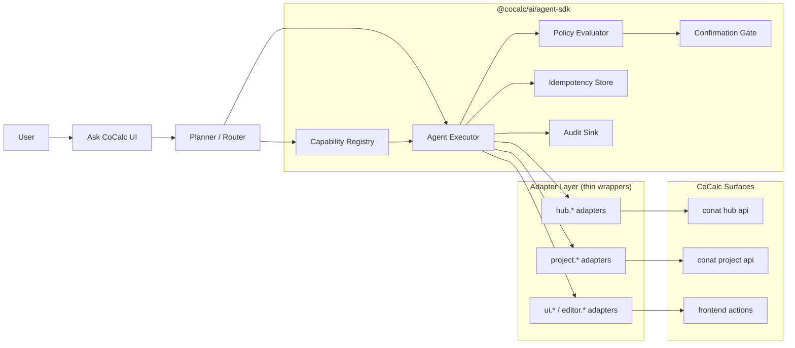

# `@cocalc/ai/agent-sdk`

Typed control-plane SDK for running CoCalc agent actions safely.

This package is the execution boundary between:

- model/planner logic (fast-path or coding-path plans), and
- side effects in CoCalc (hub/project/ui/editor actions).

The model proposes actions. The executor validates, applies policy, requests confirmation if needed, then executes handlers.

## Goals

- Keep agent actions typed and composable.
- Enforce policy before side effects.
- Make every action auditable and idempotent where possible.
- Support both `cocalc-plus` and `launchpad/rocket`.

## Main Pieces

- [types.ts](./types.ts)
  Core action/result/risk/audit types.
- [capabilities.ts](./capabilities.ts)
  Capability descriptors and registry.
- [policy.ts](./policy.ts)
  Policy evaluator contract and default risk-based policy.
- [executor.ts](./executor.ts)
  Policy-gated runtime executor.
- [memory.ts](./memory.ts)
  In-memory idempotency + audit sinks for tests/local runs.

## Architecture



## Execution Flow

1. Planner emits an `AgentActionEnvelope`.
2. Executor resolves action in registry.
3. Args are validated (`validateArgs`) and preconditions are checked.
4. Policy decides allow/block and confirmation requirements.
5. If allowed, handler executes; result is audited.
6. If `idempotencyKey` is present, result can be replayed from store.

## Responsibility Boundaries

- Planner/model:
  chooses *what* to do.
- `agent-sdk` executor:
  controls *whether* it can run and *how* it runs safely.
- Adapter handlers:
  implement the minimal call into concrete CoCalc APIs.

## Minimal Usage Sketch

```ts
import {
  AgentCapabilityRegistry,
  AgentExecutor,
  InMemoryAuditSink,
} from "@cocalc/ai/agent-sdk";

const registry = new AgentCapabilityRegistry<void>();
registry.register({
  actionType: "workspace.list",
  summary: "List workspaces",
  riskLevel: "read",
  handler: async () => ["ws-1", "ws-2"],
});

const executor = new AgentExecutor({
  registry,
  audit: new InMemoryAuditSink(),
});

const result = await executor.execute({
  action: { actionType: "workspace.list", args: {} },
  context: undefined,
});
```

## Current Status

- Core contracts and executor are implemented.
- Initial tests cover:
  - read actions
  - confirmation gating for risky actions
  - argument validation failures
  - idempotent replay behavior

Next step is adding real adapter-backed capabilities over existing hub/project/ui APIs.

