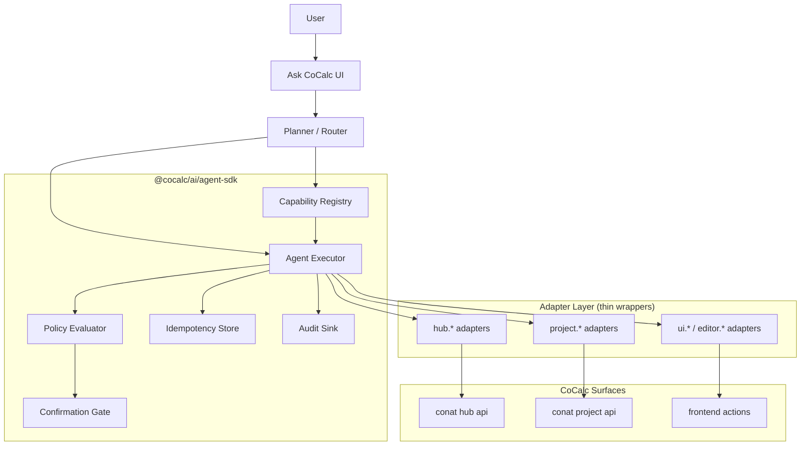

# `@cocalc/ai/agent-sdk`

Typed control-plane SDK for running CoCalc agent actions safely.

This package is the execution boundary between:

- model/planner logic (fast-path or coding-path plans), and
- side effects in CoCalc (hub/project/ui/editor actions).

The model proposes actions. The executor validates, applies policy, requests confirmation if needed, then executes handlers.

## Goals

- Keep agent actions typed and composable.
- Enforce policy before side effects.
- Make every action auditable and idempotent where possible.
- Support both `cocalc-plus` and `launchpad/rocket`.

## Main Pieces

- [types.ts](./types.ts)
  Core action/result/risk/audit types.
- [capabilities.ts](./capabilities.ts)
  Capability descriptors and registry.
- [policy.ts](./policy.ts)
  Policy evaluator contract and default risk-based policy.
- [executor.ts](./executor.ts)
  Policy-gated runtime executor.
- [memory.ts](./memory.ts)
  In-memory idempotency + audit sinks for tests/local runs.

## Architecture


```mermaid
flowchart TD
  User[User]
  UI[Ask CoCalc UI]
  Planner[Planner / Router]

  subgraph SDK["@cocalc/ai/agent-sdk"]
    Registry[Capability Registry]
    Executor[Agent Executor]
    Policy[Policy Evaluator]
    Confirm[Confirmation Gate]
    Idem[Idempotency Store]
    Audit[Audit Sink]
  end

  subgraph Adapters["Adapter Layer (thin wrappers)"]
    Hub[hub.* adapters]
    Project[project.* adapters]
    UIA[ui.* / editor.* adapters]
  end

  subgraph CoCalc["CoCalc Surfaces"]
    HubAPI[conat hub api]
    ProjAPI[conat project api]
    Frontend[frontend actions]
  end

  User --> UI --> Planner
  Planner --> Registry
  Planner --> Executor
  Registry --> Executor
  Executor --> Policy
  Policy --> Confirm
  Executor --> Idem
  Executor --> Audit
  Executor --> Hub
  Executor --> Project
  Executor --> UIA
  Hub --> HubAPI
  Project --> ProjAPI
  UIA --> Frontend
```

## Execution Flow

1. Planner emits an `AgentActionEnvelope`.
2. Executor resolves action in registry.
3. Args are validated (`validateArgs`) and preconditions are checked.
4. Policy decides allow/block and confirmation requirements.
5. If allowed, handler executes; result is audited.
6. If `idempotencyKey` is present, result can be replayed from store.

## Responsibility Boundaries

- Planner/model:
  chooses _what_ to do.
- `agent-sdk` executor:
  controls _whether_ it can run and _how_ it runs safely.
- Adapter handlers:
  implement the minimal call into concrete CoCalc APIs.

## Minimal Usage Sketch

```ts
import {
  AgentCapabilityRegistry,
  AgentExecutor,
  InMemoryAuditSink,
} from "@cocalc/ai/agent-sdk";

const registry = new AgentCapabilityRegistry<void>();
registry.register({
  actionType: "workspace.list",
  summary: "List workspaces",
  riskLevel: "read",
  handler: async () => ["ws-1", "ws-2"],
});

const executor = new AgentExecutor({
  registry,
  audit: new InMemoryAuditSink(),
});

const result = await executor.execute({
  action: { actionType: "workspace.list", args: {} },
  context: undefined,
});
```

## Current Status

The core executor and real adapter-backed capabilities are implemented.
[`runtime.ts`](./runtime.ts) exports `createAgentSdkBridge`,
`createPlusAgentSdkBridge`, and `createLaunchpadAgentSdkBridge`. Each bridge
registers the [basic capability pack](./packs/basic.ts) and exposes `manifest()`,
`buildContext()`, and `execute()`.

The basic pack supports hub ping/customization reads and project creation;
project listings and text writes; filesystem reads, writes, renames and moves;
and application status/start/stop. Inspect the manifest for action names,
argument schemas and policy metadata. An action still needs the corresponding
adapter: registration alone does not establish availability in a deployment.

Plus uses a fixed project client and optional filesystem client. Launchpad
resolves project/filesystem clients from the action target or default project;
the server integration checks collaborator access when resolving those clients.

The hub integrations expose `agent.manifest`, `agent.execute` and `agent.plan`.
The Lite integration additionally implements the bounded, multi-step
`agent.run` loop; the Launchpad handler currently returns a failed result saying
`agent.run` is not implemented. Project creation in Lite is also unsupported.
These differences must not be presented as uniform product support.

Policy, audit sinks and idempotency stores are configurable executor concerns.
The default bridge does not install durable audit or idempotency storage;
supply those explicitly when the integration requires them.
