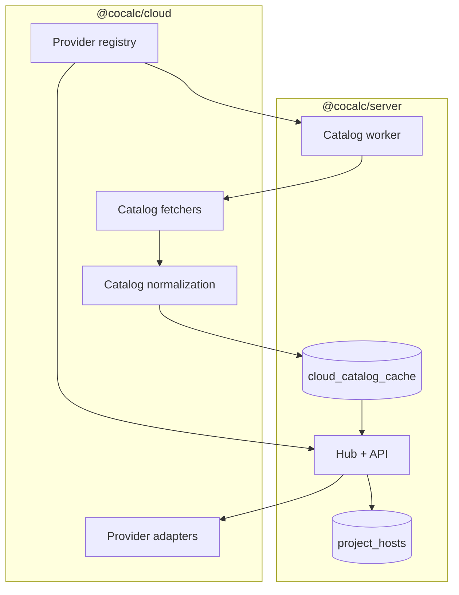

# @cocalc/cloud

This package provides a small, provider\-agnostic interface for provisioning and
controlling project hosts through cloud and self-host connector adapters.
It is intentionally narrow in scope: create, start, stop, delete, resize, and
query status for a host runtime. Everything else \(host registration, auth,
billing, UI, catalog persistence, etc.\) lives in higher\-level packages.

## Purpose

The goal is to make cloud providers swappable. The interfaces here are minimal
and designed to be used by `@cocalc/server` when a user creates or starts a host.
Adapters map a generic host spec \(CPU/RAM/disk/GPU/region\) to provider-specific
operations; available settings depend on the adapter.

## What is here now

- A provider\-agnostic interface (`CloudProvider`, `HostSpec`, `HostRuntime`).
- Provider adapters for GCP, Hyperstack, Lambda, Nebius, SelfHost, and Local.
- Catalog fetchers for GCP, Hyperstack, Lambda, and Nebius
  \(regions/zones/flavors/images, etc.\).
- Catalog normalization helpers and a provider registry that describes
  capabilities and catalog TTLs.
- A Local provider that keeps an in\-memory lifecycle state for dev/tests.
- Unit tests for provider behavior and catalog normalization.

The [provider registry](registry.ts) describes implemented adapter capabilities,
not which providers are configured or available on a particular CoCalc site.
Site credentials and provider configuration live in
[`@cocalc/server`](../server/cloud/providers.ts). The SelfHost adapter sends
commands to a configured connector; it is distinct from the Local development
provider and from installing a complete CoCalc Star site.

## Planned additions

- Additional providers \(AWS, etc.\) using the same interface.
- Stronger status reconciliation and cost/usage reporting.
- Optional "bootstrap helpers" to generate startup scripts that install
  podman, btrfs, and the project\-host bundle.

## Scope and design constraints

- **Image selection is provider-specific**: GCP, Hyperstack, Lambda, and Nebius
  accept explicit source-image metadata. Check `supportsCustomImage` in the
  registry and the adapter's image-selection rules; this capability does not
  establish that an arbitrary image will work with the project-host bootstrap.
- **Default images**: defaults and fallbacks vary by provider. For example,
  [Lambda](lambda/provider.ts) has a separate GPU image fallback before its
  general Ubuntu filter. Validate the selected image with the project-host
  bootstrap; image selection alone does not establish a tested deployment.
- **No bucket or storage management**: object storage configuration and mounts
  are handled elsewhere (project\-host or user configuration).
- **No long\-lived orchestration**: once a host is provisioned, ongoing host logic
  is handled by the project\-host runtime itself.
- **Provider\-specific complexity stays in adapters**: the rest of CoCalc should
  only depend on the interface in `types.ts`.
- **No DB access here**: catalog persistence and locking live in
  `@cocalc/server`; `@cocalc/cloud` only produces catalog data.

## How to add a new cloud

1. Implement a provider in `src/packages/cloud/<provider>/provider.ts` that
   satisfies `CloudProvider` (`createHost`, `startHost`, `stopHost`, `deleteHost`,
   `getHost`, etc.\).
2. Add catalog fetcher(s) in `src/packages/cloud/catalog/<provider>.ts` and a
   `toEntries()` helper that converts provider\-specific data into the generic
   `CatalogEntry` list.
3. Register the provider in `src/packages/cloud/registry.ts` with:
   - `id`, `provider` instance, `capabilities`
   - `fetchCatalog` and `catalog` spec (`ttlSeconds`, `toEntries`)
4. Export the provider and catalog helpers in `src/packages/cloud/index.ts`.
5. In `@cocalc/server`, add provider-specific catalog fetch options and credentials
   in `src/packages/server/cloud/providers.ts`. The catalog worker in
   `src/packages/server/cloud/catalog.ts` consumes these options.
6. Add provider settings to `site-settings-extras` if needed.
7. Update the host UI to expose provider selection and catalog fields.

## Architecture

The server supplies credentials, handles locking and persistence, and exposes
catalog data to the frontend. The cloud package owns provider logic and catalog
generation only.
