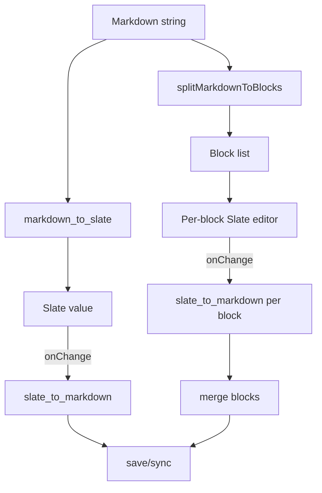

# Slate Editor Integration (CoCalc)

This directory contains CoCalc's Slate-based rich text editor integration and
the new block-based editor mode for large documents.

Goals
- Fast, stable editing with minimal cursor jumps.
- Round-trip Markdown with minimal formatting churn.
- Support large documents via block virtualization.
- Integrate inline rich elements (mentions, math, images, code blocks).

Constraints (non-negotiable)
- Do NOT fork upstream `slate` or `slate-react`.
- Keep upstream upgrades feasible.
- Avoid placeholder paragraphs as a general solution for "cursor stuck".
- Prefer rendering overlays and auxiliary UI outside Slate's memoized tree.

High-level Architecture

1) Full editor (single Slate tree)
- Entry: `editable-markdown.tsx`
- Markdown string -> `markdown_to_slate` -> Slate value
- Slate change -> `slate_to_markdown` -> sync/save
- Optional windowing via `ReactEditor.isUsingWindowing`

2) Block editor (large docs)
- Entry: `block-markdown-editor.tsx`
- Markdown -> `splitMarkdownToBlocks`
- Each block uses its own Slate editor
- Virtualized list (react-virtuoso)
- Tradeoff: no multi-block selection; use Markdown mode when needed

3) Gap cursor (between blocks)
- Goal: allow inserting a paragraph between non-paragraph blocks (lists, quotes)
- Implementation: overlay bar rendered outside Slate (not inside element render)
- ArrowUp/ArrowDown set `editor.gapCursor`
- Typing/Enter inserts a paragraph at the gap

4) Slate wrapper
- `slate-react.ts` wraps upstream `slate-react`
- Adds windowing helpers, `forceUpdate`, and selection utilities
- Keep this thin and compatible with upstream

5) Code blocks
- `elements/code-block` embeds CodeMirror 5
- Special focus handling to avoid selection glitches

Key Files
- `editable-markdown.tsx`: main WYSIWYG editor
- `block-markdown-editor.tsx`: block-based editor for large docs
- `gap-cursor.ts`: gap cursor state + insert behavior
- `keyboard/*`: key handlers (arrow keys, enter, tab, etc.)
- `slate-react.ts`: upstream wrapper
- `markdown-to-slate.ts`, `slate-to-markdown.ts`: conversion layer

Mermaid Diagram (data flow)

Design Notes and Pitfalls
- Slate memoizes element rendering; avoid relying on element re-render to show
  UI state that does not change the Slate value.
- The gap cursor is rendered as an absolute overlay in `editable-markdown.tsx`
  so it is visible even when Slate does not re-render elements.
- Selection sync is fragile. Avoid mutating selection outside the keyboard
  handlers and the designated overlay path.
- Use debounced save (`SAVE_DEBOUNCE_MS`) and sync caching to reduce churn.

Strategy (current direction)
- Use upstream Slate + wrapper only.
- Use block editor + virtualization for large docs.
- Keep the full editor for smaller docs and for rich WYSIWYG flows.
- Use gap cursor overlay rather than placeholder paragraphs.

Testing
- `pnpm test slate` (fast unit tests)
- Playwright tests live in `editors/slate/playwright`

Notes for Future Work
- Keyboard navigation between block editors (up/down across blocks).
- CodeMirror integration tweaks (focus in/out with arrow keys).
- Evaluate CodeMirror 6 if CM5 becomes limiting.
