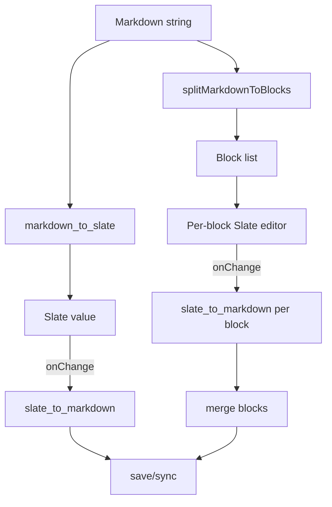

# Slate Editor Integration (CoCalc)

This directory contains CoCalc's Slate-based rich text editor integration and
the new block-based editor mode for large documents.

Goals
- Fast, stable editing with minimal cursor jumps.
- Round-trip Markdown with minimal formatting churn.
- Support large documents via block virtualization.
- Integrate inline rich elements (mentions, math, images, code blocks).

Constraints (non-negotiable)
- Do NOT fork upstream `slate` or `slate-react`.
- Keep upstream upgrades feasible.
- Use thin spacer paragraphs around block void elements (esp. code blocks)
  so navigation stays in normal contenteditable flow.

High-level Architecture

1) Full editor (single Slate tree)
- Entry: `editable-markdown.tsx`
- Markdown string -> `markdown_to_slate` -> Slate value
- Slate change -> `slate_to_markdown` -> sync/save
- Optional windowing via `ReactEditor.isUsingWindowing`

2) Block editor (large docs)
- Entry: `block-markdown-editor.tsx`
- Markdown -> `splitMarkdownToBlocks`
- Each block uses its own Slate editor
- Virtualized list (react-virtuoso)
- Tradeoff: no multi-block selection; use Markdown mode when needed

Block Editor: Architecture, Design, Motivation
- Motivation: keep editing fast and stable for very large Markdown files by
  avoiding a single huge Slate tree and minimizing render/selection churn.
- Core idea: split Markdown into blocks, give each block its own Slate editor,
  and virtualize the list so only visible blocks are mounted.
- Chunking: block editor now groups multiple top-level Markdown blocks into
  **chunks** by size (never splitting a top-level block). Each chunk is a
  single editor that may contain many Slate blocks. This keeps the editor
  stable while still windowing large docs.
- Chunk size override for dev/testing:
  - `window.COCALC_SLATE_BLOCK_CHUNK_CHARS = 800` (or any positive number).
- Large-doc debounce (to keep other editors responsive):
  - `window.COCALC_SLATE_BLOCK_DEFER_CHARS = 200000` (default).
  - `window.COCALC_SLATE_BLOCK_DEFER_MS = 300` (default).
  - Set smaller values for dev or to observe re-chunking behavior.
- Incremental chunking:
  - Reuses unchanged prefix/suffix chunks and re-chunks only the middle window.
- Optional profiling:
- Page boundaries: chunks render a subtle "Page N" boundary label so it’s
  clear where chunk edges are during manual testing.
- State flow: block editors emit per-block changes; we merge back to Markdown
  and sync/save at the document level.
- Editing constraints: cross-block selection is intentionally unsupported to
  keep the model simple and performance predictable.
- Merge behavior: block-to-block operations (e.g., backspace at block start)
  are handled by explicit merge logic rather than relying on Slate's normal
  multi-node transforms across the entire document.
- Design goal: a block editor is a collection of small, stable editors, not a
  transient view of one giant editor.

3) Slate wrapper
- `slate-react.ts` wraps upstream `slate-react`
- Adds windowing helpers, `forceUpdate`, and selection utilities
- Keep this thin and compatible with upstream

4) Code blocks
- `elements/code-block` renders inline-editable code lines (Prism highlight)
- No embedded CodeMirror editor; code is normal Slate text

Key Files
- `editable-markdown.tsx`: main WYSIWYG editor
- `block-markdown-editor.tsx`: block-based editor for large docs
- `keyboard/*`: key handlers (arrow keys, enter, tab, etc.)
- `slate-react.ts`: upstream wrapper
- `markdown-to-slate.ts`, `slate-to-markdown.ts`: conversion layer

Mermaid Diagram (data flow)

Design Notes and Pitfalls
- Slate memoizes element rendering; avoid relying on element re-render to show
  UI state that does not change the Slate value.
- Selection sync is fragile. Avoid mutating selection outside the keyboard
  handlers and the designated overlay path.
- Use debounced save (`SAVE_DEBOUNCE_MS`) and sync caching to reduce churn.

Strategy (current direction)
- Use upstream Slate + wrapper only.
- Use block editor + virtualization for large docs.
- Keep the full editor for smaller docs and for rich WYSIWYG flows.
- Use spacer paragraphs around block void elements instead of gap cursors.

Testing
- `pnpm test slate` (fast unit tests)
- Playwright tests live in `editors/slate/playwright`

Notes for Future Work
- Keyboard navigation between block editors (up/down across blocks).
- Evaluate dedicated code editor integrations if needed later.
