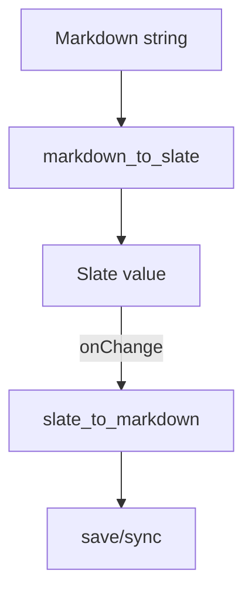

# Slate Editor Integration (CoCalc)

This directory contains CoCalc's Slate-based rich text editor integration.

Goals

- Fast, stable editing with minimal cursor jumps.
- Round-trip Markdown with minimal formatting churn.
- Integrate inline rich elements (mentions, math, images, code blocks).

Constraints (non-negotiable)

- Do NOT fork upstream `slate` or `slate-react`.
- Keep upstream upgrades feasible.
- Use thin spacer paragraphs around block void elements (esp. code blocks)
  so navigation stays in normal contenteditable flow.

High-level Architecture

1. Full editor (single Slate tree)

- Entry: `editable-markdown.tsx`
- Markdown string -> `markdown_to_slate` -> Slate value
- Slate change -> `slate_to_markdown` -> sync/save
- Optional windowing via `ReactEditor.isUsingWindowing`

2. Slate wrapper

- `slate-react.ts` wraps upstream `slate-react`
- Adds windowing helpers, `forceUpdate`, and selection utilities
- Keep this thin and compatible with upstream

3. Code blocks

- `elements/code-block` renders inline-editable code lines (Prism highlight)
- No embedded CodeMirror editor; code is normal Slate text

Key Files

- `editable-markdown.tsx`: main WYSIWYG editor
- `keyboard/*`: key handlers (arrow keys, enter, tab, etc.)
- `slate-react.ts`: upstream wrapper
- `markdown-to-slate.ts`, `slate-to-markdown.ts`: conversion layer

Mermaid Diagram (data flow)

```mermaid
flowchart TD
  A[Markdown string] --> B[markdown_to_slate]
  B --> C[Slate value]
  C -->|onChange| D[slate_to_markdown]
  D --> E[save/sync]
```

Design Notes and Pitfalls

- Slate memoizes element rendering; avoid relying on element re-render to show
  UI state that does not change the Slate value.
- Performance: avoid subscribing heavy elements to the global `ChangeContext`
  (e.g., `useChange()`), and avoid `useSlateSelection()` for every node in
  large documents. Prefer `useSelected()` and `editor.selection` so only the
  active element re-renders on selection changes.
- Selection sync is fragile. Avoid mutating selection outside the keyboard
  handlers and the designated overlay path.
- Use debounced save (`SAVE_DEBOUNCE_MS`) and sync caching to reduce churn.

Strategy (current direction)

- Use upstream Slate + wrapper only.
- Use the full editor for rich WYSIWYG flows.
- Use CodeMirror mode for very large Markdown documents.
- Use spacer paragraphs around block void elements instead of gap cursors.

Testing

- `pnpm test slate` (fast unit tests)
- Playwright tests live in `editors/slate/playwright`

Notes for Future Work

- Evaluate dedicated code editor integrations if needed later.
