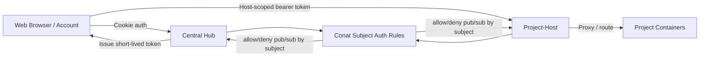

# Conat Socket.IO Auth Overview

This folder defines Conat websocket authentication and per-subject authorization rules.

In CoCalc, Conat security is primarily enforced by restricting which subjects a connected identity may publish to and subscribe to. Authentication establishes identity (`account`, `project`, `host`, or `hub`), then authorization is evaluated on each subject operation.

The same policy model is used in two places:

- Central hub adapter: [src/packages/server/conat/socketio/auth.ts](./auth.ts)
- Project-host adapter: [src/packages/project-host/conat-auth.ts](../../project-host/conat-auth.ts)

To avoid policy drift, shared rule helpers live in [src/packages/conat/auth/subject-policy.ts](../../../conat/auth/subject-policy.ts).

## What Rules Are Enforced

At a high level:

- Allow publish to own hub request subject: `hub.<type>.<id>.*`
- Allow publish to `_INBOX.*` (request/reply responses)
- Allow subscribe to own inbox prefix only
- Allow subscribe to `public.*`
- Allow account/project/host self-subjects (e.g. `account.<id>.*`, `project.<id>.*`, `host.<id>.*`)
- For accounts, allow project subjects only when collaborator/owner checks pass
- Deny by default for unknown subjects

Central hub and project-host differ in where collaborator checks come from:

- Central hub: postgres-backed checks
- Project-host: local mirrored project metadata / ACL cache

## Main Components

## Caveats When Changing Rules

- Keep shared policy in `conat/auth/subject-policy.ts` authoritative where possible.
- If adding a new subject namespace, update both adapters and tests together.
- Subject auth is capability auth. Accidentally broad patterns can grant large access quickly.
- Frontend routing can send hub RPC traffic directly to project-host for selected methods; auth rules must still be strict on project-host.
- Avoid coupling policy to transient transport details (addresses, websocket ids). Prefer stable identity + subject checks.

## Related Documentation

- [docs/project-host-auth.md](../../../../docs/project-host-auth.md)
- [docs/codex-auth.md](../../../../docs/codex-auth.md)
